GDP Prediction
================
Nikhil Gutpa and Stuart Miller
2020-04-07 22:58:06

# Introduction

Economic recessions are periods of time when an economy shinks. These
periods of time generally costly to businesses and the populace alike.
Deep recessions can be particularly costly to the populace as business
downsizing and business failures during recessions generally result in a
decrease in available jobs (increasing unemployment). However, if it was
possible to predict a coming recession with some confidence, then it may
be possible for business and the populace to prepare and mitigate
losses.

We propose to model the change in GDP for the United States to attempt
to predict recessions. A working definition of a recession is two
consecutive quarters of decrease in GDP \[1\]. Thus, we will use a
2-step ahead forecast in evaluating models. Eleven years (44 quarters)
of historical data will be used for training models to predict the next
2 quarters.

# Data

All data was collected from [Federal Reserve Economic Data (FRED)
Repository](https://fred.stlouisfed.org/), which is provided by the
Federal Reserve Bank of Saint Louis. In addition to quarterly change in
GDP, 18 exogenous variables were also collected. The data from 151
quarters (from 1982 Q1 to 2019 Q3) were collected. The data starts at
1982 Q1 because that was the earliest observation available for
`treas10yr3mo`.

The exogenous variables are summerized in the table
below.

| Variable          | Description                                                                                          | FRED ID          |
| ----------------- | ---------------------------------------------------------------------------------------------------- | ---------------- |
| Date              | Date of observation                                                                                  | N/A              |
| gdp\_change       | Change in GDP from the previous observation                                                          | A191RP1Q027SBEA  |
| unrate            | Unemployment rate                                                                                    | UNRATE           |
| nfjobs            | Non-farming jobs                                                                                     | PAYEMS           |
| treas10yr         | 10 Year US treasury constant maturity rate                                                           | DGS10            |
| fedintrate        | US federal interest rate                                                                             | FEDFUNDS         |
| personincomechg   | Change in real disposable personal income                                                            | A067RO1Q156NBEA  |
| cpichg            | Change in Consumer Price Index for all urban consumers: all ttems in U.S. city average               | CPIAUCNS         |
| popchg            | Change in Population                                                                                 | POPTHM           |
| corpprofitchg     | Change in Corporate profits after tax (converted to percent change)                                  | CP               |
| crude\_wtichg     | Change in Spot Crude Oil Price: West Texas Intermediate                                              | WTISPLC          |
| goldchg           | Change in Gold Fixing Price 10:30 A.M. (London time) in london bullion market, based in U.S. Dollars | GOLDAMGBD228NLBM |
| ppichg            | Change in Producer price index                                                                       | PPIACO           |
| japanchg          | Change in US/Japan exchange rate                                                                     | EXJPUS           |
| ukchg             | Change in US/UK exchange rate                                                                        | EXUSUK           |
| wilshirechg       | Change in Wilshire 5000 Total Market Full Cap Index                                                  | WILL5000INDFC    |
| ipichg            | Change in Industrial Production Index                                                                | INDPRO           |
| inventorieschg    | Change in Real Manufacturing and Trade Inventories                                                   | INVCMRMTSPL      |
| homeownership     | Cahnge in Homeownership Rate for the United States                                                   | RHORUSQ156N      |
| housingpermitschg | Change in New Private Housing Units Authorized by Building Permits                                   | PERMIT           |
| treas10yr3mo      | 10-Year Treasury Constant Maturity Minus 3-Month Treasury Constant Maturity                          | T10Y3M           |

``` r
data %>% glimpse()
```

    ## Rows: 151
    ## Columns: 22
    ## $ date              <fct> 1982 Q1, 1982 Q2, 1982 Q3, 1982 Q4, 1983 Q1, 1…
    ## $ gdp_change        <dbl> -0.8, 7.2, 4.2, 4.4, 8.6, 12.7, 12.9, 11.9, 12…
    ## $ unrate            <dbl> 9.0, 9.6, 10.1, 10.8, 10.3, 10.1, 9.2, 8.3, 7.…
    ## $ nfjobschg         <dbl> -0.5071786, -0.6291881, -0.7589162, -0.4619715…
    ## $ treas10yr         <dbl> 14.18, 14.44, 11.73, 10.36, 10.62, 10.96, 11.4…
    ## $ treas3mo          <dbl> 13.99, 13.36, 7.88, 8.20, 8.96, 9.15, 9.04, 9.…
    ## $ treas10yr3mo      <dbl> 0.19, 1.08, 3.85, 2.16, 1.66, 1.81, 2.40, 2.49…
    ## $ fedintrate        <dbl> 14.68, 14.15, 10.31, 8.95, 8.77, 8.98, 9.45, 9…
    ## $ personincomechg   <dbl> 2.6, 3.1, 1.4, 1.6, 2.4, 2.5, 3.5, 5.5, 6.6, 7…
    ## $ cpichg            <dbl> 0.5319149, 2.6455026, 0.9278351, -0.3064351, 0…
    ## $ popchg            <dbl> 0.2098904, 0.2297481, 0.2662760, 0.2290424, 0.…
    ## $ housingpermitschg <dbl> 11.9346734, 2.4691358, 14.1292442, 29.6545106,…
    ## $ homeownership     <dbl> 64.8, 64.9, 64.9, 64.5, 64.7, 64.7, 64.8, 64.4…
    ## $ corpprofitchg     <dbl> -9.8822616, 1.0334227, -2.5010250, -3.4051171,…
    ## $ inventorieschg    <dbl> -1.3318626, -0.2449114, -0.1071666, -1.6367250…
    ## $ crude_wtichg      <dbl> -18.6285714, 23.1390449, 1.5968064, -10.973898…
    ## $ ppichg            <dbl> 0.80971660, 0.40160643, 0.00000000, 0.50000000…
    ## $ ipichg            <dbl> -0.81243157, -1.84873818, -1.48731619, -1.9981…
    ## $ wilshirechg       <dbl> -9.0163934, -1.3513514, 11.4155251, 18.8524590…
    ## $ goldchg           <dbl> -19.8750000, -2.0280811, 25.7165605, 13.489550…
    ## $ japanchg          <dbl> 10.1727985, 4.1327655, 4.8121460, -8.1069348, …
    ## $ ukchg             <dbl> -5.1489518, -2.7142303, -2.5223481, -5.6074766…

# Response Variable

The response variable is change in GDP, denoted as `gdp_change`. The
realization, sample autocorrelations, and Parzen window are shown below.
The realization appears to express wandering behavior with some
oscillation. Based on the sample aucorrelations, wandering appears to be
the dominate behavior. The oscillations do not appear to be expressed
strongly in the sample autocorrelations. This is consisent with the
Parzen window, which shows a dominate frequency at 0. The other
frequencies shown in the parzen window have very low
magnitudes.

<!-- -->

# Modeling

## Stationarity

We start the analysis with an assessment of startionarity of the
realization.

<!-- -->

    ## [1] TRUE

### Condition 1: Constant Mean

  - There does not appear to be evidence of a trend in the data.
  - Additionaly there does not appear to be any kind of deterministic
    oscillation in the data

Therefore, the assumption of constant mean does not appear to be
violated.

### Condition 2: Constant Variance

  - There does not apprear to be evidence of the variance of the
    realization changing over time.
  - the drastic change at time step 75 maybe uncharacterisic of the
    process generating this realization, but it is difficult to
    determine with only one realization. This could be normal wandering
    behavior of the process generating this realization.

Therefore, the assumption of constant variance does not appear to be
violated.

### Condition 3: Constant Autocorrelation

The ACF of the first and second half of the realization appear to
exhibit similar behavior. However, the autocorrelations have very low
magnitudes - most of the autocorrelations do not appear to be
significantly different than 0.

Therefore, the assumption of constant autocorrelation does not appear to
be violated.

### Conclusion

Given the above analysis, there does not appear to be sufficient
evidence to suggest that the process generating the realization is not
stationary. We will continue the ananlysis assuming the process
generating the realization is stationary.

## ARMA Model

Since the process generating the realization is assumed to be
stationary, we will model this realization with an ARMA model.

### Model ID

``` r
# get the top five models selected by AIC and BIC
aicbic(x, 0:12, 0:3, silent = TRUE)
```

    ## [[1]]
    ##    p q      aic
    ## 9  2 0 1.765702
    ## 6  1 1 1.772199
    ## 7  1 2 1.776732
    ## 10 2 1 1.778418
    ## 13 3 0 1.778594
    ## 
    ## [[2]]
    ##    p q      bic
    ## 9  2 0 1.825648
    ## 6  1 1 1.832145
    ## 5  1 0 1.854565
    ## 7  1 2 1.856660
    ## 10 2 1 1.858346

Both AIC and BIC select low order models with an ARMA(2, 0) selected as
the best ID by both criteria. The following models are selected by both
criteria:

  - ARMA(2, 0)
  - ARMA(1, 1)
  - ARMA(1, 2)
  - ARMA(2, 1)

### Model Fit

An ARMA(2,0) was fit based on the model ID from AIC and BIC. The factor
table for the estimated model does not show roots near the unit circle.

``` r
est.s <- est.arma.wge(x, 2, 0)
```

    ## 
    ## Coefficients of Original polynomial:  
    ## 0.3919 0.2566 
    ## 
    ## Factor                 Roots                Abs Recip    System Freq 
    ## 1-0.7391B              1.3530               0.7391       0.0000
    ## 1+0.3472B             -2.8801               0.3472       0.5000
    ##   
    ## 

(1-0.7391\(B\))(1+0.3472\(B\))(\(X_t\) - 5.1490066) = \(a_t\) with
\(\sigma_a^2\) = 5.6179518

The results from the model fit appear to be nearly consisent with white
noise. The resulting realization appears very close to white noise.
Several of the autocorrelations of the results are marginally
significant, but not more than expected. As secondary evaluation, the
Ljung-Box test does not reject the null hypothesis that residuals are
not white noise. However, all the models selected by AIC and BIC show a
similar behavior.

``` r
# evaluate residuals of arma model
tbl <- tswgewrapped::evaluate_residuals(est.s$res)
```

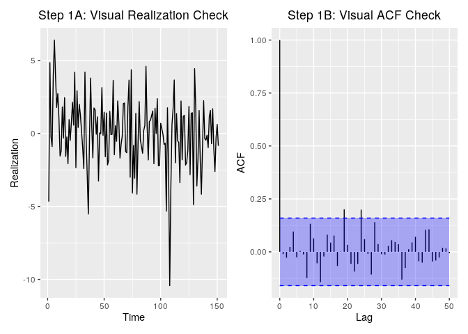<!-- -->

    ## None of the 'ljung_box' tests rejected the null hypothesis that the data is consistent with white noise at an significance level of  0.05

``` r
tbl %>%
  select(-c(Model)) %>%
  kable() %>%
  kable_styling(bootstrap_options = "striped", full_width = F)
```

<table class="table table-striped" style="width: auto !important; margin-left: auto; margin-right: auto;">

<thead>

<tr>

<th style="text-align:left;">

test

</th>

<th style="text-align:right;">

K

</th>

<th style="text-align:right;">

chi.square

</th>

<th style="text-align:right;">

df

</th>

<th style="text-align:right;">

pval

</th>

<th style="text-align:left;">

Decision

</th>

</tr>

</thead>

<tbody>

<tr>

<td style="text-align:left;">

Ljung-Box test

</td>

<td style="text-align:right;">

24

</td>

<td style="text-align:right;">

32.08723

</td>

<td style="text-align:right;">

24

</td>

<td style="text-align:right;">

0.1248443

</td>

<td style="text-align:left;">

FTR NULL

</td>

</tr>

<tr>

<td style="text-align:left;">

Ljung-Box test

</td>

<td style="text-align:right;">

48

</td>

<td style="text-align:right;">

53.20827

</td>

<td style="text-align:right;">

48

</td>

<td style="text-align:right;">

0.2806241

</td>

<td style="text-align:left;">

FTR NULL

</td>

</tr>

</tbody>

</table>

### Forecast Results

``` r
# setup object with unitvariate model
models = list("ARMA(2,0)" = list(phi = est.s$phi,
                                  theta = est.s$theta,
                                  vara = est.s$avar,
                                  res = est.s$res,
                                  sliding_ase = TRUE))

mdl_compare_uni = tswgewrapped::ModelCompareUnivariate$new(data = x, mdl_list = models,
                                                       n.ahead = 2, batch_size = 44)
```

The model appears to capture the movement of the mean with 2-step ahead
forecasts. The model is unable to capture the steap dip near time step
100. Generally, the realization is contained in the forecast limits of
the model, but the realization does not exhibit significant wandering.
The sliding window ASE shows that the model performs badly near the
extreme step.

``` r
# show sliding window forecasts
tbl <- mdl_compare_uni$plot_batch_forecasts(only_sliding = TRUE)
```

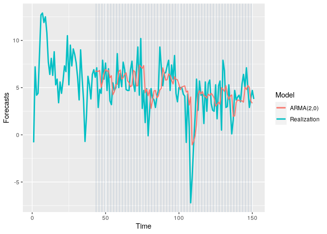<!-- -->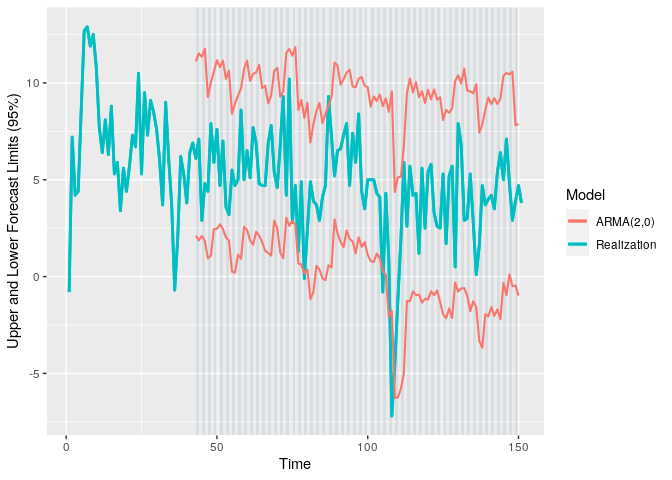<!-- -->

The histogram of ASEs from the sliding window shows that the errors are
generally below 10. However, there are a few exteme values with one
above 60.

``` r
# show the distribution of ASEs
tbl <- mdl_compare_uni$plot_boxplot_ases()
```

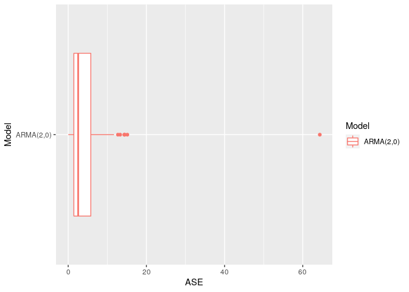<!-- -->

Viewing the rolling window ASE over time, we see that the most extreme
value occurs at the same location as the extreme value. This is not
surprising since an ARMA model will tend toward the mean and this value
is far from the window mean.

``` r
# show ASE over time (windows)
tbl <- mdl_compare_uni$plot_batch_ases(only_sliding = TRUE)
```

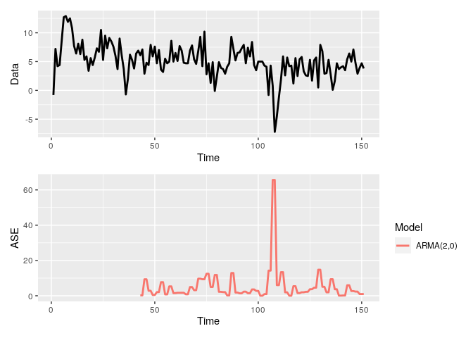<!-- -->

## VAR Model

### Explanatory Variables

The realizations of the exogeneous variables are shown
below.

``` r
eda <- MultivariateEDA$new(data = data, var_interest = "gdp_change", var_time = "date")
eda$plot_data(ncol = 3)
```

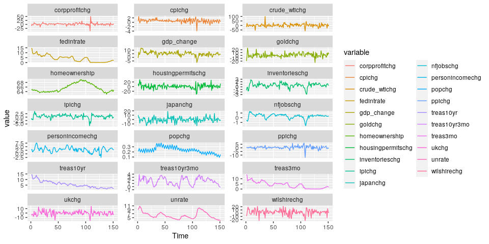<!-- -->

### CCF Analysis

**Summary**

The significant cross correlations of the variable `popchg` lags the
response variable. The following variables do no have significant cross
correlations with the response variable: `corpprofitchg`, `japanchg`,
`japanchg`, `crude_wtchg`, `goldchg`, and `ukchg`. All other variables
appear to have significant cross correlations and will be included as
exogeneous variables.

We suspect that `nfjobschg`, `ipichg`, `treas10yr`, `fedintrate`,
`cpichg`, `inventorieschg`, `ppichg`, `homeownership`,
`personincomechg`, `housingpermitschg`, `treas10yr3mo`, `wilshirechg`,
`ipichg` will be useful given the cross-correlations.

Plots of the CCF are shown below.

``` r
# plot the ccfs and get back the ccf table
ccf <- eda$plot_ccf_analysis(negative_only = TRUE)
```

<!-- --><!-- --><!-- --><!-- --><!-- --><!-- --><!-- --><!-- --><!-- --><!-- --><!-- --><!-- --><!-- --><!-- --><!-- --><!-- --><!-- --><!-- --><!-- --><!-- -->

``` r
# show the ccf table
ccf %>%
  select(-c(max_ccf_index_adjusted)) %>%
  kable() %>%
  kable_styling(bootstrap_options = "striped", full_width = F)
```

<table class="table table-striped" style="width: auto !important; margin-left: auto; margin-right: auto;">

<thead>

<tr>

<th style="text-align:left;">

variable

</th>

<th style="text-align:right;">

max\_ccf\_index

</th>

<th style="text-align:right;">

max\_ccf\_value

</th>

</tr>

</thead>

<tbody>

<tr>

<td style="text-align:left;">

nfjobschg

</td>

<td style="text-align:right;">

0

</td>

<td style="text-align:right;">

0.6813313

</td>

</tr>

<tr>

<td style="text-align:left;">

ipichg

</td>

<td style="text-align:right;">

0

</td>

<td style="text-align:right;">

0.5907396

</td>

</tr>

<tr>

<td style="text-align:left;">

inventorieschg

</td>

<td style="text-align:right;">

0

</td>

<td style="text-align:right;">

0.4848070

</td>

</tr>

<tr>

<td style="text-align:left;">

treas10yr

</td>

<td style="text-align:right;">

0

</td>

<td style="text-align:right;">

0.4676136

</td>

</tr>

<tr>

<td style="text-align:left;">

treas3mo

</td>

<td style="text-align:right;">

0

</td>

<td style="text-align:right;">

0.4464707

</td>

</tr>

<tr>

<td style="text-align:left;">

fedintrate

</td>

<td style="text-align:right;">

0

</td>

<td style="text-align:right;">

0.4175177

</td>

</tr>

<tr>

<td style="text-align:left;">

personincomechg

</td>

<td style="text-align:right;">

0

</td>

<td style="text-align:right;">

0.3711867

</td>

</tr>

<tr>

<td style="text-align:left;">

cpichg

</td>

<td style="text-align:right;">

0

</td>

<td style="text-align:right;">

0.2808012

</td>

</tr>

<tr>

<td style="text-align:left;">

homeownership

</td>

<td style="text-align:right;">

\-12

</td>

<td style="text-align:right;">

\-0.2782904

</td>

</tr>

<tr>

<td style="text-align:left;">

unrate

</td>

<td style="text-align:right;">

\-5

</td>

<td style="text-align:right;">

0.2681861

</td>

</tr>

<tr>

<td style="text-align:left;">

housingpermitschg

</td>

<td style="text-align:right;">

\-1

</td>

<td style="text-align:right;">

0.2666555

</td>

</tr>

<tr>

<td style="text-align:left;">

wilshirechg

</td>

<td style="text-align:right;">

\-3

</td>

<td style="text-align:right;">

0.2656827

</td>

</tr>

<tr>

<td style="text-align:left;">

ppichg

</td>

<td style="text-align:right;">

0

</td>

<td style="text-align:right;">

0.2597778

</td>

</tr>

<tr>

<td style="text-align:left;">

treas10yr3mo

</td>

<td style="text-align:right;">

\-7

</td>

<td style="text-align:right;">

0.2060971

</td>

</tr>

<tr>

<td style="text-align:left;">

corpprofitchg

</td>

<td style="text-align:right;">

0

</td>

<td style="text-align:right;">

0.1771913

</td>

</tr>

<tr>

<td style="text-align:left;">

goldchg

</td>

<td style="text-align:right;">

\-8

</td>

<td style="text-align:right;">

\-0.1503708

</td>

</tr>

<tr>

<td style="text-align:left;">

popchg

</td>

<td style="text-align:right;">

0

</td>

<td style="text-align:right;">

0.1365039

</td>

</tr>

<tr>

<td style="text-align:left;">

crude\_wtichg

</td>

<td style="text-align:right;">

0

</td>

<td style="text-align:right;">

0.1364508

</td>

</tr>

<tr>

<td style="text-align:left;">

japanchg

</td>

<td style="text-align:right;">

\-9

</td>

<td style="text-align:right;">

\-0.1058820

</td>

</tr>

<tr>

<td style="text-align:left;">

ukchg

</td>

<td style="text-align:right;">

\-1

</td>

<td style="text-align:right;">

0.0965275

</td>

</tr>

</tbody>

</table>

Subset to variables that may be useful given cross-correlations.

``` r
# Subset data to most intersting variables
data <- data %>% dplyr::select(c(gdp_change, nfjobschg, ipichg, treas10yr,
                                 fedintrate, cpichg, inventorieschg, ppichg,
                                 homeownership, personincomechg, housingpermitschg,
                                 treas10yr3mo, wilshirechg, ipichg))
```

### Modeling

Initially we attempted to select models starting with all the variables
and removing statistially insiginificant variables. However, this
resulted in models that appeared to be very overfit. For more details
see *VAR Modeling with Backward Feature Selection* in the appendix.

We continued by starting with no variables in the model and visualizing
the forecast at each variable addition to determine if the model
appeared to overfit. This resulted in a much smaller model. The constant
term was found to be significant, but the trend term was not
significant. Thus, we only fit models with the constant term.

The models selected contained the variables `housingpermitschg` and
`inventorieschg`.

``` r
# Use max lag of 12
lag.max = 12
# construct VAR model with type const and variables 'housingpermitschg', 'inventorieschg'
models = list("VARS AIC Both"    = list(select = "aic", trend_type = "const", lag.max = lag.max))
mdl_build = ModelBuildMultivariateVAR$new(data[ , c(var_interest, 'housingpermitschg', 'inventorieschg')],
                                          var_interest = var_interest,
                                            mdl_list = models, verbose = 1)

#mdl_build$summarize_build()
mdl_build$build_recommended_models()
model.both <- mdl_build$get_final_models(subset = 'r')

# construct VAR model with type const and variable 'inventorieschg'
models = list("VARS AIC Inven"    = list(select = "aic", trend_type = "const", lag.max = lag.max))
mdl_build = ModelBuildMultivariateVAR$new(data[ , c(var_interest, 'inventorieschg')],
                                          var_interest = var_interest,
                                            mdl_list = models, verbose = 1)

#mdl_build$summarize_build()
mdl_build$build_recommended_models()
model.inven <- mdl_build$get_final_models(subset = 'r')

# construct VAR model with type const and variable 'housingpermitschg'
models = list("VARS AIC HousePerm"    = list(select = "aic", trend_type = "const", lag.max = lag.max))
mdl_build = ModelBuildMultivariateVAR$new(data[ , c(var_interest, 'housingpermitschg')],
                                          var_interest = var_interest,
                                            mdl_list = models, verbose = 1)

#mdl_build$summarize_build()
mdl_build$build_recommended_models()
model.housperm <- mdl_build$get_final_models(subset = 'r')

# combine models in a list
models <- append(model.both, model.inven)
models <- append(models, model.housperm)

# set models to use sliding window ASE
for (name in names(models)){
  models[[name]][['sliding_ase']] = TRUE
}

# set the batch size (window) and forecast horizon
batch_size = 44
n.ahead = 2

# run model comparison
mdl_compare_var = ModelCompareMultivariateVAR$new(data = data, var_interest = var_interest,
                                              mdl_list = models, n.ahead = n.ahead, batch_size = batch_size, verbose = 1)
```

``` r
# show forecasts on batches
tbl <- mdl_compare_var$plot_batch_forecasts()
```

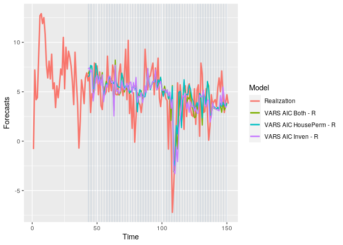<!-- -->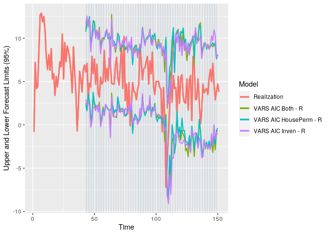<!-- -->

``` r
# show distributions of ASEs
tbl <- mdl_compare_var$plot_boxplot_ases()
```

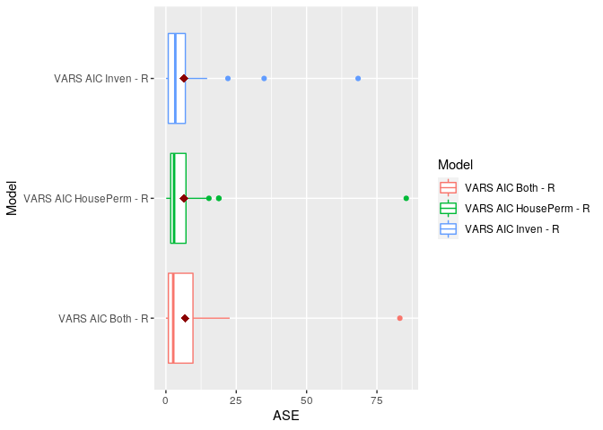<!-- -->

It is difficult to determine when models appear to perform well based on
the plot of the rolling forecasts. However, there appears to be some
evidence that the forecast lags the behavior of the realization. While
there are several instances where this behvaior can be seen, it is
particularly evident when the realization dips suddenly near time step
75. The models forecast a dip in the next time step.

Like the univariate models, these VAR models appear generally tend to
capture the movement of the realization within the forecast intervals.

From the plot of the rolling ASE, the model containing only
`inventorieschg` appears to perform best. The ASE appears to be lower on
average over the windows with the spread of the main distribution also
being lower than the other two models. The outliers of the ASE plot also
appear to be as extreme or less extreme than the other two models. We
will select the VAR model containing on `inventorieschg` as an
explanatory variable.

## Neural Network Model

### Hyperparameter Grid Search

All of the data is used in the neural network. We ran the neural network
with different sets of variables and the performance appeared to
decrease when varaibles were removed - see *Neural Networks with Sets of
Regressors* in the appedix for more details. A grid search is performed
over number of repetitions, the number of hidden layers, and whether
seasonality is allowed.

``` r
# setup search grid
nnfor_grid = expand.grid(reps = c(15, 25, 35, 45),
                         hd = c(1:7),
                         allow.det.season = c(FALSE, TRUE))
# search for best NN hyperparameters in given grid
model = ModelBuildNNforCaret$new(data = data, var_interest = "gdp_change", m = 6,
                                 search = 'grid',
                                 grid = nnfor_grid,
                                 batch_size = 44, h = 2,
                                 parallel = TRUE,
                                 seed = 1,
                                 verbose = 1)

#model$summarize_hyperparam_results()
#model$summarize_build()

#nnfor_model = model$get_final_models(subset = 'r')
#nfor_model

temp <- model$summarize_best_hyperparams()
res <- model$summarize_hyperparam_results()
final.ase <- filter(res, reps == temp$reps &
                      hd == temp$hd &
                      allow.det.season == temp$allow.det.season)[['ASE']]
```

The ASE associated with the grid of hyperparameters is shown in the
heatmap below. The panel (True/False) is for the seasonality option.
Seasonality does not appear to have an affect on ASE. However, the
combination of number of hidden layers and number of repetitions
strongly affects the ASE. The best hyperparameters based on this grid
search are 25 repetitions and 4 hidden layers, which has a mean rolling
window ASE of
7.3979769.

``` r
model$plot_hyperparam_results()
```

<!-- --><!-- -->

The best hyperparemeters are shown below

``` r
model$summarize_best_hyperparams()
```

    ##    reps hd allow.det.season
    ## 21   25  4            FALSE

``` r
# get back the final model
caret_model = model$get_final_models(subset = 'a')
mdl_compare_nn = ModelCompareNNforCaret$new(data = data,
                                         var_interest = var_interest,
                                         mdl_list = caret_model,
                                         verbose = 1)
```

    ## 
    ## Computing metrics for:  reps15_hd1_sdetFALSE

    ## Warning in private$models[[name]]$ASEs = res$ASEs: Coercing LHS to a list

    ## 
    ## Computing metrics for:  reps15_hd1_sdetTRUE

    ## Warning in private$models[[name]]$ASEs = res$ASEs: Coercing LHS to a list

    ## 
    ## Computing metrics for:  reps15_hd2_sdetFALSE

    ## Warning in private$models[[name]]$ASEs = res$ASEs: Coercing LHS to a list

    ## 
    ## Computing metrics for:  reps15_hd2_sdetTRUE

    ## Warning in private$models[[name]]$ASEs = res$ASEs: Coercing LHS to a list

    ## 
    ## Computing metrics for:  reps15_hd3_sdetFALSE

    ## Warning in private$models[[name]]$ASEs = res$ASEs: Coercing LHS to a list

    ## 
    ## Computing metrics for:  reps15_hd3_sdetTRUE

    ## Warning in private$models[[name]]$ASEs = res$ASEs: Coercing LHS to a list

    ## 
    ## Computing metrics for:  reps15_hd4_sdetFALSE

    ## Warning in private$models[[name]]$ASEs = res$ASEs: Coercing LHS to a list

    ## 
    ## Computing metrics for:  reps15_hd4_sdetTRUE

    ## Warning in private$models[[name]]$ASEs = res$ASEs: Coercing LHS to a list

    ## 
    ## Computing metrics for:  reps15_hd5_sdetFALSE

    ## Warning in private$models[[name]]$ASEs = res$ASEs: Coercing LHS to a list

    ## 
    ## Computing metrics for:  reps15_hd5_sdetTRUE

    ## Warning in private$models[[name]]$ASEs = res$ASEs: Coercing LHS to a list

    ## 
    ## Computing metrics for:  reps15_hd6_sdetFALSE

    ## Warning in private$models[[name]]$ASEs = res$ASEs: Coercing LHS to a list

    ## 
    ## Computing metrics for:  reps15_hd6_sdetTRUE

    ## Warning in private$models[[name]]$ASEs = res$ASEs: Coercing LHS to a list

    ## 
    ## Computing metrics for:  reps15_hd7_sdetFALSE

    ## Warning in private$models[[name]]$ASEs = res$ASEs: Coercing LHS to a list

    ## 
    ## Computing metrics for:  reps15_hd7_sdetTRUE

    ## Warning in private$models[[name]]$ASEs = res$ASEs: Coercing LHS to a list

    ## 
    ## Computing metrics for:  reps25_hd1_sdetFALSE

    ## Warning in private$models[[name]]$ASEs = res$ASEs: Coercing LHS to a list

    ## 
    ## Computing metrics for:  reps25_hd1_sdetTRUE

    ## Warning in private$models[[name]]$ASEs = res$ASEs: Coercing LHS to a list

    ## 
    ## Computing metrics for:  reps25_hd2_sdetFALSE

    ## Warning in private$models[[name]]$ASEs = res$ASEs: Coercing LHS to a list

    ## 
    ## Computing metrics for:  reps25_hd2_sdetTRUE

    ## Warning in private$models[[name]]$ASEs = res$ASEs: Coercing LHS to a list

    ## 
    ## Computing metrics for:  reps25_hd3_sdetFALSE

    ## Warning in private$models[[name]]$ASEs = res$ASEs: Coercing LHS to a list

    ## 
    ## Computing metrics for:  reps25_hd3_sdetTRUE

    ## Warning in private$models[[name]]$ASEs = res$ASEs: Coercing LHS to a list

    ## 
    ## Computing metrics for:  reps25_hd4_sdetFALSE

    ## Warning in private$models[[name]]$ASEs = res$ASEs: Coercing LHS to a list

    ## 
    ## Computing metrics for:  reps25_hd4_sdetTRUE

    ## Warning in private$models[[name]]$ASEs = res$ASEs: Coercing LHS to a list

    ## 
    ## Computing metrics for:  reps25_hd5_sdetFALSE

    ## Warning in private$models[[name]]$ASEs = res$ASEs: Coercing LHS to a list

    ## 
    ## Computing metrics for:  reps25_hd5_sdetTRUE

    ## Warning in private$models[[name]]$ASEs = res$ASEs: Coercing LHS to a list

    ## 
    ## Computing metrics for:  reps25_hd6_sdetFALSE

    ## Warning in private$models[[name]]$ASEs = res$ASEs: Coercing LHS to a list

    ## 
    ## Computing metrics for:  reps25_hd6_sdetTRUE

    ## Warning in private$models[[name]]$ASEs = res$ASEs: Coercing LHS to a list

    ## 
    ## Computing metrics for:  reps25_hd7_sdetFALSE

    ## Warning in private$models[[name]]$ASEs = res$ASEs: Coercing LHS to a list

    ## 
    ## Computing metrics for:  reps25_hd7_sdetTRUE

    ## Warning in private$models[[name]]$ASEs = res$ASEs: Coercing LHS to a list

    ## 
    ## Computing metrics for:  reps35_hd1_sdetFALSE

    ## Warning in private$models[[name]]$ASEs = res$ASEs: Coercing LHS to a list

    ## 
    ## Computing metrics for:  reps35_hd1_sdetTRUE

    ## Warning in private$models[[name]]$ASEs = res$ASEs: Coercing LHS to a list

    ## 
    ## Computing metrics for:  reps35_hd2_sdetFALSE

    ## Warning in private$models[[name]]$ASEs = res$ASEs: Coercing LHS to a list

    ## 
    ## Computing metrics for:  reps35_hd2_sdetTRUE

    ## Warning in private$models[[name]]$ASEs = res$ASEs: Coercing LHS to a list

    ## 
    ## Computing metrics for:  reps35_hd3_sdetFALSE

    ## Warning in private$models[[name]]$ASEs = res$ASEs: Coercing LHS to a list

    ## 
    ## Computing metrics for:  reps35_hd3_sdetTRUE

    ## Warning in private$models[[name]]$ASEs = res$ASEs: Coercing LHS to a list

    ## 
    ## Computing metrics for:  reps35_hd4_sdetFALSE

    ## Warning in private$models[[name]]$ASEs = res$ASEs: Coercing LHS to a list

    ## 
    ## Computing metrics for:  reps35_hd4_sdetTRUE

    ## Warning in private$models[[name]]$ASEs = res$ASEs: Coercing LHS to a list

    ## 
    ## Computing metrics for:  reps35_hd5_sdetFALSE

    ## Warning in private$models[[name]]$ASEs = res$ASEs: Coercing LHS to a list

    ## 
    ## Computing metrics for:  reps35_hd5_sdetTRUE

    ## Warning in private$models[[name]]$ASEs = res$ASEs: Coercing LHS to a list

    ## 
    ## Computing metrics for:  reps35_hd6_sdetFALSE

    ## Warning in private$models[[name]]$ASEs = res$ASEs: Coercing LHS to a list

    ## 
    ## Computing metrics for:  reps35_hd6_sdetTRUE

    ## Warning in private$models[[name]]$ASEs = res$ASEs: Coercing LHS to a list

    ## 
    ## Computing metrics for:  reps35_hd7_sdetFALSE

    ## Warning in private$models[[name]]$ASEs = res$ASEs: Coercing LHS to a list

    ## 
    ## Computing metrics for:  reps35_hd7_sdetTRUE

    ## Warning in private$models[[name]]$ASEs = res$ASEs: Coercing LHS to a list

    ## 
    ## Computing metrics for:  reps45_hd1_sdetFALSE

    ## Warning in private$models[[name]]$ASEs = res$ASEs: Coercing LHS to a list

    ## 
    ## Computing metrics for:  reps45_hd1_sdetTRUE

    ## Warning in private$models[[name]]$ASEs = res$ASEs: Coercing LHS to a list

    ## 
    ## Computing metrics for:  reps45_hd2_sdetFALSE

    ## Warning in private$models[[name]]$ASEs = res$ASEs: Coercing LHS to a list

    ## 
    ## Computing metrics for:  reps45_hd2_sdetTRUE

    ## Warning in private$models[[name]]$ASEs = res$ASEs: Coercing LHS to a list

    ## 
    ## Computing metrics for:  reps45_hd3_sdetFALSE

    ## Warning in private$models[[name]]$ASEs = res$ASEs: Coercing LHS to a list

    ## 
    ## Computing metrics for:  reps45_hd3_sdetTRUE

    ## Warning in private$models[[name]]$ASEs = res$ASEs: Coercing LHS to a list

    ## 
    ## Computing metrics for:  reps45_hd4_sdetFALSE

    ## Warning in private$models[[name]]$ASEs = res$ASEs: Coercing LHS to a list

    ## 
    ## Computing metrics for:  reps45_hd4_sdetTRUE

    ## Warning in private$models[[name]]$ASEs = res$ASEs: Coercing LHS to a list

    ## 
    ## Computing metrics for:  reps45_hd5_sdetFALSE

    ## Warning in private$models[[name]]$ASEs = res$ASEs: Coercing LHS to a list

    ## 
    ## Computing metrics for:  reps45_hd5_sdetTRUE

    ## Warning in private$models[[name]]$ASEs = res$ASEs: Coercing LHS to a list

    ## 
    ## Computing metrics for:  reps45_hd6_sdetFALSE

    ## Warning in private$models[[name]]$ASEs = res$ASEs: Coercing LHS to a list

    ## 
    ## Computing metrics for:  reps45_hd6_sdetTRUE

    ## Warning in private$models[[name]]$ASEs = res$ASEs: Coercing LHS to a list

    ## 
    ## Computing metrics for:  reps45_hd7_sdetFALSE

    ## Warning in private$models[[name]]$ASEs = res$ASEs: Coercing LHS to a list

    ## 
    ## Computing metrics for:  reps45_hd7_sdetTRUE

    ## Warning in private$models[[name]]$ASEs = res$ASEs: Coercing LHS to a list

    ## NULL

``` r
# plot the rolling window forecasts
p = mdl_compare_nn$plot_batch_forecasts()
```

<!-- --><!-- -->

``` r
# plot the ASC over time
p = mdl_compare_nn$plot_batch_ases() 
```

    ## Warning: Removed 2352 row(s) containing missing values (geom_path).

<!-- -->

## Ensemble Mode

## Comparison

``` r
# build compare model object
mdl_combine = ModelCombine$new(data = data, 
                               var_interest = var_interest,
                               uni_models = mdl_compare_uni, 
                               var_models = mdl_compare_var, 
                               mlp_models = mdl_compare_nn,
                               verbose = 1)
# plot the distributions of ASE from the rolling windows
mdl_combine$plot_boxplot_ases()
```

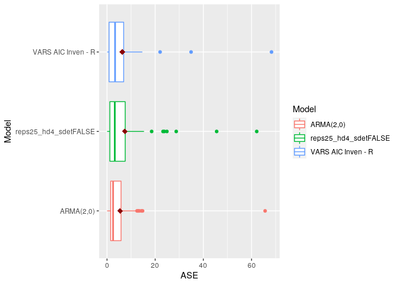<!-- -->

``` r
mdl_combine$plot_batch_forecasts()
```

    ## Warning: Removed 86 row(s) containing missing values (geom_path).

<!-- -->

    ## Warning: Removed 86 row(s) containing missing values (geom_path).
    
    ## Warning: Removed 86 row(s) containing missing values (geom_path).

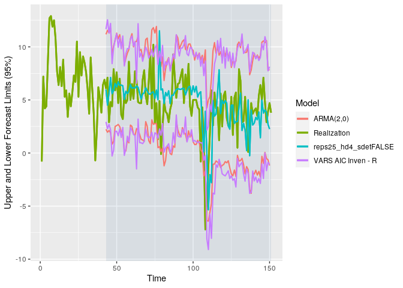<!-- -->

## Conclusion

# References

1.  Jim Chappelow, Recession, Investopedia. Accessed March 6, 2020.
    <https://www.investopedia.com/terms/r/recession.asp>
2.  U.S. Bureau of Economic Analysis, Gross Domestic Product
    \[A191RP1Q027SBEA\], retrieved from FRED, Federal Reserve Bank of
    St. Louis; <https://fred.stlouisfed.org/series/A191RP1Q027SBEA>,
    March 6, 2020.
3.  U.S. Bureau of Labor Statistics, All Employees, Total Nonfarm
    \[PAYEMS\], retrieved from FRED, Federal Reserve Bank of St. Louis;
    <https://fred.stlouisfed.org/series/PAYEMS>, March 6, 2020.
4.  Board of Governors of the Federal Reserve System (US), 10-Year
    Treasury Constant Maturity Rate \[DGS10\], retrieved from FRED,
    Federal Reserve Bank of St. Louis;
    <https://fred.stlouisfed.org/series/DGS10>, March 6, 2020.
5.  Board of Governors of the Federal Reserve System (US), Effective
    Federal Funds Rate \[FEDFUNDS\], retrieved from FRED, Federal
    Reserve Bank of St. Louis;
    <https://fred.stlouisfed.org/series/FEDFUNDS>, March 6, 2020.
6.  U.S. Bureau of Economic Analysis, Real Disposable Personal Income
    \[A067RO1Q156NBEA\], retrieved from FRED, Federal Reserve Bank of
    St. Louis; <https://fred.stlouisfed.org/series/A067RO1Q156NBEA>,
    March 6, 2020.
7.  U.S. Bureau of Labor Statistics, Consumer Price Index for All Urban
    Consumers: All Items in U.S. City Average \[CPIAUCNS\], retrieved
    from FRED, Federal Reserve Bank of St. Louis;
    <https://fred.stlouisfed.org/series/CPIAUCNS>, March 6, 2020.
8.  U.S. Bureau of Economic Analysis, Population \[POPTHM\], retrieved
    from FRED, Federal Reserve Bank of St. Louis;
    <https://fred.stlouisfed.org/series/POPTHM>, March 6, 2020.
9.  U.S. Bureau of Economic Analysis, Corporate Profits After Tax
    (without IVA and CCAdj) \[CP\], retrieved from FRED, Federal Reserve
    Bank of St. Louis; <https://fred.stlouisfed.org/series/CP>, March 6,
    2020.
10. Federal Reserve Bank of St. Louis, Spot Crude Oil Price: West Texas
    Intermediate (WTI) \[WTISPLC\], retrieved from FRED, Federal Reserve
    Bank of St. Louis; <https://fred.stlouisfed.org/series/WTISPLC>,
    March 6, 2020.
11. ICE Benchmark Administration Limited (IBA), Gold Fixing Price 10:30
    A.M. (London time) in London Bullion Market, based in U.S. Dollars
    \[GOLDAMGBD228NLBM\], retrieved from FRED, Federal Reserve Bank of
    St. Louis; <https://fred.stlouisfed.org/series/GOLDAMGBD228NLBM>,
    March 6, 2020.
12. Board of Governors of the Federal Reserve System (US), Japan / U.S.
    Foreign Exchange Rate \[EXJPUS\], retrieved from FRED, Federal
    Reserve Bank of St. Louis;
    <https://fred.stlouisfed.org/series/EXJPUS>, March 6, 2020.
13. Board of Governors of the Federal Reserve System (US), U.S. / U.K.
    Foreign Exchange Rate \[EXUSUK\], retrieved from FRED, Federal
    Reserve Bank of St. Louis;
    <https://fred.stlouisfed.org/series/EXUSUK>, March 6, 2020.
14. Wilshire Associates, Wilshire 5000 Total Market Full Cap Index
    \[WILL5000INDFC\], retrieved from FRED, Federal Reserve Bank of
    St. Louis; <https://fred.stlouisfed.org/series/WILL5000INDFC>,
    March 26, 2020.
15. Federal Reserve Bank of St. Louis, Real Manufacturing and Trade
    Inventories \[INVCMRMTSPL\], retrieved from FRED, Federal Reserve
    Bank of St. Louis; <https://fred.stlouisfed.org/series/INVCMRMTSPL>,
    March 26, 2020.
16. U.S. Census Bureau and U.S. Department of Housing and Urban
    Development, New Private Housing Units Authorized by Building
    Permits \[PERMIT\], retrieved from FRED, Federal Reserve Bank of
    St. Louis; <https://fred.stlouisfed.org/series/PERMIT>, March 26,
    2020.
17. U.S. Census Bureau, Homeownership Rate for the United States
    \[RHORUSQ156N\], retrieved from FRED, Federal Reserve Bank of
    St. Louis; <https://fred.stlouisfed.org/series/RHORUSQ156N>, March
    26, 2020.
18. Board of Governors of the Federal Reserve System (US), Industrial
    Production Index \[INDPRO\], retrieved from FRED, Federal Reserve
    Bank of St. Louis; <https://fred.stlouisfed.org/series/INDPRO>,
    March 26, 2020.
19. Federal Reserve Bank of St. Louis, 10-Year Treasury Constant
    Maturity Minus 3-Month Treasury Constant Maturity \[T10Y3M\],
    retrieved from FRED, Federal Reserve Bank of St. Louis;
    <https://fred.stlouisfed.org/series/T10Y3M>, March 26, 2020.

# Appendix

## VAR Modeling with Backward Feature Selection

### VAR with `trend_type = Trend`

**Iteration 1**

Starting with all variables with non-zero cross-correlation and max lag
of
12.

``` r
data = read.csv("../data/economic_indicators_all_ex_3mo_china.csv")[80:195, ]
data <- data %>% dplyr::select(c(gdp_change, nfjobschg, ipichg, treas10yr,
                                 fedintrate, cpichg, inventorieschg, ppichg, popchg,
                                 homeownership, corpprofitchg, personincomechg, housingpermitschg,
                                 japanchg))

lag.max = 12
models = list("VARS AIC Trend"    = list(select = "aic", trend_type = "trend", lag.max = lag.max))
mdl_build = ModelBuildMultivariateVAR$new(data = data, var_interest = var_interest,
                                            mdl_list = models, verbose = 1)
```

    ## 
    ## Model: VARS AIC Trend
    ## Trend type: trend
    ## Seasonality: 
    ## VARselect Object:
    ## $selection
    ## AIC(n)  HQ(n)  SC(n) FPE(n) 
    ##      8      8      8      8 
    ## 
    ## $criteria
    ##                  1             2             3             4             5
    ## AIC(n) -6.07793517 -7.3471509769 -8.6958063414 -1.001272e+01 -1.380542e+01
    ## HQ(n)  -3.91469192 -3.1648806943 -2.4945090258 -1.792401e+00 -3.566067e+00
    ## SC(n)  -0.73829971  2.9761442640  6.6111486710  1.027789e+01  1.146886e+01
    ## FPE(n)  0.00235886  0.0007968938  0.0003495348  2.971469e-04  7.014783e-05
    ##                    6              7    8    9   10   11   12
    ## AIC(n) -2.186095e+01  -3.479789e+02 -Inf -Inf -Inf -Inf -Inf
    ## HQ(n)  -9.602573e+00  -3.337015e+02 -Inf -Inf -Inf -Inf -Inf
    ## SC(n)   8.396983e+00  -3.127373e+02 -Inf -Inf -Inf -Inf -Inf
    ## FPE(n)  3.428956e-06  6.583010e-141    0    0    0    0    0

    ## Warning in private$extract_correct_varselection(varselect): VARselect
    ## produced -Inf values. These will be removed before making final 'K'
    ## selection.

    ## 
    ## Lag K to use for the VAR Model:  7
    ## Printing summary of the VAR fit for the variable of interest: gdp_change
    ## 
    ## Call:
    ## lm(formula = y ~ -1 + ., data = datamat)
    ## 
    ## Residuals:
    ##      Min       1Q   Median       3Q      Max 
    ## -0.86569 -0.26523 -0.02201  0.22322  0.89486 
    ## 
    ## Coefficients:
    ##                        Estimate Std. Error t value Pr(>|t|)  
    ## gdp_change.l1        -3.557e-01  3.636e-01  -0.978   0.3511  
    ## nfjobschg.l1          9.324e+00  3.522e+00   2.648   0.0244 *
    ## ipichg.l1             1.198e+00  4.678e-01   2.560   0.0284 *
    ## treas10yr.l1         -2.237e+00  1.210e+00  -1.849   0.0942 .
    ## fedintrate.l1         5.319e-01  1.453e+00   0.366   0.7220  
    ## cpichg.l1             2.767e+00  2.162e+00   1.280   0.2294  
    ## inventorieschg.l1    -1.511e+00  8.318e-01  -1.817   0.0992 .
    ## ppichg.l1            -9.189e-01  5.342e-01  -1.720   0.1161  
    ## popchg.l1             5.646e+01  3.725e+01   1.516   0.1605  
    ## homeownership.l1      9.905e-01  1.197e+00   0.827   0.4275  
    ## corpprofitchg.l1      2.068e-02  9.762e-02   0.212   0.8364  
    ## personincomechg.l1   -1.881e-01  5.715e-01  -0.329   0.7488  
    ## housingpermitschg.l1 -2.317e-02  6.486e-02  -0.357   0.7283  
    ## japanchg.l1          -1.088e-02  7.616e-02  -0.143   0.8892  
    ## gdp_change.l2         6.104e-01  3.557e-01   1.716   0.1169  
    ## nfjobschg.l2          1.713e+00  3.379e+00   0.507   0.6233  
    ## ipichg.l2             1.484e-01  9.352e-01   0.159   0.8771  
    ## treas10yr.l2         -8.530e-01  1.289e+00  -0.662   0.5231  
    ## fedintrate.l2         1.587e+00  2.779e+00   0.571   0.5806  
    ## cpichg.l2            -1.012e+00  2.839e+00  -0.356   0.7290  
    ## inventorieschg.l2    -1.794e+00  8.737e-01  -2.053   0.0672 .
    ## ppichg.l2            -4.168e-02  6.489e-01  -0.064   0.9500  
    ## popchg.l2            -1.384e+02  4.820e+01  -2.872   0.0166 *
    ## homeownership.l2      1.641e+00  1.728e+00   0.950   0.3645  
    ## corpprofitchg.l2      4.889e-02  1.346e-01   0.363   0.7239  
    ## personincomechg.l2   -7.343e-01  6.915e-01  -1.062   0.3133  
    ## housingpermitschg.l2 -1.019e-01  9.064e-02  -1.125   0.2870  
    ## japanchg.l2          -3.246e-02  9.763e-02  -0.332   0.7464  
    ## gdp_change.l3         8.797e-01  3.431e-01   2.564   0.0282 *
    ## nfjobschg.l3         -2.604e+00  3.032e+00  -0.859   0.4105  
    ## ipichg.l3            -3.857e-01  9.051e-01  -0.426   0.6790  
    ## treas10yr.l3         -7.086e-01  1.254e+00  -0.565   0.5845  
    ## fedintrate.l3        -3.494e+00  2.866e+00  -1.219   0.2508  
    ## cpichg.l3            -4.623e-01  3.860e+00  -0.120   0.9070  
    ## inventorieschg.l3     1.089e+00  8.699e-01   1.252   0.2391  
    ## ppichg.l3            -6.753e-01  8.831e-01  -0.765   0.4621  
    ## popchg.l3             2.915e+00  6.219e+01   0.047   0.9635  
    ## homeownership.l3     -2.774e+00  1.774e+00  -1.563   0.1490  
    ## corpprofitchg.l3      2.154e-01  1.228e-01   1.754   0.1099  
    ## personincomechg.l3   -4.038e-01  7.611e-01  -0.530   0.6074  
    ## housingpermitschg.l3 -7.033e-02  9.516e-02  -0.739   0.4769  
    ## japanchg.l3           1.648e-02  1.015e-01   0.162   0.8743  
    ## gdp_change.l4         7.804e-01  4.735e-01   1.648   0.1304  
    ## nfjobschg.l4         -2.680e+00  3.458e+00  -0.775   0.4562  
    ## ipichg.l4            -1.270e+00  9.436e-01  -1.346   0.2082  
    ## treas10yr.l4          2.427e+00  1.218e+00   1.992   0.0744 .
    ## fedintrate.l4        -2.918e+00  2.736e+00  -1.067   0.3112  
    ## cpichg.l4            -2.717e+00  3.505e+00  -0.775   0.4561  
    ## inventorieschg.l4     1.255e+00  1.085e+00   1.157   0.2743  
    ## ppichg.l4             9.413e-01  7.985e-01   1.179   0.2657  
    ## popchg.l4            -1.114e+02  5.064e+01  -2.200   0.0524 .
    ## homeownership.l4      2.497e-01  1.686e+00   0.148   0.8852  
    ## corpprofitchg.l4      2.926e-01  1.371e-01   2.134   0.0586 .
    ## personincomechg.l4    4.591e-01  4.289e-01   1.071   0.3095  
    ## housingpermitschg.l4 -1.562e-01  1.094e-01  -1.427   0.1840  
    ## japanchg.l4           3.794e-02  7.984e-02   0.475   0.6449  
    ## gdp_change.l5        -1.281e-01  4.932e-01  -0.260   0.8004  
    ## nfjobschg.l5          3.544e+00  2.606e+00   1.360   0.2036  
    ## ipichg.l5             2.412e-01  1.063e+00   0.227   0.8251  
    ## treas10yr.l5          5.140e-01  1.742e+00   0.295   0.7740  
    ## fedintrate.l5         7.037e+00  2.625e+00   2.681   0.0230 *
    ## cpichg.l5            -1.310e+00  2.444e+00  -0.536   0.6035  
    ## inventorieschg.l5     1.642e+00  1.056e+00   1.555   0.1511  
    ## ppichg.l5            -4.655e-02  5.885e-01  -0.079   0.9385  
    ## popchg.l5             4.541e+01  4.293e+01   1.058   0.3150  
    ## homeownership.l5     -6.308e-01  1.766e+00  -0.357   0.7284  
    ## corpprofitchg.l5      1.614e-01  1.392e-01   1.159   0.2734  
    ## personincomechg.l5   -2.744e-01  4.756e-01  -0.577   0.5767  
    ## housingpermitschg.l5 -2.102e-02  1.179e-01  -0.178   0.8621  
    ## japanchg.l5          -5.583e-02  8.234e-02  -0.678   0.5131  
    ## gdp_change.l6        -3.630e-01  4.418e-01  -0.822   0.4304  
    ## nfjobschg.l6          1.887e+00  2.956e+00   0.639   0.5375  
    ## ipichg.l6            -3.575e-01  8.321e-01  -0.430   0.6766  
    ## treas10yr.l6         -1.011e+00  1.612e+00  -0.627   0.5448  
    ## fedintrate.l6        -3.077e+00  2.532e+00  -1.215   0.2522  
    ## cpichg.l6             1.938e+00  2.263e+00   0.857   0.4117  
    ## inventorieschg.l6     7.180e-02  1.058e+00   0.068   0.9472  
    ## ppichg.l6            -5.442e-01  5.913e-01  -0.920   0.3791  
    ## popchg.l6             4.294e+01  5.012e+01   0.857   0.4116  
    ## homeownership.l6     -2.312e+00  1.454e+00  -1.591   0.1428  
    ## corpprofitchg.l6     -3.534e-02  9.967e-02  -0.355   0.7303  
    ## personincomechg.l6   -8.819e-03  4.258e-01  -0.021   0.9839  
    ## housingpermitschg.l6 -4.912e-02  5.384e-02  -0.912   0.3831  
    ## japanchg.l6           4.387e-02  6.943e-02   0.632   0.5417  
    ## gdp_change.l7         2.431e-02  2.896e-01   0.084   0.9347  
    ## nfjobschg.l7         -2.288e+00  2.422e+00  -0.945   0.3669  
    ## ipichg.l7             4.188e-02  5.061e-01   0.083   0.9357  
    ## treas10yr.l7         -5.472e-01  1.236e+00  -0.443   0.6674  
    ## fedintrate.l7         2.134e+00  1.873e+00   1.139   0.2812  
    ## cpichg.l7             3.680e-01  1.962e+00   0.188   0.8550  
    ## inventorieschg.l7    -5.868e-01  6.655e-01  -0.882   0.3986  
    ## ppichg.l7            -2.719e-01  5.150e-01  -0.528   0.6091  
    ## popchg.l7             5.548e+01  5.065e+01   1.095   0.2991  
    ## homeownership.l7      3.132e+00  1.396e+00   2.243   0.0487 *
    ## corpprofitchg.l7     -8.085e-02  6.002e-02  -1.347   0.2076  
    ## personincomechg.l7   -2.553e-01  4.664e-01  -0.547   0.5962  
    ## housingpermitschg.l7  6.187e-02  5.318e-02   1.163   0.2717  
    ## japanchg.l7          -4.642e-02  8.379e-02  -0.554   0.5917  
    ## trend                -7.941e-02  9.720e-02  -0.817   0.4330  
    ## ---
    ## Signif. codes:  0 '***' 0.001 '**' 0.01 '*' 0.05 '.' 0.1 ' ' 1
    ## 
    ## Residual standard error: 1.293 on 10 degrees of freedom
    ## Multiple R-squared:  0.9944, Adjusted R-squared:  0.9387 
    ## F-statistic: 17.85 on 99 and 10 DF,  p-value: 1.355e-05

``` r
mdl_build$summarize_build()
```

    ## # A tibble: 6 x 9
    ##   Model    select trend_type season     p SigVar   OriginalVar   Lag MaxLag
    ##   <chr>    <chr>  <chr>       <dbl> <dbl> <fct>    <chr>       <dbl>  <dbl>
    ## 1 VARS AI… aic    trend           0     7 nfjobsc… nfjobschg      -1     -1
    ## 2 VARS AI… aic    trend           0     7 ipichg.… ipichg         -1     -1
    ## 3 VARS AI… aic    trend           0     7 popchg.… popchg         -2     -2
    ## 4 VARS AI… aic    trend           0     7 gdp_cha… gdp_change     -3     -3
    ## 5 VARS AI… aic    trend           0     7 fedintr… fedintrate     -5     -5
    ## 6 VARS AI… aic    trend           0     7 homeown… homeowners…    -7     -7

The recommended model as a lag of 7 and most variables are not
significant in the model. Additionally, trend is not significant in the
model.

**Iteration 2**

Variable `japanchg` is removed and max lags remains at 12.

``` r
lag.max = 12
models = list("VARS AIC Trend"    = list(select = "aic", trend_type = "trend", lag.max = lag.max))
mdl_build = ModelBuildMultivariateVAR$new(data = data[ , c(var_interest, 'nfjobschg', 'ipichg', 'treas10yr',
                                                           'fedintrate', 'cpichg', 'inventorieschg', 'ppichg', 'popchg',
                                                           'homeownership', 'corpprofitchg', 'personincomechg', 'housingpermitschg')],
                                          var_interest = var_interest,
                                            mdl_list = models, verbose = 1)
```

    ## 
    ## Model: VARS AIC Trend
    ## Trend type: trend
    ## Seasonality: 
    ## VARselect Object:
    ## $selection
    ## AIC(n)  HQ(n)  SC(n) FPE(n) 
    ##      8      8      8      8 
    ## 
    ## $criteria
    ##                    1             2             3             4
    ## AIC(n) -9.397333e+00 -1.054340e+01 -1.189897e+01 -1.251352e+01
    ## HQ(n)  -7.522523e+00 -6.927691e+00 -6.542363e+00 -5.416019e+00
    ## SC(n)  -4.769649e+00 -1.618578e+00  1.322989e+00  5.005573e+00
    ## FPE(n)  8.473693e-05  3.088307e-05  1.168888e-05  1.443211e-05
    ##                    5             6             7    8    9   10   11   12
    ## AIC(n) -1.538893e+01 -1.973694e+01 -6.981948e+01 -Inf -Inf -Inf -Inf -Inf
    ## HQ(n)  -6.550538e+00 -9.157651e+00 -5.749930e+01 -Inf -Inf -Inf -Inf -Inf
    ## SC(n)   6.427293e+00  6.376420e+00 -3.940899e+01 -Inf -Inf -Inf -Inf -Inf
    ## FPE(n)  4.068759e-06  1.229373e-06  2.877286e-25    0    0    0    0    0

    ## Warning in private$extract_correct_varselection(varselect): VARselect
    ## produced -Inf values. These will be removed before making final 'K'
    ## selection.

    ## 
    ## Lag K to use for the VAR Model:  7
    ## Printing summary of the VAR fit for the variable of interest: gdp_change
    ## 
    ## Call:
    ## lm(formula = y ~ -1 + ., data = datamat)
    ## 
    ## Residuals:
    ##      Min       1Q   Median       3Q      Max 
    ## -1.07384 -0.26235 -0.02543  0.20936  1.06569 
    ## 
    ## Coefficients:
    ##                        Estimate Std. Error t value Pr(>|t|)    
    ## gdp_change.l1        -2.663e-01  2.207e-01  -1.207 0.244048    
    ## nfjobschg.l1          7.958e+00  2.212e+00   3.598 0.002217 ** 
    ## ipichg.l1             1.261e+00  2.927e-01   4.310 0.000475 ***
    ## treas10yr.l1         -2.412e+00  8.008e-01  -3.012 0.007854 ** 
    ## fedintrate.l1         9.467e-01  1.015e+00   0.933 0.364007    
    ## cpichg.l1             3.724e+00  1.275e+00   2.921 0.009524 ** 
    ## inventorieschg.l1    -1.315e+00  4.437e-01  -2.963 0.008716 ** 
    ## ppichg.l1            -1.175e+00  3.561e-01  -3.300 0.004232 ** 
    ## popchg.l1             5.820e+01  2.837e+01   2.051 0.055969 .  
    ## homeownership.l1      6.168e-01  7.959e-01   0.775 0.449023    
    ## corpprofitchg.l1     -1.942e-02  5.707e-02  -0.340 0.737776    
    ## personincomechg.l1   -2.614e-01  3.416e-01  -0.765 0.454590    
    ## housingpermitschg.l1 -1.276e-02  3.839e-02  -0.332 0.743691    
    ## gdp_change.l2         6.727e-01  2.222e-01   3.028 0.007591 ** 
    ## nfjobschg.l2          1.401e+00  2.132e+00   0.657 0.519867    
    ## ipichg.l2             1.587e-01  5.129e-01   0.309 0.760775    
    ## treas10yr.l2         -5.524e-01  8.996e-01  -0.614 0.547316    
    ## fedintrate.l2         6.735e-01  1.877e+00   0.359 0.724212    
    ## cpichg.l2            -6.519e-01  1.878e+00  -0.347 0.732726    
    ## inventorieschg.l2    -1.968e+00  5.430e-01  -3.624 0.002096 ** 
    ## ppichg.l2             3.599e-02  4.639e-01   0.078 0.939067    
    ## popchg.l2            -1.391e+02  3.500e+01  -3.974 0.000982 ***
    ## homeownership.l2      2.219e+00  1.174e+00   1.891 0.075837 .  
    ## corpprofitchg.l2      3.180e-03  7.125e-02   0.045 0.964921    
    ## personincomechg.l2   -4.755e-01  3.480e-01  -1.366 0.189590    
    ## housingpermitschg.l2 -1.385e-01  4.560e-02  -3.037 0.007445 ** 
    ## gdp_change.l3         8.970e-01  2.332e-01   3.847 0.001292 ** 
    ## nfjobschg.l3         -4.216e+00  2.018e+00  -2.089 0.052066 .  
    ## ipichg.l3            -2.884e-01  5.212e-01  -0.553 0.587235    
    ## treas10yr.l3         -9.268e-01  8.205e-01  -1.130 0.274362    
    ## fedintrate.l3        -2.942e+00  1.848e+00  -1.592 0.129856    
    ## cpichg.l3            -2.769e-01  1.933e+00  -0.143 0.887792    
    ## inventorieschg.l3     1.053e+00  5.231e-01   2.012 0.060304 .  
    ## ppichg.l3            -7.702e-01  4.489e-01  -1.716 0.104371    
    ## popchg.l3             8.452e+00  3.933e+01   0.215 0.832406    
    ## homeownership.l3     -2.896e+00  1.221e+00  -2.372 0.029733 *  
    ## corpprofitchg.l3      1.885e-01  7.203e-02   2.617 0.018043 *  
    ## personincomechg.l3   -3.626e-01  3.097e-01  -1.171 0.257791    
    ## housingpermitschg.l3 -9.280e-02  4.758e-02  -1.950 0.067833 .  
    ## gdp_change.l4         5.924e-01  2.251e-01   2.632 0.017479 *  
    ## nfjobschg.l4         -1.634e+00  2.304e+00  -0.709 0.487994    
    ## ipichg.l4            -7.697e-01  5.514e-01  -1.396 0.180738    
    ## treas10yr.l4          2.778e+00  8.946e-01   3.105 0.006433 ** 
    ## fedintrate.l4        -2.204e+00  1.460e+00  -1.510 0.149440    
    ## cpichg.l4            -1.813e+00  1.672e+00  -1.084 0.293441    
    ## inventorieschg.l4     1.046e+00  6.420e-01   1.630 0.121524    
    ## ppichg.l4             6.613e-01  4.473e-01   1.478 0.157600    
    ## popchg.l4            -1.077e+02  3.213e+01  -3.352 0.003781 ** 
    ## homeownership.l4     -3.574e-01  1.073e+00  -0.333 0.743057    
    ## corpprofitchg.l4      2.621e-01  7.537e-02   3.478 0.002879 ** 
    ## personincomechg.l4    2.256e-01  2.195e-01   1.027 0.318625    
    ## housingpermitschg.l4 -1.459e-01  5.626e-02  -2.593 0.018959 *  
    ## gdp_change.l5        -1.541e-01  2.346e-01  -0.657 0.520187    
    ## nfjobschg.l5          2.817e+00  1.827e+00   1.541 0.141606    
    ## ipichg.l5             1.333e-01  5.459e-01   0.244 0.810025    
    ## treas10yr.l5         -4.482e-01  1.042e+00  -0.430 0.672424    
    ## fedintrate.l5         5.585e+00  1.368e+00   4.082 0.000777 ***
    ## cpichg.l5            -1.937e+00  1.230e+00  -1.575 0.133717    
    ## inventorieschg.l5     1.360e+00  6.045e-01   2.250 0.037946 *  
    ## ppichg.l5             1.611e-01  3.026e-01   0.532 0.601394    
    ## popchg.l5             4.315e+01  3.300e+01   1.307 0.208458    
    ## homeownership.l5      5.081e-01  1.019e+00   0.498 0.624566    
    ## corpprofitchg.l5      1.038e-01  8.210e-02   1.264 0.223243    
    ## personincomechg.l5   -1.273e-01  2.677e-01  -0.476 0.640421    
    ## housingpermitschg.l5 -2.101e-02  6.340e-02  -0.331 0.744438    
    ## gdp_change.l6        -2.133e-01  2.121e-01  -1.006 0.328729    
    ## nfjobschg.l6          1.544e+00  2.021e+00   0.764 0.455515    
    ## ipichg.l6             2.944e-03  3.911e-01   0.008 0.994080    
    ## treas10yr.l6         -4.241e-01  1.008e+00  -0.421 0.679077    
    ## fedintrate.l6        -2.167e+00  1.628e+00  -1.331 0.200733    
    ## cpichg.l6             2.065e+00  1.184e+00   1.744 0.099155 .  
    ## inventorieschg.l6    -4.288e-01  6.643e-01  -0.645 0.527253    
    ## ppichg.l6            -6.657e-01  3.369e-01  -1.976 0.064645 .  
    ## popchg.l6             3.334e+01  3.261e+01   1.022 0.320964    
    ## homeownership.l6     -2.797e+00  1.036e+00  -2.701 0.015138 *  
    ## corpprofitchg.l6     -4.952e-02  6.580e-02  -0.753 0.461948    
    ## personincomechg.l6    8.345e-02  2.637e-01   0.316 0.755519    
    ## housingpermitschg.l6 -4.086e-02  4.223e-02  -0.968 0.346808    
    ## gdp_change.l7        -5.325e-02  1.660e-01  -0.321 0.752281    
    ## nfjobschg.l7         -8.910e-01  1.577e+00  -0.565 0.579473    
    ## ipichg.l7            -1.355e-01  3.169e-01  -0.428 0.674260    
    ## treas10yr.l7         -5.141e-01  7.251e-01  -0.709 0.487950    
    ## fedintrate.l7         1.225e+00  1.250e+00   0.980 0.341023    
    ## cpichg.l7             4.989e-01  1.194e+00   0.418 0.681215    
    ## inventorieschg.l7    -1.460e-01  4.247e-01  -0.344 0.735255    
    ## ppichg.l7            -3.230e-01  3.602e-01  -0.897 0.382319    
    ## popchg.l7             6.117e+01  3.523e+01   1.736 0.100641    
    ## homeownership.l7      3.041e+00  9.035e-01   3.366 0.003670 ** 
    ## corpprofitchg.l7     -7.044e-02  4.196e-02  -1.679 0.111461    
    ## personincomechg.l7   -2.471e-01  2.551e-01  -0.969 0.346328    
    ## housingpermitschg.l7  3.860e-02  3.107e-02   1.242 0.231044    
    ## trend                -1.093e-01  5.624e-02  -1.943 0.068769 .  
    ## ---
    ## Signif. codes:  0 '***' 0.001 '**' 0.01 '*' 0.05 '.' 0.1 ' ' 1
    ## 
    ## Residual standard error: 1.058 on 17 degrees of freedom
    ## Multiple R-squared:  0.9936, Adjusted R-squared:  0.959 
    ## F-statistic: 28.69 on 92 and 17 DF,  p-value: 3.819e-10

``` r
mdl_build$summarize_build()
```

    ## # A tibble: 22 x 9
    ##    Model   select trend_type season     p SigVar   OriginalVar   Lag MaxLag
    ##    <chr>   <chr>  <chr>       <dbl> <dbl> <fct>    <chr>       <dbl>  <dbl>
    ##  1 VARS A… aic    trend           0     7 nfjobsc… nfjobschg      -1     -1
    ##  2 VARS A… aic    trend           0     7 ipichg.… ipichg         -1     -1
    ##  3 VARS A… aic    trend           0     7 treas10… treas10yr      -1     -4
    ##  4 VARS A… aic    trend           0     7 cpichg.… cpichg         -1     -1
    ##  5 VARS A… aic    trend           0     7 invento… inventorie…    -1     -5
    ##  6 VARS A… aic    trend           0     7 ppichg.… ppichg         -1     -1
    ##  7 VARS A… aic    trend           0     7 gdp_cha… gdp_change     -2     -4
    ##  8 VARS A… aic    trend           0     7 invento… inventorie…    -2     -5
    ##  9 VARS A… aic    trend           0     7 popchg.… popchg         -2     -4
    ## 10 VARS A… aic    trend           0     7 housing… housingper…    -2     -4
    ## # … with 12 more rows

All varaibles are now significant in the model. Trend is still not
significant at the 0.05 level, but it is marginal.

**Iteration 3**

The max lag to test is reduced to 7.

``` r
lag.max = 7
models = list("VARS AIC Trend"    = list(select = "aic", trend_type = "trend", lag.max = lag.max))
mdl_build = ModelBuildMultivariateVAR$new(data = data[ , c(var_interest, 'nfjobschg', 'ipichg', 'treas10yr',
                                                           'fedintrate', 'cpichg', 'inventorieschg', 'ppichg', 'popchg',
                                                           'homeownership', 'corpprofitchg', 'personincomechg', 'housingpermitschg')],
                                          var_interest = var_interest,
                                            mdl_list = models, verbose = 1)
```

    ## 
    ## Model: VARS AIC Trend
    ## Trend type: trend
    ## Seasonality: 
    ## VARselect Object:
    ## $selection
    ## AIC(n)  HQ(n)  SC(n) FPE(n) 
    ##      7      7      1      7 
    ## 
    ## $criteria
    ##                    1             2             3             4
    ## AIC(n) -9.563210e+00 -1.079226e+01 -1.210690e+01 -1.259363e+01
    ## HQ(n)  -7.740806e+00 -7.277627e+00 -6.900029e+00 -5.694525e+00
    ## SC(n)  -5.069400e+00 -2.125630e+00  7.325592e-01  4.418655e+00
    ## FPE(n)  7.158231e-05  2.357161e-05  8.804342e-06  1.090109e-05
    ##                    5             6             7
    ## AIC(n) -1.521711e+01 -1.830143e+01 -2.623266e+01
    ## HQ(n)  -6.625773e+00 -8.017867e+00 -1.425686e+01
    ## SC(n)   5.967998e+00  7.056495e+00  3.298097e+00
    ## FPE(n)  3.009880e-06  1.695910e-06  1.053034e-07
    ## 
    ## 
    ## Lag K to use for the VAR Model:  7
    ## Printing summary of the VAR fit for the variable of interest: gdp_change
    ## 
    ## Call:
    ## lm(formula = y ~ -1 + ., data = datamat)
    ## 
    ## Residuals:
    ##      Min       1Q   Median       3Q      Max 
    ## -1.07384 -0.26235 -0.02543  0.20936  1.06569 
    ## 
    ## Coefficients:
    ##                        Estimate Std. Error t value Pr(>|t|)    
    ## gdp_change.l1        -2.663e-01  2.207e-01  -1.207 0.244048    
    ## nfjobschg.l1          7.958e+00  2.212e+00   3.598 0.002217 ** 
    ## ipichg.l1             1.261e+00  2.927e-01   4.310 0.000475 ***
    ## treas10yr.l1         -2.412e+00  8.008e-01  -3.012 0.007854 ** 
    ## fedintrate.l1         9.467e-01  1.015e+00   0.933 0.364007    
    ## cpichg.l1             3.724e+00  1.275e+00   2.921 0.009524 ** 
    ## inventorieschg.l1    -1.315e+00  4.437e-01  -2.963 0.008716 ** 
    ## ppichg.l1            -1.175e+00  3.561e-01  -3.300 0.004232 ** 
    ## popchg.l1             5.820e+01  2.837e+01   2.051 0.055969 .  
    ## homeownership.l1      6.168e-01  7.959e-01   0.775 0.449023    
    ## corpprofitchg.l1     -1.942e-02  5.707e-02  -0.340 0.737776    
    ## personincomechg.l1   -2.614e-01  3.416e-01  -0.765 0.454590    
    ## housingpermitschg.l1 -1.276e-02  3.839e-02  -0.332 0.743691    
    ## gdp_change.l2         6.727e-01  2.222e-01   3.028 0.007591 ** 
    ## nfjobschg.l2          1.401e+00  2.132e+00   0.657 0.519867    
    ## ipichg.l2             1.587e-01  5.129e-01   0.309 0.760775    
    ## treas10yr.l2         -5.524e-01  8.996e-01  -0.614 0.547316    
    ## fedintrate.l2         6.735e-01  1.877e+00   0.359 0.724212    
    ## cpichg.l2            -6.519e-01  1.878e+00  -0.347 0.732726    
    ## inventorieschg.l2    -1.968e+00  5.430e-01  -3.624 0.002096 ** 
    ## ppichg.l2             3.599e-02  4.639e-01   0.078 0.939067    
    ## popchg.l2            -1.391e+02  3.500e+01  -3.974 0.000982 ***
    ## homeownership.l2      2.219e+00  1.174e+00   1.891 0.075837 .  
    ## corpprofitchg.l2      3.180e-03  7.125e-02   0.045 0.964921    
    ## personincomechg.l2   -4.755e-01  3.480e-01  -1.366 0.189590    
    ## housingpermitschg.l2 -1.385e-01  4.560e-02  -3.037 0.007445 ** 
    ## gdp_change.l3         8.970e-01  2.332e-01   3.847 0.001292 ** 
    ## nfjobschg.l3         -4.216e+00  2.018e+00  -2.089 0.052066 .  
    ## ipichg.l3            -2.884e-01  5.212e-01  -0.553 0.587235    
    ## treas10yr.l3         -9.268e-01  8.205e-01  -1.130 0.274362    
    ## fedintrate.l3        -2.942e+00  1.848e+00  -1.592 0.129856    
    ## cpichg.l3            -2.769e-01  1.933e+00  -0.143 0.887792    
    ## inventorieschg.l3     1.053e+00  5.231e-01   2.012 0.060304 .  
    ## ppichg.l3            -7.702e-01  4.489e-01  -1.716 0.104371    
    ## popchg.l3             8.452e+00  3.933e+01   0.215 0.832406    
    ## homeownership.l3     -2.896e+00  1.221e+00  -2.372 0.029733 *  
    ## corpprofitchg.l3      1.885e-01  7.203e-02   2.617 0.018043 *  
    ## personincomechg.l3   -3.626e-01  3.097e-01  -1.171 0.257791    
    ## housingpermitschg.l3 -9.280e-02  4.758e-02  -1.950 0.067833 .  
    ## gdp_change.l4         5.924e-01  2.251e-01   2.632 0.017479 *  
    ## nfjobschg.l4         -1.634e+00  2.304e+00  -0.709 0.487994    
    ## ipichg.l4            -7.697e-01  5.514e-01  -1.396 0.180738    
    ## treas10yr.l4          2.778e+00  8.946e-01   3.105 0.006433 ** 
    ## fedintrate.l4        -2.204e+00  1.460e+00  -1.510 0.149440    
    ## cpichg.l4            -1.813e+00  1.672e+00  -1.084 0.293441    
    ## inventorieschg.l4     1.046e+00  6.420e-01   1.630 0.121524    
    ## ppichg.l4             6.613e-01  4.473e-01   1.478 0.157600    
    ## popchg.l4            -1.077e+02  3.213e+01  -3.352 0.003781 ** 
    ## homeownership.l4     -3.574e-01  1.073e+00  -0.333 0.743057    
    ## corpprofitchg.l4      2.621e-01  7.537e-02   3.478 0.002879 ** 
    ## personincomechg.l4    2.256e-01  2.195e-01   1.027 0.318625    
    ## housingpermitschg.l4 -1.459e-01  5.626e-02  -2.593 0.018959 *  
    ## gdp_change.l5        -1.541e-01  2.346e-01  -0.657 0.520187    
    ## nfjobschg.l5          2.817e+00  1.827e+00   1.541 0.141606    
    ## ipichg.l5             1.333e-01  5.459e-01   0.244 0.810025    
    ## treas10yr.l5         -4.482e-01  1.042e+00  -0.430 0.672424    
    ## fedintrate.l5         5.585e+00  1.368e+00   4.082 0.000777 ***
    ## cpichg.l5            -1.937e+00  1.230e+00  -1.575 0.133717    
    ## inventorieschg.l5     1.360e+00  6.045e-01   2.250 0.037946 *  
    ## ppichg.l5             1.611e-01  3.026e-01   0.532 0.601394    
    ## popchg.l5             4.315e+01  3.300e+01   1.307 0.208458    
    ## homeownership.l5      5.081e-01  1.019e+00   0.498 0.624566    
    ## corpprofitchg.l5      1.038e-01  8.210e-02   1.264 0.223243    
    ## personincomechg.l5   -1.273e-01  2.677e-01  -0.476 0.640421    
    ## housingpermitschg.l5 -2.101e-02  6.340e-02  -0.331 0.744438    
    ## gdp_change.l6        -2.133e-01  2.121e-01  -1.006 0.328729    
    ## nfjobschg.l6          1.544e+00  2.021e+00   0.764 0.455515    
    ## ipichg.l6             2.944e-03  3.911e-01   0.008 0.994080    
    ## treas10yr.l6         -4.241e-01  1.008e+00  -0.421 0.679077    
    ## fedintrate.l6        -2.167e+00  1.628e+00  -1.331 0.200733    
    ## cpichg.l6             2.065e+00  1.184e+00   1.744 0.099155 .  
    ## inventorieschg.l6    -4.288e-01  6.643e-01  -0.645 0.527253    
    ## ppichg.l6            -6.657e-01  3.369e-01  -1.976 0.064645 .  
    ## popchg.l6             3.334e+01  3.261e+01   1.022 0.320964    
    ## homeownership.l6     -2.797e+00  1.036e+00  -2.701 0.015138 *  
    ## corpprofitchg.l6     -4.952e-02  6.580e-02  -0.753 0.461948    
    ## personincomechg.l6    8.345e-02  2.637e-01   0.316 0.755519    
    ## housingpermitschg.l6 -4.086e-02  4.223e-02  -0.968 0.346808    
    ## gdp_change.l7        -5.325e-02  1.660e-01  -0.321 0.752281    
    ## nfjobschg.l7         -8.910e-01  1.577e+00  -0.565 0.579473    
    ## ipichg.l7            -1.355e-01  3.169e-01  -0.428 0.674260    
    ## treas10yr.l7         -5.141e-01  7.251e-01  -0.709 0.487950    
    ## fedintrate.l7         1.225e+00  1.250e+00   0.980 0.341023    
    ## cpichg.l7             4.989e-01  1.194e+00   0.418 0.681215    
    ## inventorieschg.l7    -1.460e-01  4.247e-01  -0.344 0.735255    
    ## ppichg.l7            -3.230e-01  3.602e-01  -0.897 0.382319    
    ## popchg.l7             6.117e+01  3.523e+01   1.736 0.100641    
    ## homeownership.l7      3.041e+00  9.035e-01   3.366 0.003670 ** 
    ## corpprofitchg.l7     -7.044e-02  4.196e-02  -1.679 0.111461    
    ## personincomechg.l7   -2.471e-01  2.551e-01  -0.969 0.346328    
    ## housingpermitschg.l7  3.860e-02  3.107e-02   1.242 0.231044    
    ## trend                -1.093e-01  5.624e-02  -1.943 0.068769 .  
    ## ---
    ## Signif. codes:  0 '***' 0.001 '**' 0.01 '*' 0.05 '.' 0.1 ' ' 1
    ## 
    ## Residual standard error: 1.058 on 17 degrees of freedom
    ## Multiple R-squared:  0.9936, Adjusted R-squared:  0.959 
    ## F-statistic: 28.69 on 92 and 17 DF,  p-value: 3.819e-10

``` r
mdl_build$summarize_build()
```

    ## # A tibble: 22 x 9
    ##    Model   select trend_type season     p SigVar   OriginalVar   Lag MaxLag
    ##    <chr>   <chr>  <chr>       <dbl> <dbl> <fct>    <chr>       <dbl>  <dbl>
    ##  1 VARS A… aic    trend           0     7 nfjobsc… nfjobschg      -1     -1
    ##  2 VARS A… aic    trend           0     7 ipichg.… ipichg         -1     -1
    ##  3 VARS A… aic    trend           0     7 treas10… treas10yr      -1     -4
    ##  4 VARS A… aic    trend           0     7 cpichg.… cpichg         -1     -1
    ##  5 VARS A… aic    trend           0     7 invento… inventorie…    -1     -5
    ##  6 VARS A… aic    trend           0     7 ppichg.… ppichg         -1     -1
    ##  7 VARS A… aic    trend           0     7 gdp_cha… gdp_change     -2     -4
    ##  8 VARS A… aic    trend           0     7 invento… inventorie…    -2     -5
    ##  9 VARS A… aic    trend           0     7 popchg.… popchg         -2     -4
    ## 10 VARS A… aic    trend           0     7 housing… housingper…    -2     -4
    ## # … with 12 more rows

``` r
mdl_build$build_recommended_models()
```

    ## 
    ## Model: VARS AIC Trend - R
    ## Trend type: trend
    ## Seasonality: 
    ## 
    ## Printing summary of the VAR fit for the variable of interest: gdp_change
    ## Call:
    ## lm(formula = y ~ -1 + ., data = datamat)
    ## 
    ## Residuals:
    ##     Min      1Q  Median      3Q     Max 
    ## -1.3619 -0.3840  0.0009  0.3630  1.3235 
    ## 
    ## Coefficients:
    ##                        Estimate Std. Error t value Pr(>|t|)    
    ## gdp_change.l1        -3.298e-01  2.156e-01  -1.529 0.139232    
    ## nfjobschg.l1          6.256e+00  1.892e+00   3.306 0.002966 ** 
    ## ipichg.l1             1.221e+00  2.841e-01   4.296 0.000249 ***
    ## treas10yr.l1         -1.507e+00  6.320e-01  -2.385 0.025339 *  
    ## cpichg.l1             4.260e+00  1.306e+00   3.262 0.003305 ** 
    ## inventorieschg.l1    -1.105e+00  4.643e-01  -2.380 0.025597 *  
    ## ppichg.l1            -1.078e+00  3.569e-01  -3.021 0.005903 ** 
    ## popchg.l1             5.007e+01  2.651e+01   1.889 0.071096 .  
    ## housingpermitschg.l1 -1.667e-02  3.553e-02  -0.469 0.643197    
    ## homeownership.l1      8.317e-01  8.480e-01   0.981 0.336457    
    ## corpprofitchg.l1     -3.173e-04  5.454e-02  -0.006 0.995405    
    ## fedintrate.l1         5.055e-01  9.834e-01   0.514 0.611918    
    ## gdp_change.l2         4.816e-01  1.936e-01   2.488 0.020188 *  
    ## nfjobschg.l2          1.587e+00  2.076e+00   0.764 0.452107    
    ## ipichg.l2            -4.368e-02  3.721e-01  -0.117 0.907548    
    ## treas10yr.l2         -1.245e-01  8.984e-01  -0.139 0.890983    
    ## cpichg.l2             9.659e-01  1.668e+00   0.579 0.568005    
    ## inventorieschg.l2    -1.357e+00  4.857e-01  -2.793 0.010083 *  
    ## ppichg.l2            -2.807e-01  4.106e-01  -0.684 0.500810    
    ## popchg.l2            -1.083e+02  3.265e+01  -3.317 0.002889 ** 
    ## housingpermitschg.l2 -1.565e-01  4.330e-02  -3.613 0.001391 ** 
    ## homeownership.l2      1.690e+00  1.243e+00   1.360 0.186590    
    ## corpprofitchg.l2     -2.402e-03  6.795e-02  -0.035 0.972097    
    ## fedintrate.l2         1.677e+00  1.838e+00   0.912 0.370638    
    ## gdp_change.l3         5.552e-01  1.973e-01   2.813 0.009625 ** 
    ## nfjobschg.l3         -4.700e+00  2.012e+00  -2.336 0.028150 *  
    ## ipichg.l3            -1.704e-01  4.040e-01  -0.422 0.676856    
    ## treas10yr.l3         -1.547e+00  8.600e-01  -1.799 0.084538 .  
    ## cpichg.l3             1.997e+00  1.613e+00   1.238 0.227546    
    ## inventorieschg.l3     1.085e+00  4.400e-01   2.467 0.021152 *  
    ## ppichg.l3            -1.045e+00  4.185e-01  -2.497 0.019773 *  
    ## popchg.l3             2.664e+01  3.854e+01   0.691 0.496009    
    ## housingpermitschg.l3 -1.223e-01  5.042e-02  -2.426 0.023149 *  
    ## homeownership.l3     -1.795e+00  1.235e+00  -1.453 0.159128    
    ## corpprofitchg.l3      1.596e-01  7.105e-02   2.247 0.034124 *  
    ## fedintrate.l3        -4.214e+00  1.890e+00  -2.229 0.035433 *  
    ## gdp_change.l4         1.318e-01  1.749e-01   0.754 0.458404    
    ## nfjobschg.l4         -3.162e+00  1.970e+00  -1.606 0.121443    
    ## ipichg.l4             3.009e-02  4.351e-01   0.069 0.945431    
    ## treas10yr.l4          2.517e+00  8.547e-01   2.945 0.007069 ** 
    ## cpichg.l4             2.827e-01  1.524e+00   0.186 0.854370    
    ## inventorieschg.l4     2.070e-01  5.496e-01   0.377 0.709788    
    ## ppichg.l4             2.414e-01  4.188e-01   0.576 0.569781    
    ## popchg.l4            -7.190e+01  2.937e+01  -2.448 0.022051 *  
    ## housingpermitschg.l4 -1.531e-01  6.071e-02  -2.522 0.018703 *  
    ## homeownership.l4     -2.257e-01  1.098e+00  -0.206 0.838821    
    ## corpprofitchg.l4      1.880e-01  7.342e-02   2.560 0.017171 *  
    ## fedintrate.l4        -1.435e+00  1.550e+00  -0.926 0.363825    
    ## gdp_change.l5        -3.592e-01  1.828e-01  -1.965 0.061042 .  
    ## nfjobschg.l5          1.056e+00  1.606e+00   0.658 0.517016    
    ## ipichg.l5             1.150e+00  4.203e-01   2.736 0.011515 *  
    ## treas10yr.l5         -7.147e-01  9.111e-01  -0.784 0.440442    
    ## cpichg.l5            -4.265e-01  1.081e+00  -0.395 0.696631    
    ## inventorieschg.l5     7.225e-01  5.884e-01   1.228 0.231421    
    ## ppichg.l5            -5.936e-02  2.817e-01  -0.211 0.834843    
    ## popchg.l5             1.798e+01  2.914e+01   0.617 0.543068    
    ## housingpermitschg.l5 -3.030e-02  6.485e-02  -0.467 0.644610    
    ## homeownership.l5      8.552e-01  1.011e+00   0.846 0.406128    
    ## corpprofitchg.l5      2.251e-02  8.160e-02   0.276 0.785027    
    ## fedintrate.l5         5.289e+00  1.468e+00   3.602 0.001432 ** 
    ## gdp_change.l6        -1.520e-01  2.105e-01  -0.722 0.477157    
    ## nfjobschg.l6          1.528e+00  1.738e+00   0.879 0.388028    
    ## ipichg.l6             5.964e-01  3.762e-01   1.585 0.126011    
    ## treas10yr.l6         -1.294e+00  9.596e-01  -1.348 0.190203    
    ## cpichg.l6             2.777e+00  1.018e+00   2.728 0.011724 *  
    ## inventorieschg.l6    -4.790e-01  5.944e-01  -0.806 0.428189    
    ## ppichg.l6            -8.834e-01  3.400e-01  -2.598 0.015760 *  
    ## popchg.l6             3.855e+01  3.377e+01   1.142 0.264822    
    ## housingpermitschg.l6 -3.765e-02  4.375e-02  -0.861 0.398017    
    ## homeownership.l6     -2.823e+00  1.046e+00  -2.699 0.012542 *  
    ## corpprofitchg.l6     -8.136e-02  6.571e-02  -1.238 0.227592    
    ## fedintrate.l6        -9.608e-01  1.703e+00  -0.564 0.577853    
    ## gdp_change.l7         5.513e-02  1.617e-01   0.341 0.736178    
    ## nfjobschg.l7          1.890e-01  1.389e+00   0.136 0.892926    
    ## ipichg.l7            -3.439e-01  3.345e-01  -1.028 0.314130    
    ## treas10yr.l7         -1.471e-01  6.946e-01  -0.212 0.834108    
    ## cpichg.l7             4.669e-01  1.192e+00   0.392 0.698785    
    ## inventorieschg.l7     5.075e-02  4.082e-01   0.124 0.902089    
    ## ppichg.l7            -4.142e-01  3.703e-01  -1.118 0.274450    
    ## popchg.l7             2.692e+01  3.437e+01   0.783 0.441015    
    ## housingpermitschg.l7  2.030e-02  3.122e-02   0.650 0.521675    
    ## homeownership.l7      1.808e+00  9.005e-01   2.008 0.056025 .  
    ## corpprofitchg.l7     -5.962e-02  4.358e-02  -1.368 0.184012    
    ## fedintrate.l7        -1.052e+00  1.120e+00  -0.939 0.356940    
    ## trend                -1.357e-01  5.874e-02  -2.310 0.029792 *  
    ## ---
    ## Signif. codes:  0 '***' 0.001 '**' 0.01 '*' 0.05 '.' 0.1 ' ' 1
    ## 
    ## Residual standard error: 1.177 on 24 degrees of freedom
    ## Multiple R-squared:  0.9888, Adjusted R-squared:  0.9492 
    ## F-statistic: 24.94 on 85 and 24 DF,  p-value: 7.63e-13

``` r
model.trend <- mdl_build$get_final_models(subset = 'r')
```

The recommended model remains the same as the previous model.

### VAR with `trend_type = Both`

**Iteration 1**

Starting with all variables with non-zero cross-correlation and max lag
of 12.

``` r
lag.max = 12
models = list("VARS AIC Both"    = list(select = "aic", trend_type = "both", lag.max = lag.max))
mdl_build = ModelBuildMultivariateVAR$new(data = data,
                                          var_interest = var_interest,
                                            mdl_list = models, verbose = 1)
```

    ## 
    ## Model: VARS AIC Both
    ## Trend type: both
    ## Seasonality: 
    ## VARselect Object:
    ## $selection
    ## AIC(n)  HQ(n)  SC(n) FPE(n) 
    ##      8      8      8      8 
    ## 
    ## $criteria
    ##                  1            2             3             4             5
    ## AIC(n) -6.25832242 -7.608008223 -9.0156172698 -1.061188e+01 -1.435480e+01
    ## HQ(n)  -3.95086296 -3.281521724 -2.6701037377 -2.247341e+00 -3.971232e+00
    ## SC(n)  -0.56271126  3.071262716  6.6473134405  1.003471e+01  1.127545e+01
    ## FPE(n)  0.00198161  0.000628556  0.0002687784  1.837568e-04  5.155084e-05
    ##                    6              7    8    9   10   11   12
    ## AIC(n) -2.465143e+01  -3.885665e+02 -Inf -Inf -Inf -Inf -Inf
    ## HQ(n)  -1.224884e+01  -3.741449e+02 -Inf -Inf -Inf -Inf -Inf
    ## SC(n)   5.962479e+00  -3.529690e+02 -Inf -Inf -Inf -Inf -Inf
    ## FPE(n)  3.691198e-07  2.891616e-157    0    0    0    0    0

    ## Warning in private$extract_correct_varselection(varselect): VARselect
    ## produced -Inf values. These will be removed before making final 'K'
    ## selection.

    ## 
    ## Lag K to use for the VAR Model:  7
    ## Printing summary of the VAR fit for the variable of interest: gdp_change
    ## 
    ## Call:
    ## lm(formula = y ~ -1 + ., data = datamat)
    ## 
    ## Residuals:
    ##      Min       1Q   Median       3Q      Max 
    ## -0.88721 -0.23693 -0.00745  0.23113  0.99187 
    ## 
    ## Coefficients:
    ##                        Estimate Std. Error t value Pr(>|t|)  
    ## gdp_change.l1        -4.743e-01  3.668e-01  -1.293   0.2282  
    ## nfjobschg.l1          1.112e+01  3.722e+00   2.987   0.0153 *
    ## ipichg.l1             1.330e+00  4.679e-01   2.842   0.0193 *
    ## treas10yr.l1         -2.575e+00  1.209e+00  -2.129   0.0621 .
    ## fedintrate.l1         7.292e-01  1.424e+00   0.512   0.6210  
    ## cpichg.l1             1.855e+00  2.230e+00   0.832   0.4271  
    ## inventorieschg.l1    -1.144e+00  8.626e-01  -1.326   0.2176  
    ## ppichg.l1            -4.495e-01  6.431e-01  -0.699   0.5023  
    ## popchg.l1             2.889e+01  4.254e+01   0.679   0.5141  
    ## homeownership.l1      5.768e-01  1.213e+00   0.476   0.6457  
    ## corpprofitchg.l1      1.147e-01  1.215e-01   0.944   0.3700  
    ## personincomechg.l1    2.562e-03  5.775e-01   0.004   0.9966  
    ## housingpermitschg.l1 -4.879e-02  6.645e-02  -0.734   0.4815  
    ## japanchg.l1          -2.053e-02  7.458e-02  -0.275   0.7893  
    ## gdp_change.l2         7.413e-01  3.621e-01   2.047   0.0709 .
    ## nfjobschg.l2          1.031e+00  3.336e+00   0.309   0.7644  
    ## ipichg.l2            -7.827e-01  1.180e+00  -0.663   0.5237  
    ## treas10yr.l2         -2.143e+00  1.629e+00  -1.315   0.2210  
    ## fedintrate.l2         2.861e+00  2.894e+00   0.988   0.3488  
    ## cpichg.l2            -1.959e+00  2.868e+00  -0.683   0.5118  
    ## inventorieschg.l2    -9.606e-01  1.084e+00  -0.886   0.3984  
    ## ppichg.l2             1.108e-01  6.438e-01   0.172   0.8672  
    ## popchg.l2            -1.508e+02  4.799e+01  -3.142   0.0119 *
    ## homeownership.l2     -1.625e-01  2.223e+00  -0.073   0.9433  
    ## corpprofitchg.l2      1.459e-01  1.526e-01   0.956   0.3640  
    ## personincomechg.l2   -6.523e-01  6.767e-01  -0.964   0.3602  
    ## housingpermitschg.l2 -7.254e-02  9.140e-02  -0.794   0.4478  
    ## japanchg.l2           1.825e-02  1.035e-01   0.176   0.8639  
    ## gdp_change.l3         1.105e+00  3.802e-01   2.906   0.0174 *
    ## nfjobschg.l3         -1.378e+00  3.113e+00  -0.443   0.6684  
    ## ipichg.l3            -9.687e-01  9.988e-01  -0.970   0.3574  
    ## treas10yr.l3         -4.500e-01  1.239e+00  -0.363   0.7248  
    ## fedintrate.l3        -5.303e+00  3.149e+00  -1.684   0.1264  
    ## cpichg.l3             2.546e-01  3.803e+00   0.067   0.9481  
    ## inventorieschg.l3     1.462e+00  8.988e-01   1.626   0.1383  
    ## ppichg.l3            -5.459e-01  8.664e-01  -0.630   0.5443  
    ## popchg.l3             4.178e+00  6.058e+01   0.069   0.9465  
    ## homeownership.l3     -2.176e+00  1.794e+00  -1.213   0.2560  
    ## corpprofitchg.l3      2.576e-01  1.243e-01   2.072   0.0682 .
    ## personincomechg.l3   -6.239e-01  7.622e-01  -0.818   0.4342  
    ## housingpermitschg.l3 -1.197e-01  1.009e-01  -1.187   0.2656  
    ## japanchg.l3           6.092e-02  1.052e-01   0.579   0.5767  
    ## gdp_change.l4         8.702e-01  4.668e-01   1.864   0.0952 .
    ## nfjobschg.l4         -4.361e+00  3.630e+00  -1.201   0.2603  
    ## ipichg.l4            -1.861e+00  1.035e+00  -1.798   0.1057  
    ## treas10yr.l4          2.102e+00  1.215e+00   1.730   0.1177  
    ## fedintrate.l4        -2.366e+00  2.701e+00  -0.876   0.4039  
    ## cpichg.l4            -4.229e+00  3.624e+00  -1.167   0.2733  
    ## inventorieschg.l4     1.416e+00  1.065e+00   1.330   0.2163  
    ## ppichg.l4             1.562e+00  9.245e-01   1.690   0.1254  
    ## popchg.l4            -1.078e+02  4.941e+01  -2.181   0.0571 .
    ## homeownership.l4      1.442e+00  1.902e+00   0.758   0.4679  
    ## corpprofitchg.l4      3.109e-01  1.343e-01   2.314   0.0459 *
    ## personincomechg.l4    4.490e-01  4.178e-01   1.075   0.3104  
    ## housingpermitschg.l4 -2.347e-01  1.239e-01  -1.894   0.0908 .
    ## japanchg.l4           5.640e-02  7.917e-02   0.712   0.4943  
    ## gdp_change.l5        -2.590e-01  4.918e-01  -0.527   0.6112  
    ## nfjobschg.l5          4.980e+00  2.789e+00   1.786   0.1078  
    ## ipichg.l5             3.814e-01  1.041e+00   0.366   0.7227  
    ## treas10yr.l5         -1.511e-01  1.779e+00  -0.085   0.9342  
    ## fedintrate.l5         8.746e+00  2.903e+00   3.013   0.0147 *
    ## cpichg.l5            -7.954e-01  2.416e+00  -0.329   0.7495  
    ## inventorieschg.l5     2.078e+00  1.087e+00   1.912   0.0882 .
    ## ppichg.l5            -3.341e-01  6.182e-01  -0.540   0.6020  
    ## popchg.l5             3.845e+01  4.219e+01   0.911   0.3859  
    ## homeownership.l5     -2.407e+00  2.237e+00  -1.076   0.3100  
    ## corpprofitchg.l5      1.929e-01  1.380e-01   1.398   0.1956  
    ## personincomechg.l5   -1.145e-01  4.808e-01  -0.238   0.8172  
    ## housingpermitschg.l5 -4.497e-02  1.165e-01  -0.386   0.7084  
    ## japanchg.l5          -4.811e-02  8.044e-02  -0.598   0.5645  
    ## gdp_change.l6        -2.830e-01  4.351e-01  -0.651   0.5316  
    ## nfjobschg.l6          1.983e+00  2.880e+00   0.689   0.5084  
    ## ipichg.l6            -1.069e+00  9.923e-01  -1.077   0.3096  
    ## treas10yr.l6         -2.372e+00  1.915e+00  -1.239   0.2468  
    ## fedintrate.l6        -3.165e+00  2.467e+00  -1.283   0.2315  
    ## cpichg.l6             1.815e+00  2.206e+00   0.823   0.4320  
    ## inventorieschg.l6    -5.596e-02  1.035e+00  -0.054   0.9581  
    ## ppichg.l6            -3.460e-01  5.976e-01  -0.579   0.5768  
    ## popchg.l6             6.314e+01  5.145e+01   1.227   0.2509  
    ## homeownership.l6     -1.370e+00  1.606e+00  -0.853   0.4157  
    ## corpprofitchg.l6     -3.048e-02  9.715e-02  -0.314   0.7608  
    ## personincomechg.l6   -9.806e-02  4.209e-01  -0.233   0.8210  
    ## housingpermitschg.l6 -1.089e-01  7.121e-02  -1.530   0.1604  
    ## japanchg.l6           1.166e-01  8.945e-02   1.303   0.2248  
    ## gdp_change.l7         4.434e-01  4.398e-01   1.008   0.3397  
    ## nfjobschg.l7         -5.094e+00  3.266e+00  -1.560   0.1533  
    ## ipichg.l7            -1.996e-01  5.299e-01  -0.377   0.7152  
    ## treas10yr.l7         -5.250e-01  1.204e+00  -0.436   0.6730  
    ## fedintrate.l7         2.426e+00  1.839e+00   1.319   0.2198  
    ## cpichg.l7            -9.939e-01  2.204e+00  -0.451   0.6626  
    ## inventorieschg.l7    -1.390e+00  9.159e-01  -1.518   0.1633  
    ## ppichg.l7            -6.802e-03  5.452e-01  -0.012   0.9903  
    ## popchg.l7             5.898e+00  6.347e+01   0.093   0.9280  
    ## homeownership.l7      3.298e+00  1.366e+00   2.414   0.0390 *
    ## corpprofitchg.l7     -8.331e-02  5.849e-02  -1.424   0.1881  
    ## personincomechg.l7   -4.908e-01  4.922e-01  -0.997   0.3448  
    ## housingpermitschg.l7  3.922e-02  5.492e-02   0.714   0.4932  
    ## japanchg.l7          -6.471e-02  8.293e-02  -0.780   0.4553  
    ## const                 1.124e+02  9.053e+01   1.242   0.2457  
    ## trend                -3.065e-01  2.059e-01  -1.488   0.1708  
    ## ---
    ## Signif. codes:  0 '***' 0.001 '**' 0.01 '*' 0.05 '.' 0.1 ' ' 1
    ## 
    ## Residual standard error: 1.259 on 9 degrees of freedom
    ## Multiple R-squared:  0.9802, Adjusted R-squared:  0.7621 
    ## F-statistic: 4.495 on 99 and 9 DF,  p-value: 0.009372

``` r
mdl_build$summarize_build()
```

    ## # A tibble: 7 x 9
    ##   Model   select trend_type season     p SigVar    OriginalVar   Lag MaxLag
    ##   <chr>   <chr>  <chr>       <dbl> <dbl> <fct>     <chr>       <dbl>  <dbl>
    ## 1 VARS A… aic    both            0     7 nfjobsch… nfjobschg      -1     -1
    ## 2 VARS A… aic    both            0     7 ipichg.l1 ipichg         -1     -1
    ## 3 VARS A… aic    both            0     7 popchg.l2 popchg         -2     -2
    ## 4 VARS A… aic    both            0     7 gdp_chan… gdp_change     -3     -3
    ## 5 VARS A… aic    both            0     7 corpprof… corpprofit…    -4     -4
    ## 6 VARS A… aic    both            0     7 fedintra… fedintrate     -5     -5
    ## 7 VARS A… aic    both            0     7 homeowne… homeowners…    -7     -7

The recommended model as a lag of 7 and most variables are not
significant in the model. Additionally, trend and const are not
significant in the model.

**Iteration 2**

Variable `japanchg` is removed and max lags remains at 12.

``` r
lag.max = 12
models = list("VARS AIC Both"    = list(select = "aic", trend_type = "both", lag.max = lag.max))
mdl_build = ModelBuildMultivariateVAR$new(data = data[ , c(var_interest, 'nfjobschg', 'ipichg', 'treas10yr',
                                                           'fedintrate', 'cpichg', 'inventorieschg', 'ppichg', 'popchg',
                                                           'homeownership', 'corpprofitchg', 'personincomechg', 'housingpermitschg')],
                                          var_interest = var_interest,
                                            mdl_list = models, verbose = 1)
```

    ## 
    ## Model: VARS AIC Both
    ## Trend type: both
    ## Seasonality: 
    ## VARselect Object:
    ## $selection
    ## AIC(n)  HQ(n)  SC(n) FPE(n) 
    ##      8      8      8      8 
    ## 
    ## $criteria
    ##                    1             2             3             4
    ## AIC(n) -9.584394e+00 -1.078786e+01 -1.221798e+01 -1.304974e+01
    ## HQ(n)  -7.575668e+00 -7.038239e+00 -6.727462e+00 -5.818328e+00
    ## SC(n)  -4.626161e+00 -1.532492e+00  1.334524e+00  4.799897e+00
    ## FPE(n)  7.062962e-05  2.464420e-05  8.884593e-06  9.236890e-06
    ##                    5             6             7    8    9   10   11   12
    ## AIC(n) -1.584584e+01 -2.107368e+01 -1.032242e+02 -Inf -Inf -Inf -Inf -Inf
    ## HQ(n)  -6.873526e+00 -1.036047e+01 -9.077009e+01 -Inf -Inf -Inf -Inf -Inf
    ## SC(n)   6.300939e+00  5.370231e+00 -7.248314e+01 -Inf -Inf -Inf -Inf -Inf
    ## FPE(n)  3.062920e-06  4.590011e-07  2.306295e-39    0    0    0    0    0

    ## Warning in private$extract_correct_varselection(varselect): VARselect
    ## produced -Inf values. These will be removed before making final 'K'
    ## selection.

    ## 
    ## Lag K to use for the VAR Model:  7
    ## Printing summary of the VAR fit for the variable of interest: gdp_change
    ## 
    ## Call:
    ## lm(formula = y ~ -1 + ., data = datamat)
    ## 
    ## Residuals:
    ##      Min       1Q   Median       3Q      Max 
    ## -1.09596 -0.26914 -0.03512  0.22045  1.12276 
    ## 
    ## Coefficients:
    ##                        Estimate Std. Error t value Pr(>|t|)    
    ## gdp_change.l1        -2.657e-01  2.251e-01  -1.180 0.255138    
    ## nfjobschg.l1          7.896e+00  2.259e+00   3.495 0.002996 ** 
    ## ipichg.l1             1.292e+00  3.033e-01   4.259 0.000600 ***
    ## treas10yr.l1         -2.519e+00  8.381e-01  -3.006 0.008381 ** 
    ## fedintrate.l1         1.085e+00  1.063e+00   1.021 0.322568    
    ## cpichg.l1             3.600e+00  1.318e+00   2.731 0.014792 *  
    ## inventorieschg.l1    -1.285e+00  4.557e-01  -2.820 0.012333 *  
    ## ppichg.l1            -1.111e+00  3.800e-01  -2.924 0.009941 ** 
    ## popchg.l1             5.415e+01  2.979e+01   1.817 0.087927 .  
    ## homeownership.l1      3.163e-01  9.660e-01   0.327 0.747618    
    ## corpprofitchg.l1     -1.730e-02  5.835e-02  -0.297 0.770619    
    ## personincomechg.l1   -1.887e-01  3.708e-01  -0.509 0.617813    
    ## housingpermitschg.l1 -1.880e-02  4.056e-02  -0.464 0.649187    
    ## gdp_change.l2         6.988e-01  2.312e-01   3.022 0.008091 ** 
    ## nfjobschg.l2          1.139e+00  2.223e+00   0.512 0.615439    
    ## ipichg.l2             5.472e-02  5.538e-01   0.099 0.922520    
    ## treas10yr.l2         -8.024e-01  1.016e+00  -0.790 0.441180    
    ## fedintrate.l2         8.144e-01  1.931e+00   0.422 0.678849    
    ## cpichg.l2            -7.819e-01  1.929e+00  -0.405 0.690649    
    ## inventorieschg.l2    -1.852e+00  5.899e-01  -3.139 0.006339 ** 
    ## ppichg.l2             5.275e-02  4.743e-01   0.111 0.912817    
    ## popchg.l2            -1.376e+02  3.580e+01  -3.843 0.001437 ** 
    ## homeownership.l2      2.113e+00  1.212e+00   1.744 0.100382    
    ## corpprofitchg.l2      2.609e-03  7.271e-02   0.036 0.971823    
    ## personincomechg.l2   -4.909e-01  3.561e-01  -1.379 0.186940    
    ## housingpermitschg.l2 -1.328e-01  4.758e-02  -2.790 0.013097 *  
    ## gdp_change.l3         9.337e-01  2.463e-01   3.790 0.001605 ** 
    ## nfjobschg.l3         -3.997e+00  2.095e+00  -1.908 0.074481 .  
    ## ipichg.l3            -3.092e-01  5.330e-01  -0.580 0.569996    
    ## treas10yr.l3         -1.047e+00  8.630e-01  -1.213 0.242594    
    ## fedintrate.l3        -3.225e+00  1.949e+00  -1.655 0.117459    
    ## cpichg.l3            -2.485e-01  1.973e+00  -0.126 0.901330    
    ## inventorieschg.l3     1.046e+00  5.338e-01   1.959 0.067715 .  
    ## ppichg.l3            -7.438e-01  4.603e-01  -1.616 0.125695    
    ## popchg.l3             8.043e+00  4.014e+01   0.200 0.843692    
    ## homeownership.l3     -2.992e+00  1.257e+00  -2.381 0.030043 *  
    ## corpprofitchg.l3      1.818e-01  7.442e-02   2.442 0.026582 *  
    ## personincomechg.l3   -4.432e-01  3.457e-01  -1.282 0.218138    
    ## housingpermitschg.l3 -9.981e-02  5.006e-02  -1.994 0.063507 .  
    ## gdp_change.l4         6.328e-01  2.402e-01   2.635 0.018021 *  
    ## nfjobschg.l4         -2.031e+00  2.451e+00  -0.829 0.419436    
    ## ipichg.l4            -8.378e-01  5.750e-01  -1.457 0.164449    
    ## treas10yr.l4          2.661e+00  9.351e-01   2.846 0.011685 *  
    ## fedintrate.l4        -1.964e+00  1.547e+00  -1.270 0.222366    
    ## cpichg.l4            -2.225e+00  1.851e+00  -1.202 0.246817    
    ## inventorieschg.l4     9.994e-01  6.601e-01   1.514 0.149519    
    ## ppichg.l4             7.765e-01  4.986e-01   1.558 0.138901    
    ## popchg.l4            -1.114e+02  3.342e+01  -3.334 0.004205 ** 
    ## homeownership.l4     -1.307e-01  1.163e+00  -0.112 0.911912    
    ## corpprofitchg.l4      2.481e-01  8.066e-02   3.076 0.007228 ** 
    ## personincomechg.l4    2.346e-01  2.245e-01   1.045 0.311633    
    ## housingpermitschg.l4 -1.567e-01  6.041e-02  -2.594 0.019594 *  
    ## gdp_change.l5        -9.315e-02  2.618e-01  -0.356 0.726666    
    ## nfjobschg.l5          2.871e+00  1.867e+00   1.538 0.143665    
    ## ipichg.l5             1.058e-01  5.590e-01   0.189 0.852233    
    ## treas10yr.l5         -6.388e-01  1.113e+00  -0.574 0.574151    
    ## fedintrate.l5         5.794e+00  1.443e+00   4.016 0.000998 ***
    ## cpichg.l5            -2.088e+00  1.282e+00  -1.628 0.123020    
    ## inventorieschg.l5     1.313e+00  6.223e-01   2.110 0.051001 .  
    ## ppichg.l5             1.503e-01  3.093e-01   0.486 0.633734    
    ## popchg.l5             3.957e+01  3.424e+01   1.155 0.264883    
    ## homeownership.l5      3.418e-01  1.080e+00   0.317 0.755670    
    ## corpprofitchg.l5      9.698e-02  8.460e-02   1.146 0.268479    
    ## personincomechg.l5   -9.972e-02  2.773e-01  -0.360 0.723834    
    ## housingpermitschg.l5 -2.795e-02  6.581e-02  -0.425 0.676686    
    ## gdp_change.l6        -1.607e-01  2.350e-01  -0.684 0.503799    
    ## nfjobschg.l6          1.889e+00  2.148e+00   0.879 0.392282    
    ## ipichg.l6            -1.698e-01  4.997e-01  -0.340 0.738418    
    ## treas10yr.l6         -4.712e-01  1.031e+00  -0.457 0.653880    
    ## fedintrate.l6        -2.251e+00  1.667e+00  -1.350 0.195822    
    ## cpichg.l6             1.780e+00  1.306e+00   1.363 0.191755    
    ## inventorieschg.l6    -4.782e-01  6.833e-01  -0.700 0.494016    
    ## ppichg.l6            -5.928e-01  3.665e-01  -1.618 0.125248    
    ## popchg.l6             3.059e+01  3.362e+01   0.910 0.376314    
    ## homeownership.l6     -2.723e+00  1.065e+00  -2.557 0.021086 *  
    ## corpprofitchg.l6     -4.765e-02  6.721e-02  -0.709 0.488530    
    ## personincomechg.l6    3.673e-02  2.811e-01   0.131 0.897661    
    ## housingpermitschg.l6 -5.534e-02  4.992e-02  -1.109 0.284012    
    ## gdp_change.l7         2.190e-02  2.140e-01   0.102 0.919784    
    ## nfjobschg.l7         -1.226e+00  1.711e+00  -0.716 0.484175    
    ## ipichg.l7            -2.401e-01  3.711e-01  -0.647 0.526799    
    ## treas10yr.l7         -5.928e-01  7.524e-01  -0.788 0.442324    
    ## fedintrate.l7         1.261e+00  1.277e+00   0.987 0.338249    
    ## cpichg.l7             1.391e-01  1.370e+00   0.102 0.920383    
    ## inventorieschg.l7    -2.707e-01  4.847e-01  -0.559 0.584180    
    ## ppichg.l7            -2.919e-01  3.715e-01  -0.786 0.443517    
    ## popchg.l7             5.288e+01  3.874e+01   1.365 0.191091    
    ## homeownership.l7      3.177e+00  9.518e-01   3.338 0.004172 ** 
    ## corpprofitchg.l7     -6.648e-02  4.336e-02  -1.533 0.144785    
    ## personincomechg.l7   -2.746e-01  2.647e-01  -1.038 0.314860    
    ## housingpermitschg.l7  3.375e-02  3.281e-02   1.029 0.318921    
    ## const                 2.755e+01  4.797e+01   0.574 0.573758    
    ## trend                -1.790e-01  1.343e-01  -1.333 0.201310    
    ## ---
    ## Signif. codes:  0 '***' 0.001 '**' 0.01 '*' 0.05 '.' 0.1 ' ' 1
    ## 
    ## Residual standard error: 1.079 on 16 degrees of freedom
    ## Multiple R-squared:  0.9741, Adjusted R-squared:  0.8254 
    ## F-statistic: 6.549 on 92 and 16 DF,  p-value: 6.285e-05

``` r
mdl_build$summarize_build()
```

    ## # A tibble: 21 x 9
    ##    Model   select trend_type season     p SigVar   OriginalVar   Lag MaxLag
    ##    <chr>   <chr>  <chr>       <dbl> <dbl> <fct>    <chr>       <dbl>  <dbl>
    ##  1 VARS A… aic    both            0     7 nfjobsc… nfjobschg      -1     -1
    ##  2 VARS A… aic    both            0     7 ipichg.… ipichg         -1     -1
    ##  3 VARS A… aic    both            0     7 treas10… treas10yr      -1     -4
    ##  4 VARS A… aic    both            0     7 cpichg.… cpichg         -1     -1
    ##  5 VARS A… aic    both            0     7 invento… inventorie…    -1     -2
    ##  6 VARS A… aic    both            0     7 ppichg.… ppichg         -1     -1
    ##  7 VARS A… aic    both            0     7 gdp_cha… gdp_change     -2     -4
    ##  8 VARS A… aic    both            0     7 invento… inventorie…    -2     -2
    ##  9 VARS A… aic    both            0     7 popchg.… popchg         -2     -4
    ## 10 VARS A… aic    both            0     7 housing… housingper…    -2     -4
    ## # … with 11 more rows

All varaibles are now significant in the model. Trend and const are not
significant in the model

**Iteration 3**

The max lag to test is reduced to 7.

``` r
lag.max = 7
models = list("VARS AIC Both"    = list(select = "aic", trend_type = "both", lag.max = lag.max))
mdl_build = ModelBuildMultivariateVAR$new(data = data[ , c(var_interest, 'nfjobschg', 'ipichg', 'treas10yr',
                                                           'fedintrate', 'cpichg', 'inventorieschg', 'ppichg', 'popchg',
                                                           'homeownership', 'corpprofitchg', 'personincomechg', 'housingpermitschg')],
                                          var_interest = var_interest,
                                            mdl_list = models, verbose = 1)
```

    ## 
    ## Model: VARS AIC Both
    ## Trend type: both
    ## Seasonality: 
    ## VARselect Object:
    ## $selection
    ## AIC(n)  HQ(n)  SC(n) FPE(n) 
    ##      7      7      1      7 
    ## 
    ## $criteria
    ##                    1             2             3             4
    ## AIC(n) -9.786692e+00 -1.103861e+01 -1.236696e+01 -1.307980e+01
    ## HQ(n)  -7.834116e+00 -7.393798e+00 -7.029922e+00 -6.050523e+00
    ## SC(n)  -4.971895e+00 -2.050986e+00  7.934816e-01  4.253471e+00
    ## FPE(n)  5.749314e-05  1.872609e-05  7.052556e-06  7.231173e-06
    ##                    5             6             7
    ## AIC(n) -1.568353e+01 -1.920072e+01 -2.888942e+01
    ## HQ(n)  -6.962022e+00 -8.786983e+00 -1.678345e+01
    ## SC(n)   5.822564e+00  6.478194e+00  9.623204e-01
    ## FPE(n)  2.174759e-06  9.049150e-07  1.365611e-08
    ## 
    ## 
    ## Lag K to use for the VAR Model:  7
    ## Printing summary of the VAR fit for the variable of interest: gdp_change
    ## 
    ## Call:
    ## lm(formula = y ~ -1 + ., data = datamat)
    ## 
    ## Residuals:
    ##      Min       1Q   Median       3Q      Max 
    ## -1.09596 -0.26914 -0.03512  0.22045  1.12276 
    ## 
    ## Coefficients:
    ##                        Estimate Std. Error t value Pr(>|t|)    
    ## gdp_change.l1        -2.657e-01  2.251e-01  -1.180 0.255138    
    ## nfjobschg.l1          7.896e+00  2.259e+00   3.495 0.002996 ** 
    ## ipichg.l1             1.292e+00  3.033e-01   4.259 0.000600 ***
    ## treas10yr.l1         -2.519e+00  8.381e-01  -3.006 0.008381 ** 
    ## fedintrate.l1         1.085e+00  1.063e+00   1.021 0.322568    
    ## cpichg.l1             3.600e+00  1.318e+00   2.731 0.014792 *  
    ## inventorieschg.l1    -1.285e+00  4.557e-01  -2.820 0.012333 *  
    ## ppichg.l1            -1.111e+00  3.800e-01  -2.924 0.009941 ** 
    ## popchg.l1             5.415e+01  2.979e+01   1.817 0.087927 .  
    ## homeownership.l1      3.163e-01  9.660e-01   0.327 0.747618    
    ## corpprofitchg.l1     -1.730e-02  5.835e-02  -0.297 0.770619    
    ## personincomechg.l1   -1.887e-01  3.708e-01  -0.509 0.617813    
    ## housingpermitschg.l1 -1.880e-02  4.056e-02  -0.464 0.649187    
    ## gdp_change.l2         6.988e-01  2.312e-01   3.022 0.008091 ** 
    ## nfjobschg.l2          1.139e+00  2.223e+00   0.512 0.615439    
    ## ipichg.l2             5.472e-02  5.538e-01   0.099 0.922520    
    ## treas10yr.l2         -8.024e-01  1.016e+00  -0.790 0.441180    
    ## fedintrate.l2         8.144e-01  1.931e+00   0.422 0.678849    
    ## cpichg.l2            -7.819e-01  1.929e+00  -0.405 0.690649    
    ## inventorieschg.l2    -1.852e+00  5.899e-01  -3.139 0.006339 ** 
    ## ppichg.l2             5.275e-02  4.743e-01   0.111 0.912817    
    ## popchg.l2            -1.376e+02  3.580e+01  -3.843 0.001437 ** 
    ## homeownership.l2      2.113e+00  1.212e+00   1.744 0.100382    
    ## corpprofitchg.l2      2.609e-03  7.271e-02   0.036 0.971823    
    ## personincomechg.l2   -4.909e-01  3.561e-01  -1.379 0.186940    
    ## housingpermitschg.l2 -1.328e-01  4.758e-02  -2.790 0.013097 *  
    ## gdp_change.l3         9.337e-01  2.463e-01   3.790 0.001605 ** 
    ## nfjobschg.l3         -3.997e+00  2.095e+00  -1.908 0.074481 .  
    ## ipichg.l3            -3.092e-01  5.330e-01  -0.580 0.569996    
    ## treas10yr.l3         -1.047e+00  8.630e-01  -1.213 0.242594    
    ## fedintrate.l3        -3.225e+00  1.949e+00  -1.655 0.117459    
    ## cpichg.l3            -2.485e-01  1.973e+00  -0.126 0.901330    
    ## inventorieschg.l3     1.046e+00  5.338e-01   1.959 0.067715 .  
    ## ppichg.l3            -7.438e-01  4.603e-01  -1.616 0.125695    
    ## popchg.l3             8.043e+00  4.014e+01   0.200 0.843692    
    ## homeownership.l3     -2.992e+00  1.257e+00  -2.381 0.030043 *  
    ## corpprofitchg.l3      1.818e-01  7.442e-02   2.442 0.026582 *  
    ## personincomechg.l3   -4.432e-01  3.457e-01  -1.282 0.218138    
    ## housingpermitschg.l3 -9.981e-02  5.006e-02  -1.994 0.063507 .  
    ## gdp_change.l4         6.328e-01  2.402e-01   2.635 0.018021 *  
    ## nfjobschg.l4         -2.031e+00  2.451e+00  -0.829 0.419436    
    ## ipichg.l4            -8.378e-01  5.750e-01  -1.457 0.164449    
    ## treas10yr.l4          2.661e+00  9.351e-01   2.846 0.011685 *  
    ## fedintrate.l4        -1.964e+00  1.547e+00  -1.270 0.222366    
    ## cpichg.l4            -2.225e+00  1.851e+00  -1.202 0.246817    
    ## inventorieschg.l4     9.994e-01  6.601e-01   1.514 0.149519    
    ## ppichg.l4             7.765e-01  4.986e-01   1.558 0.138901    
    ## popchg.l4            -1.114e+02  3.342e+01  -3.334 0.004205 ** 
    ## homeownership.l4     -1.307e-01  1.163e+00  -0.112 0.911912    
    ## corpprofitchg.l4      2.481e-01  8.066e-02   3.076 0.007228 ** 
    ## personincomechg.l4    2.346e-01  2.245e-01   1.045 0.311633    
    ## housingpermitschg.l4 -1.567e-01  6.041e-02  -2.594 0.019594 *  
    ## gdp_change.l5        -9.315e-02  2.618e-01  -0.356 0.726666    
    ## nfjobschg.l5          2.871e+00  1.867e+00   1.538 0.143665    
    ## ipichg.l5             1.058e-01  5.590e-01   0.189 0.852233    
    ## treas10yr.l5         -6.388e-01  1.113e+00  -0.574 0.574151    
    ## fedintrate.l5         5.794e+00  1.443e+00   4.016 0.000998 ***
    ## cpichg.l5            -2.088e+00  1.282e+00  -1.628 0.123020    
    ## inventorieschg.l5     1.313e+00  6.223e-01   2.110 0.051001 .  
    ## ppichg.l5             1.503e-01  3.093e-01   0.486 0.633734    
    ## popchg.l5             3.957e+01  3.424e+01   1.155 0.264883    
    ## homeownership.l5      3.418e-01  1.080e+00   0.317 0.755670    
    ## corpprofitchg.l5      9.698e-02  8.460e-02   1.146 0.268479    
    ## personincomechg.l5   -9.972e-02  2.773e-01  -0.360 0.723834    
    ## housingpermitschg.l5 -2.795e-02  6.581e-02  -0.425 0.676686    
    ## gdp_change.l6        -1.607e-01  2.350e-01  -0.684 0.503799    
    ## nfjobschg.l6          1.889e+00  2.148e+00   0.879 0.392282    
    ## ipichg.l6            -1.698e-01  4.997e-01  -0.340 0.738418    
    ## treas10yr.l6         -4.712e-01  1.031e+00  -0.457 0.653880    
    ## fedintrate.l6        -2.251e+00  1.667e+00  -1.350 0.195822    
    ## cpichg.l6             1.780e+00  1.306e+00   1.363 0.191755    
    ## inventorieschg.l6    -4.782e-01  6.833e-01  -0.700 0.494016    
    ## ppichg.l6            -5.928e-01  3.665e-01  -1.618 0.125248    
    ## popchg.l6             3.059e+01  3.362e+01   0.910 0.376314    
    ## homeownership.l6     -2.723e+00  1.065e+00  -2.557 0.021086 *  
    ## corpprofitchg.l6     -4.765e-02  6.721e-02  -0.709 0.488530    
    ## personincomechg.l6    3.673e-02  2.811e-01   0.131 0.897661    
    ## housingpermitschg.l6 -5.534e-02  4.992e-02  -1.109 0.284012    
    ## gdp_change.l7         2.190e-02  2.140e-01   0.102 0.919784    
    ## nfjobschg.l7         -1.226e+00  1.711e+00  -0.716 0.484175    
    ## ipichg.l7            -2.401e-01  3.711e-01  -0.647 0.526799    
    ## treas10yr.l7         -5.928e-01  7.524e-01  -0.788 0.442324    
    ## fedintrate.l7         1.261e+00  1.277e+00   0.987 0.338249    
    ## cpichg.l7             1.391e-01  1.370e+00   0.102 0.920383    
    ## inventorieschg.l7    -2.707e-01  4.847e-01  -0.559 0.584180    
    ## ppichg.l7            -2.919e-01  3.715e-01  -0.786 0.443517    
    ## popchg.l7             5.288e+01  3.874e+01   1.365 0.191091    
    ## homeownership.l7      3.177e+00  9.518e-01   3.338 0.004172 ** 
    ## corpprofitchg.l7     -6.648e-02  4.336e-02  -1.533 0.144785    
    ## personincomechg.l7   -2.746e-01  2.647e-01  -1.038 0.314860    
    ## housingpermitschg.l7  3.375e-02  3.281e-02   1.029 0.318921    
    ## const                 2.755e+01  4.797e+01   0.574 0.573758    
    ## trend                -1.790e-01  1.343e-01  -1.333 0.201310    
    ## ---
    ## Signif. codes:  0 '***' 0.001 '**' 0.01 '*' 0.05 '.' 0.1 ' ' 1
    ## 
    ## Residual standard error: 1.079 on 16 degrees of freedom
    ## Multiple R-squared:  0.9741, Adjusted R-squared:  0.8254 
    ## F-statistic: 6.549 on 92 and 16 DF,  p-value: 6.285e-05

``` r
mdl_build$summarize_build()
```

    ## # A tibble: 21 x 9
    ##    Model   select trend_type season     p SigVar   OriginalVar   Lag MaxLag
    ##    <chr>   <chr>  <chr>       <dbl> <dbl> <fct>    <chr>       <dbl>  <dbl>
    ##  1 VARS A… aic    both            0     7 nfjobsc… nfjobschg      -1     -1
    ##  2 VARS A… aic    both            0     7 ipichg.… ipichg         -1     -1
    ##  3 VARS A… aic    both            0     7 treas10… treas10yr      -1     -4
    ##  4 VARS A… aic    both            0     7 cpichg.… cpichg         -1     -1
    ##  5 VARS A… aic    both            0     7 invento… inventorie…    -1     -2
    ##  6 VARS A… aic    both            0     7 ppichg.… ppichg         -1     -1
    ##  7 VARS A… aic    both            0     7 gdp_cha… gdp_change     -2     -4
    ##  8 VARS A… aic    both            0     7 invento… inventorie…    -2     -2
    ##  9 VARS A… aic    both            0     7 popchg.… popchg         -2     -4
    ## 10 VARS A… aic    both            0     7 housing… housingper…    -2     -4
    ## # … with 11 more rows

``` r
mdl_build$build_recommended_models()
```

    ## 
    ## Model: VARS AIC Both - R
    ## Trend type: both
    ## Seasonality: 
    ## 
    ## Printing summary of the VAR fit for the variable of interest: gdp_change
    ## Call:
    ## lm(formula = y ~ -1 + ., data = datamat)
    ## 
    ## Residuals:
    ##      Min       1Q   Median       3Q      Max 
    ## -1.38714 -0.36582 -0.01581  0.39159  1.30650 
    ## 
    ## Coefficients:
    ##                        Estimate Std. Error t value Pr(>|t|)    
    ## gdp_change.l1        -3.156e-01  2.231e-01  -1.414 0.170637    
    ## nfjobschg.l1          6.201e+00  1.933e+00   3.207 0.003912 ** 
    ## ipichg.l1             1.247e+00  2.983e-01   4.180 0.000359 ***
    ## treas10yr.l1         -1.596e+00  6.886e-01  -2.318 0.029700 *  
    ## cpichg.l1             4.209e+00  1.338e+00   3.147 0.004514 ** 
    ## inventorieschg.l1    -1.091e+00  4.744e-01  -2.301 0.030822 *  
    ## ppichg.l1            -1.063e+00  3.660e-01  -2.905 0.007981 ** 
    ## popchg.l1             4.895e+01  2.718e+01   1.801 0.084854 .  
    ## housingpermitschg.l1 -1.877e-02  3.664e-02  -0.512 0.613440    
    ## homeownership.l1      6.695e-01  9.720e-01   0.689 0.497814    
    ## corpprofitchg.l1     -1.226e-03  5.561e-02  -0.022 0.982600    
    ## fedintrate.l1         6.037e-01  1.037e+00   0.582 0.566242    
    ## gdp_change.l2         5.074e-01  2.095e-01   2.422 0.023736 *  
    ## nfjobschg.l2          1.465e+00  2.141e+00   0.684 0.500509    
    ## ipichg.l2            -8.114e-02  3.928e-01  -0.207 0.838162    
    ## treas10yr.l2         -2.213e-01  9.531e-01  -0.232 0.818419    
    ## cpichg.l2             8.023e-01  1.758e+00   0.456 0.652376    
    ## inventorieschg.l2    -1.312e+00  5.098e-01  -2.574 0.016979 *  
    ## ppichg.l2            -2.488e-01  4.273e-01  -0.582 0.566041    
    ## popchg.l2            -1.085e+02  3.326e+01  -3.263 0.003421 ** 
    ## housingpermitschg.l2 -1.549e-01  4.431e-02  -3.497 0.001943 ** 
    ## homeownership.l2      1.594e+00  1.293e+00   1.233 0.229979    
    ## corpprofitchg.l2     -3.659e-03  6.930e-02  -0.053 0.958347    
    ## fedintrate.l2         1.669e+00  1.872e+00   0.892 0.381846    
    ## gdp_change.l3         5.885e-01  2.209e-01   2.664 0.013857 *  
    ## nfjobschg.l3         -4.658e+00  2.053e+00  -2.269 0.032944 *  
    ## ipichg.l3            -2.040e-01  4.217e-01  -0.484 0.633087    
    ## treas10yr.l3         -1.608e+00  8.918e-01  -1.803 0.084427 .  
    ## cpichg.l3             1.884e+00  1.672e+00   1.127 0.271376    
    ## inventorieschg.l3     1.115e+00  4.553e-01   2.448 0.022408 *  
    ## ppichg.l3            -1.008e+00  4.382e-01  -2.301 0.030819 *  
    ## popchg.l3             2.604e+01  3.929e+01   0.663 0.514052    
    ## housingpermitschg.l3 -1.273e-01  5.315e-02  -2.395 0.025142 *  
    ## homeownership.l3     -1.863e+00  1.272e+00  -1.465 0.156550    
    ## corpprofitchg.l3      1.563e-01  7.294e-02   2.144 0.042873 *  
    ## fedintrate.l3        -4.291e+00  1.937e+00  -2.215 0.036935 *  
    ## gdp_change.l4         1.638e-01  1.987e-01   0.824 0.418128    
    ## nfjobschg.l4         -3.230e+00  2.015e+00  -1.603 0.122524    
    ## ipichg.l4            -2.744e-02  4.705e-01  -0.058 0.954002    
    ## treas10yr.l4          2.465e+00  8.824e-01   2.793 0.010326 *  
    ## cpichg.l4             4.129e-02  1.688e+00   0.024 0.980699    
    ## inventorieschg.l4     2.375e-01  5.660e-01   0.420 0.678641    
    ## ppichg.l4             3.126e-01  4.694e-01   0.666 0.512042    
    ## popchg.l4            -7.424e+01  3.060e+01  -2.426 0.023502 *  
    ## housingpermitschg.l4 -1.604e-01  6.497e-02  -2.469 0.021428 *  
    ## homeownership.l4     -1.487e-01  1.138e+00  -0.131 0.897162    
    ## corpprofitchg.l4      1.838e-01  7.566e-02   2.430 0.023335 *  
    ## fedintrate.l4        -1.339e+00  1.600e+00  -0.837 0.411437    
    ## gdp_change.l5        -3.397e-01  1.937e-01  -1.754 0.092827 .  
    ## nfjobschg.l5          1.017e+00  1.640e+00   0.620 0.541239    
    ## ipichg.l5             1.101e+00  4.482e-01   2.457 0.021959 *  
    ## treas10yr.l5         -7.950e-01  9.539e-01  -0.833 0.413169    
    ## cpichg.l5            -5.352e-01  1.141e+00  -0.469 0.643381    
    ## inventorieschg.l5     7.092e-01  6.005e-01   1.181 0.249659    
    ## ppichg.l5            -4.686e-02  2.889e-01  -0.162 0.872583    
    ## popchg.l5             1.586e+01  3.025e+01   0.524 0.605009    
    ## housingpermitschg.l5 -3.564e-02  6.767e-02  -0.527 0.603455    
    ## homeownership.l5      7.935e-01  1.044e+00   0.760 0.454885    
    ## corpprofitchg.l5      2.005e-02  8.339e-02   0.240 0.812084    
    ## fedintrate.l5         5.409e+00  1.532e+00   3.531 0.001787 ** 
    ## gdp_change.l6        -1.355e-01  2.191e-01  -0.618 0.542524    
    ## nfjobschg.l6          1.540e+00  1.771e+00   0.870 0.393396    
    ## ipichg.l6             5.142e-01  4.448e-01   1.156 0.259555    
    ## treas10yr.l6         -1.310e+00  9.785e-01  -1.339 0.193678    
    ## cpichg.l6             2.684e+00  1.068e+00   2.513 0.019421 *  
    ## inventorieschg.l6    -5.402e-01  6.283e-01  -0.860 0.398801    
    ## ppichg.l6            -8.504e-01  3.580e-01  -2.376 0.026230 *  
    ## popchg.l6             3.766e+01  3.448e+01   1.092 0.286004    
    ## housingpermitschg.l6 -4.503e-02  4.897e-02  -0.920 0.367306    
    ## homeownership.l6     -2.755e+00  1.082e+00  -2.545 0.018089 *  
    ## corpprofitchg.l6     -8.211e-02  6.696e-02  -1.226 0.232481    
    ## fedintrate.l6        -9.757e-01  1.735e+00  -0.562 0.579339    
    ## gdp_change.l7         8.714e-02  1.868e-01   0.467 0.645198    
    ## nfjobschg.l7          1.592e-01  1.417e+00   0.112 0.911542    
    ## ipichg.l7            -3.975e-01  3.712e-01  -1.071 0.295328    
    ## treas10yr.l7         -2.293e-01  7.427e-01  -0.309 0.760309    
    ## cpichg.l7             3.111e-01  1.288e+00   0.242 0.811262    
    ## inventorieschg.l7    -2.589e-02  4.661e-01  -0.056 0.956190    
    ## ppichg.l7            -3.837e-01  3.863e-01  -0.993 0.330900    
    ## popchg.l7             2.276e+01  3.682e+01   0.618 0.542512    
    ## housingpermitschg.l7  1.663e-02  3.336e-02   0.498 0.622977    
    ## homeownership.l7      1.910e+00  9.590e-01   1.992 0.058411 .  
    ## corpprofitchg.l7     -5.850e-02  4.450e-02  -1.315 0.201621    
    ## fedintrate.l7        -1.054e+00  1.140e+00  -0.924 0.364837    
    ## const                 1.570e+01  4.314e+01   0.364 0.719308    
    ## trend                -1.734e-01  1.197e-01  -1.449 0.160889    
    ## ---
    ## Signif. codes:  0 '***' 0.001 '**' 0.01 '*' 0.05 '.' 0.1 ' ' 1
    ## 
    ## Residual standard error: 1.199 on 23 degrees of freedom
    ## Multiple R-squared:  0.9541, Adjusted R-squared:  0.7844 
    ## F-statistic: 5.622 on 85 and 23 DF,  p-value: 1e-05

``` r
model.both <- mdl_build$get_final_models(subset = 'r')
```

The recommend model is the same as the previous model.

### VAR with `trend_type = Const`

**Iteration 1**

Starting with all variables with non-zero cross-correlation and max lag
of 12.

``` r
lag.max = 12
models = list("VARS AIC Const"    = list(select = "aic", trend_type = "const", lag.max = lag.max))
mdl_build = ModelBuildMultivariateVAR$new(data = data,
                                          var_interest = var_interest,
                                            mdl_list = models, verbose = 1)
```

    ## 
    ## Model: VARS AIC Const
    ## Trend type: const
    ## Seasonality: 
    ## VARselect Object:
    ## $selection
    ## AIC(n)  HQ(n)  SC(n) FPE(n) 
    ##      8      8      8      8 
    ## 
    ## $criteria
    ##                   1            2            3             4             5
    ## AIC(n) -5.968182314 -6.924927736 -8.573835367 -1.001886e+01 -1.376065e+01
    ## HQ(n)  -3.804939065 -2.742657454 -2.372538051 -1.798538e+00 -3.521295e+00
    ## SC(n)  -0.628546845  3.398367505  6.733119645  1.027175e+01  1.151363e+01
    ## FPE(n)  0.002632493  0.001215541  0.000394877  2.953286e-04  7.335988e-05
    ##                    6              7    8    9   10   11   12
    ## AIC(n) -2.214485e+01  -3.482885e+02 -Inf -Inf -Inf -Inf -Inf
    ## HQ(n)  -9.886472e+00  -3.340111e+02 -Inf -Inf -Inf -Inf -Inf
    ## SC(n)   8.113084e+00  -3.130469e+02 -Inf -Inf -Inf -Inf -Inf
    ## FPE(n)  2.581465e-06  4.830245e-141    0    0    0    0    0

    ## Warning in private$extract_correct_varselection(varselect): VARselect
    ## produced -Inf values. These will be removed before making final 'K'
    ## selection.

    ## 
    ## Lag K to use for the VAR Model:  7
    ## Printing summary of the VAR fit for the variable of interest: gdp_change
    ## 
    ## Call:
    ## lm(formula = y ~ -1 + ., data = datamat)
    ## 
    ## Residuals:
    ##      Min       1Q   Median       3Q      Max 
    ## -0.92583 -0.23412 -0.02518  0.19215  0.92573 
    ## 
    ## Coefficients:
    ##                        Estimate Std. Error t value Pr(>|t|)  
    ## gdp_change.l1        -4.423e-01  3.878e-01  -1.141   0.2807  
    ## nfjobschg.l1          9.332e+00  3.731e+00   2.501   0.0314 *
    ## ipichg.l1             1.277e+00  4.940e-01   2.585   0.0272 *
    ## treas10yr.l1         -1.967e+00  1.205e+00  -1.632   0.1338  
    ## fedintrate.l1         2.091e-01  1.462e+00   0.143   0.8891  
    ## cpichg.l1             2.603e+00  2.301e+00   1.131   0.2844  
    ## inventorieschg.l1    -1.375e+00  8.985e-01  -1.530   0.1569  
    ## ppichg.l1            -8.850e-01  6.065e-01  -1.459   0.1752  
    ## popchg.l1             5.716e+01  4.031e+01   1.418   0.1866  
    ## homeownership.l1      1.359e+00  1.158e+00   1.174   0.2675  
    ## corpprofitchg.l1      5.438e-02  1.213e-01   0.448   0.6636  
    ## personincomechg.l1   -3.072e-01  5.704e-01  -0.538   0.6020  
    ## housingpermitschg.l1 -1.490e-02  6.611e-02  -0.225   0.8262  
    ## japanchg.l1          -2.474e-02  7.892e-02  -0.314   0.7603  
    ## gdp_change.l2         4.968e-01  3.417e-01   1.454   0.1767  
    ## nfjobschg.l2          2.304e+00  3.415e+00   0.675   0.5151  
    ## ipichg.l2             2.662e-01  1.002e+00   0.266   0.7959  
    ## treas10yr.l2         -7.643e-01  1.420e+00  -0.538   0.6021  
    ## fedintrate.l2         1.800e+00  2.971e+00   0.606   0.5581  
    ## cpichg.l2            -8.706e-01  2.937e+00  -0.296   0.7730  
    ## inventorieschg.l2    -1.645e+00  1.039e+00  -1.583   0.1446  
    ## ppichg.l2            -8.824e-02  6.670e-01  -0.132   0.8974  
    ## popchg.l2            -1.392e+02  5.015e+01  -2.776   0.0196 *
    ## homeownership.l2      1.228e+00  2.136e+00   0.575   0.5781  
    ## corpprofitchg.l2      1.047e-01  1.589e-01   0.659   0.5249  
    ## personincomechg.l2   -7.514e-01  7.132e-01  -1.054   0.3168  
    ## housingpermitschg.l2 -8.517e-02  9.638e-02  -0.884   0.3976  
    ## japanchg.l2          -3.166e-02  1.037e-01  -0.305   0.7663  
    ## gdp_change.l3         8.871e-01  3.716e-01   2.387   0.0382 *
    ## nfjobschg.l3         -2.280e+00  3.234e+00  -0.705   0.4969  
    ## ipichg.l3            -5.721e-01  1.019e+00  -0.561   0.5870  
    ## treas10yr.l3         -5.682e-01  1.309e+00  -0.434   0.6735  
    ## fedintrate.l3        -3.573e+00  3.099e+00  -1.153   0.2757  
    ## cpichg.l3            -3.281e-01  4.006e+00  -0.082   0.9364  
    ## inventorieschg.l3     1.410e+00  9.511e-01   1.482   0.1691  
    ## ppichg.l3            -6.438e-01  9.149e-01  -0.704   0.4977  
    ## popchg.l3            -8.136e+00  6.355e+01  -0.128   0.9007  
    ## homeownership.l3     -2.451e+00  1.890e+00  -1.297   0.2237  
    ## corpprofitchg.l3      2.689e-01  1.314e-01   2.046   0.0680 .
    ## personincomechg.l3   -1.619e-01  7.372e-01  -0.220   0.8306  
    ## housingpermitschg.l3 -7.326e-02  1.016e-01  -0.721   0.4873  
    ## japanchg.l3           4.653e-02  1.109e-01   0.419   0.6837  
    ## gdp_change.l4         8.579e-01  4.943e-01   1.736   0.1133  
    ## nfjobschg.l4         -2.901e+00  3.701e+00  -0.784   0.4513  
    ## ipichg.l4            -1.442e+00  1.055e+00  -1.367   0.2015  
    ## treas10yr.l4          2.383e+00  1.271e+00   1.875   0.0903 .
    ## fedintrate.l4        -3.152e+00  2.805e+00  -1.123   0.2875  
    ## cpichg.l4            -2.167e+00  3.547e+00  -0.611   0.5548  
    ## inventorieschg.l4     1.634e+00  1.117e+00   1.463   0.1742  
    ## ppichg.l4             8.937e-01  8.558e-01   1.044   0.3209  
    ## popchg.l4            -9.911e+01  5.196e+01  -1.907   0.0856 .
    ## homeownership.l4      1.570e-01  1.795e+00   0.087   0.9320  
    ## corpprofitchg.l4      3.563e-01  1.386e-01   2.571   0.0278 *
    ## personincomechg.l4    4.762e-01  4.420e-01   1.077   0.3066  
    ## housingpermitschg.l4 -1.745e-01  1.241e-01  -1.407   0.1898  
    ## japanchg.l4           5.480e-02  8.384e-02   0.654   0.5281  
    ## gdp_change.l5        -2.038e-01  5.193e-01  -0.392   0.7030  
    ## nfjobschg.l5          3.262e+00  2.688e+00   1.213   0.2529  
    ## ipichg.l5             1.771e-01  1.093e+00   0.162   0.8746  
    ## treas10yr.l5          9.688e-01  1.708e+00   0.567   0.5830  
    ## fedintrate.l5         6.920e+00  2.786e+00   2.484   0.0323 *
    ## cpichg.l5            -7.439e-01  2.558e+00  -0.291   0.7771  
    ## inventorieschg.l5     2.093e+00  1.151e+00   1.818   0.0991 .
    ## ppichg.l5            -6.090e-02  6.251e-01  -0.097   0.9243  
    ## popchg.l5             4.719e+01  4.424e+01   1.066   0.3113  
    ## homeownership.l5     -6.875e-01  2.029e+00  -0.339   0.7417  
    ## corpprofitchg.l5      2.251e-01  1.443e-01   1.560   0.1498  
    ## personincomechg.l5   -3.554e-01  4.794e-01  -0.741   0.4756  
    ## housingpermitschg.l5 -4.789e-02  1.233e-01  -0.388   0.7059  
    ## japanchg.l5          -4.604e-02  8.517e-02  -0.541   0.6006  
    ## gdp_change.l6        -4.999e-01  4.341e-01  -1.151   0.2763  
    ## nfjobschg.l6          1.023e+00  2.972e+00   0.344   0.7379  
    ## ipichg.l6            -1.884e-01  8.439e-01  -0.223   0.8279  
    ## treas10yr.l6         -1.256e+00  1.866e+00  -0.673   0.5162  
    ## fedintrate.l6        -2.638e+00  2.586e+00  -1.020   0.3317  
    ## cpichg.l6             2.420e+00  2.296e+00   1.054   0.3167  
    ## inventorieschg.l6     4.285e-01  1.041e+00   0.412   0.6892  
    ## ppichg.l6            -6.024e-01  6.060e-01  -0.994   0.3436  
    ## popchg.l6             5.971e+01  5.443e+01   1.097   0.2984  
    ## homeownership.l6     -2.325e+00  1.560e+00  -1.490   0.1670  
    ## corpprofitchg.l6      1.904e-03  1.003e-01   0.019   0.9852  
    ## personincomechg.l6    3.272e-02  4.359e-01   0.075   0.9416  
    ## housingpermitschg.l6 -5.010e-02  6.272e-02  -0.799   0.4430  
    ## japanchg.l6           5.428e-02  8.372e-02   0.648   0.5314  
    ## gdp_change.l7        -1.479e-02  3.327e-01  -0.044   0.9654  
    ## nfjobschg.l7         -2.747e+00  3.029e+00  -0.907   0.3858  
    ## ipichg.l7             1.906e-01  4.877e-01   0.391   0.7042  
    ## treas10yr.l7         -8.393e-01  1.255e+00  -0.669   0.5188  
    ## fedintrate.l7         2.305e+00  1.946e+00   1.184   0.2637  
    ## cpichg.l7             7.954e-01  1.956e+00   0.407   0.6928  
    ## inventorieschg.l7    -5.387e-01  7.573e-01  -0.711   0.4932  
    ## ppichg.l7            -2.634e-01  5.477e-01  -0.481   0.6409  
    ## popchg.l7             6.450e+01  5.272e+01   1.223   0.2492  
    ## homeownership.l7      2.898e+00  1.419e+00   2.042   0.0684 .
    ## corpprofitchg.l7     -7.654e-02  6.175e-02  -1.239   0.2435  
    ## personincomechg.l7   -1.541e-01  4.630e-01  -0.333   0.7461  
    ## housingpermitschg.l7  5.722e-02  5.673e-02   1.009   0.3369  
    ## japanchg.l7          -2.805e-02  8.386e-02  -0.335   0.7449  
    ## const                -7.248e+00  4.407e+01  -0.164   0.8727  
    ## ---
    ## Signif. codes:  0 '***' 0.001 '**' 0.01 '*' 0.05 '.' 0.1 ' ' 1
    ## 
    ## Residual standard error: 1.334 on 10 degrees of freedom
    ## Multiple R-squared:  0.9753, Adjusted R-squared:  0.7332 
    ## F-statistic: 4.029 on 98 and 10 DF,  p-value: 0.009872

``` r
mdl_build$summarize_build()
```

    ## # A tibble: 6 x 9
    ##   Model    select trend_type season     p SigVar   OriginalVar   Lag MaxLag
    ##   <chr>    <chr>  <chr>       <dbl> <dbl> <fct>    <chr>       <dbl>  <dbl>
    ## 1 VARS AI… aic    const           0     7 nfjobsc… nfjobschg      -1     -1
    ## 2 VARS AI… aic    const           0     7 ipichg.… ipichg         -1     -1
    ## 3 VARS AI… aic    const           0     7 popchg.… popchg         -2     -2
    ## 4 VARS AI… aic    const           0     7 gdp_cha… gdp_change     -3     -3
    ## 5 VARS AI… aic    const           0     7 corppro… corpprofit…    -4     -4
    ## 6 VARS AI… aic    const           0     7 fedintr… fedintrate     -5     -5

The recommended model as a lag of 7 and most variables are not
significant in the model. Additionally, const is not significant in the
model.

**Iteration 2**

Variable `japanchg` is removed and max lags remains at 12.

``` r
lag.max = 12
models = list("VARS AIC Const"    = list(select = "aic", trend_type = "both", lag.max = lag.max))
mdl_build = ModelBuildMultivariateVAR$new(data = data[ , c(var_interest, 'nfjobschg', 'ipichg', 'treas10yr',
                                                           'fedintrate', 'cpichg', 'inventorieschg', 'ppichg', 'popchg',
                                                           'homeownership', 'corpprofitchg', 'personincomechg', 'housingpermitschg')],
                                          var_interest = var_interest,
                                            mdl_list = models, verbose = 1)
```

    ## 
    ## Model: VARS AIC Const
    ## Trend type: both
    ## Seasonality: 
    ## VARselect Object:
    ## $selection
    ## AIC(n)  HQ(n)  SC(n) FPE(n) 
    ##      8      8      8      8 
    ## 
    ## $criteria
    ##                    1             2             3             4
    ## AIC(n) -9.584394e+00 -1.078786e+01 -1.221798e+01 -1.304974e+01
    ## HQ(n)  -7.575668e+00 -7.038239e+00 -6.727462e+00 -5.818328e+00
    ## SC(n)  -4.626161e+00 -1.532492e+00  1.334524e+00  4.799897e+00
    ## FPE(n)  7.062962e-05  2.464420e-05  8.884593e-06  9.236890e-06
    ##                    5             6             7    8    9   10   11   12
    ## AIC(n) -1.584584e+01 -2.107368e+01 -1.032242e+02 -Inf -Inf -Inf -Inf -Inf
    ## HQ(n)  -6.873526e+00 -1.036047e+01 -9.077009e+01 -Inf -Inf -Inf -Inf -Inf
    ## SC(n)   6.300939e+00  5.370231e+00 -7.248314e+01 -Inf -Inf -Inf -Inf -Inf
    ## FPE(n)  3.062920e-06  4.590011e-07  2.306295e-39    0    0    0    0    0

    ## Warning in private$extract_correct_varselection(varselect): VARselect
    ## produced -Inf values. These will be removed before making final 'K'
    ## selection.

    ## 
    ## Lag K to use for the VAR Model:  7
    ## Printing summary of the VAR fit for the variable of interest: gdp_change
    ## 
    ## Call:
    ## lm(formula = y ~ -1 + ., data = datamat)
    ## 
    ## Residuals:
    ##      Min       1Q   Median       3Q      Max 
    ## -1.09596 -0.26914 -0.03512  0.22045  1.12276 
    ## 
    ## Coefficients:
    ##                        Estimate Std. Error t value Pr(>|t|)    
    ## gdp_change.l1        -2.657e-01  2.251e-01  -1.180 0.255138    
    ## nfjobschg.l1          7.896e+00  2.259e+00   3.495 0.002996 ** 
    ## ipichg.l1             1.292e+00  3.033e-01   4.259 0.000600 ***
    ## treas10yr.l1         -2.519e+00  8.381e-01  -3.006 0.008381 ** 
    ## fedintrate.l1         1.085e+00  1.063e+00   1.021 0.322568    
    ## cpichg.l1             3.600e+00  1.318e+00   2.731 0.014792 *  
    ## inventorieschg.l1    -1.285e+00  4.557e-01  -2.820 0.012333 *  
    ## ppichg.l1            -1.111e+00  3.800e-01  -2.924 0.009941 ** 
    ## popchg.l1             5.415e+01  2.979e+01   1.817 0.087927 .  
    ## homeownership.l1      3.163e-01  9.660e-01   0.327 0.747618    
    ## corpprofitchg.l1     -1.730e-02  5.835e-02  -0.297 0.770619    
    ## personincomechg.l1   -1.887e-01  3.708e-01  -0.509 0.617813    
    ## housingpermitschg.l1 -1.880e-02  4.056e-02  -0.464 0.649187    
    ## gdp_change.l2         6.988e-01  2.312e-01   3.022 0.008091 ** 
    ## nfjobschg.l2          1.139e+00  2.223e+00   0.512 0.615439    
    ## ipichg.l2             5.472e-02  5.538e-01   0.099 0.922520    
    ## treas10yr.l2         -8.024e-01  1.016e+00  -0.790 0.441180    
    ## fedintrate.l2         8.144e-01  1.931e+00   0.422 0.678849    
    ## cpichg.l2            -7.819e-01  1.929e+00  -0.405 0.690649    
    ## inventorieschg.l2    -1.852e+00  5.899e-01  -3.139 0.006339 ** 
    ## ppichg.l2             5.275e-02  4.743e-01   0.111 0.912817    
    ## popchg.l2            -1.376e+02  3.580e+01  -3.843 0.001437 ** 
    ## homeownership.l2      2.113e+00  1.212e+00   1.744 0.100382    
    ## corpprofitchg.l2      2.609e-03  7.271e-02   0.036 0.971823    
    ## personincomechg.l2   -4.909e-01  3.561e-01  -1.379 0.186940    
    ## housingpermitschg.l2 -1.328e-01  4.758e-02  -2.790 0.013097 *  
    ## gdp_change.l3         9.337e-01  2.463e-01   3.790 0.001605 ** 
    ## nfjobschg.l3         -3.997e+00  2.095e+00  -1.908 0.074481 .  
    ## ipichg.l3            -3.092e-01  5.330e-01  -0.580 0.569996    
    ## treas10yr.l3         -1.047e+00  8.630e-01  -1.213 0.242594    
    ## fedintrate.l3        -3.225e+00  1.949e+00  -1.655 0.117459    
    ## cpichg.l3            -2.485e-01  1.973e+00  -0.126 0.901330    
    ## inventorieschg.l3     1.046e+00  5.338e-01   1.959 0.067715 .  
    ## ppichg.l3            -7.438e-01  4.603e-01  -1.616 0.125695    
    ## popchg.l3             8.043e+00  4.014e+01   0.200 0.843692    
    ## homeownership.l3     -2.992e+00  1.257e+00  -2.381 0.030043 *  
    ## corpprofitchg.l3      1.818e-01  7.442e-02   2.442 0.026582 *  
    ## personincomechg.l3   -4.432e-01  3.457e-01  -1.282 0.218138    
    ## housingpermitschg.l3 -9.981e-02  5.006e-02  -1.994 0.063507 .  
    ## gdp_change.l4         6.328e-01  2.402e-01   2.635 0.018021 *  
    ## nfjobschg.l4         -2.031e+00  2.451e+00  -0.829 0.419436    
    ## ipichg.l4            -8.378e-01  5.750e-01  -1.457 0.164449    
    ## treas10yr.l4          2.661e+00  9.351e-01   2.846 0.011685 *  
    ## fedintrate.l4        -1.964e+00  1.547e+00  -1.270 0.222366    
    ## cpichg.l4            -2.225e+00  1.851e+00  -1.202 0.246817    
    ## inventorieschg.l4     9.994e-01  6.601e-01   1.514 0.149519    
    ## ppichg.l4             7.765e-01  4.986e-01   1.558 0.138901    
    ## popchg.l4            -1.114e+02  3.342e+01  -3.334 0.004205 ** 
    ## homeownership.l4     -1.307e-01  1.163e+00  -0.112 0.911912    
    ## corpprofitchg.l4      2.481e-01  8.066e-02   3.076 0.007228 ** 
    ## personincomechg.l4    2.346e-01  2.245e-01   1.045 0.311633    
    ## housingpermitschg.l4 -1.567e-01  6.041e-02  -2.594 0.019594 *  
    ## gdp_change.l5        -9.315e-02  2.618e-01  -0.356 0.726666    
    ## nfjobschg.l5          2.871e+00  1.867e+00   1.538 0.143665    
    ## ipichg.l5             1.058e-01  5.590e-01   0.189 0.852233    
    ## treas10yr.l5         -6.388e-01  1.113e+00  -0.574 0.574151    
    ## fedintrate.l5         5.794e+00  1.443e+00   4.016 0.000998 ***
    ## cpichg.l5            -2.088e+00  1.282e+00  -1.628 0.123020    
    ## inventorieschg.l5     1.313e+00  6.223e-01   2.110 0.051001 .  
    ## ppichg.l5             1.503e-01  3.093e-01   0.486 0.633734    
    ## popchg.l5             3.957e+01  3.424e+01   1.155 0.264883    
    ## homeownership.l5      3.418e-01  1.080e+00   0.317 0.755670    
    ## corpprofitchg.l5      9.698e-02  8.460e-02   1.146 0.268479    
    ## personincomechg.l5   -9.972e-02  2.773e-01  -0.360 0.723834    
    ## housingpermitschg.l5 -2.795e-02  6.581e-02  -0.425 0.676686    
    ## gdp_change.l6        -1.607e-01  2.350e-01  -0.684 0.503799    
    ## nfjobschg.l6          1.889e+00  2.148e+00   0.879 0.392282    
    ## ipichg.l6            -1.698e-01  4.997e-01  -0.340 0.738418    
    ## treas10yr.l6         -4.712e-01  1.031e+00  -0.457 0.653880    
    ## fedintrate.l6        -2.251e+00  1.667e+00  -1.350 0.195822    
    ## cpichg.l6             1.780e+00  1.306e+00   1.363 0.191755    
    ## inventorieschg.l6    -4.782e-01  6.833e-01  -0.700 0.494016    
    ## ppichg.l6            -5.928e-01  3.665e-01  -1.618 0.125248    
    ## popchg.l6             3.059e+01  3.362e+01   0.910 0.376314    
    ## homeownership.l6     -2.723e+00  1.065e+00  -2.557 0.021086 *  
    ## corpprofitchg.l6     -4.765e-02  6.721e-02  -0.709 0.488530    
    ## personincomechg.l6    3.673e-02  2.811e-01   0.131 0.897661    
    ## housingpermitschg.l6 -5.534e-02  4.992e-02  -1.109 0.284012    
    ## gdp_change.l7         2.190e-02  2.140e-01   0.102 0.919784    
    ## nfjobschg.l7         -1.226e+00  1.711e+00  -0.716 0.484175    
    ## ipichg.l7            -2.401e-01  3.711e-01  -0.647 0.526799    
    ## treas10yr.l7         -5.928e-01  7.524e-01  -0.788 0.442324    
    ## fedintrate.l7         1.261e+00  1.277e+00   0.987 0.338249    
    ## cpichg.l7             1.391e-01  1.370e+00   0.102 0.920383    
    ## inventorieschg.l7    -2.707e-01  4.847e-01  -0.559 0.584180    
    ## ppichg.l7            -2.919e-01  3.715e-01  -0.786 0.443517    
    ## popchg.l7             5.288e+01  3.874e+01   1.365 0.191091    
    ## homeownership.l7      3.177e+00  9.518e-01   3.338 0.004172 ** 
    ## corpprofitchg.l7     -6.648e-02  4.336e-02  -1.533 0.144785    
    ## personincomechg.l7   -2.746e-01  2.647e-01  -1.038 0.314860    
    ## housingpermitschg.l7  3.375e-02  3.281e-02   1.029 0.318921    
    ## const                 2.755e+01  4.797e+01   0.574 0.573758    
    ## trend                -1.790e-01  1.343e-01  -1.333 0.201310    
    ## ---
    ## Signif. codes:  0 '***' 0.001 '**' 0.01 '*' 0.05 '.' 0.1 ' ' 1
    ## 
    ## Residual standard error: 1.079 on 16 degrees of freedom
    ## Multiple R-squared:  0.9741, Adjusted R-squared:  0.8254 
    ## F-statistic: 6.549 on 92 and 16 DF,  p-value: 6.285e-05

``` r
mdl_build$summarize_build()
```

    ## # A tibble: 21 x 9
    ##    Model   select trend_type season     p SigVar   OriginalVar   Lag MaxLag
    ##    <chr>   <chr>  <chr>       <dbl> <dbl> <fct>    <chr>       <dbl>  <dbl>
    ##  1 VARS A… aic    both            0     7 nfjobsc… nfjobschg      -1     -1
    ##  2 VARS A… aic    both            0     7 ipichg.… ipichg         -1     -1
    ##  3 VARS A… aic    both            0     7 treas10… treas10yr      -1     -4
    ##  4 VARS A… aic    both            0     7 cpichg.… cpichg         -1     -1
    ##  5 VARS A… aic    both            0     7 invento… inventorie…    -1     -2
    ##  6 VARS A… aic    both            0     7 ppichg.… ppichg         -1     -1
    ##  7 VARS A… aic    both            0     7 gdp_cha… gdp_change     -2     -4
    ##  8 VARS A… aic    both            0     7 invento… inventorie…    -2     -2
    ##  9 VARS A… aic    both            0     7 popchg.… popchg         -2     -4
    ## 10 VARS A… aic    both            0     7 housing… housingper…    -2     -4
    ## # … with 11 more rows

All varaibles are now significant in the model. Const is not significant
in the model

**Iteration 3**

The max lag to test is reduced to 7.

``` r
lag.max = 7
models = list("VARS AIC Const"    = list(select = "aic", trend_type = "both", lag.max = lag.max))
mdl_build = ModelBuildMultivariateVAR$new(data = data[ , c(var_interest, 'nfjobschg', 'ipichg', 'treas10yr',
                                                           'fedintrate', 'cpichg', 'inventorieschg', 'ppichg', 'popchg',
                                                           'homeownership', 'corpprofitchg', 'personincomechg', 'housingpermitschg')],
                                          var_interest = var_interest,
                                            mdl_list = models, verbose = 1)
```

    ## 
    ## Model: VARS AIC Const
    ## Trend type: both
    ## Seasonality: 
    ## VARselect Object:
    ## $selection
    ## AIC(n)  HQ(n)  SC(n) FPE(n) 
    ##      7      7      1      7 
    ## 
    ## $criteria
    ##                    1             2             3             4
    ## AIC(n) -9.786692e+00 -1.103861e+01 -1.236696e+01 -1.307980e+01
    ## HQ(n)  -7.834116e+00 -7.393798e+00 -7.029922e+00 -6.050523e+00
    ## SC(n)  -4.971895e+00 -2.050986e+00  7.934816e-01  4.253471e+00
    ## FPE(n)  5.749314e-05  1.872609e-05  7.052556e-06  7.231173e-06
    ##                    5             6             7
    ## AIC(n) -1.568353e+01 -1.920072e+01 -2.888942e+01
    ## HQ(n)  -6.962022e+00 -8.786983e+00 -1.678345e+01
    ## SC(n)   5.822564e+00  6.478194e+00  9.623204e-01
    ## FPE(n)  2.174759e-06  9.049150e-07  1.365611e-08
    ## 
    ## 
    ## Lag K to use for the VAR Model:  7
    ## Printing summary of the VAR fit for the variable of interest: gdp_change
    ## 
    ## Call:
    ## lm(formula = y ~ -1 + ., data = datamat)
    ## 
    ## Residuals:
    ##      Min       1Q   Median       3Q      Max 
    ## -1.09596 -0.26914 -0.03512  0.22045  1.12276 
    ## 
    ## Coefficients:
    ##                        Estimate Std. Error t value Pr(>|t|)    
    ## gdp_change.l1        -2.657e-01  2.251e-01  -1.180 0.255138    
    ## nfjobschg.l1          7.896e+00  2.259e+00   3.495 0.002996 ** 
    ## ipichg.l1             1.292e+00  3.033e-01   4.259 0.000600 ***
    ## treas10yr.l1         -2.519e+00  8.381e-01  -3.006 0.008381 ** 
    ## fedintrate.l1         1.085e+00  1.063e+00   1.021 0.322568    
    ## cpichg.l1             3.600e+00  1.318e+00   2.731 0.014792 *  
    ## inventorieschg.l1    -1.285e+00  4.557e-01  -2.820 0.012333 *  
    ## ppichg.l1            -1.111e+00  3.800e-01  -2.924 0.009941 ** 
    ## popchg.l1             5.415e+01  2.979e+01   1.817 0.087927 .  
    ## homeownership.l1      3.163e-01  9.660e-01   0.327 0.747618    
    ## corpprofitchg.l1     -1.730e-02  5.835e-02  -0.297 0.770619    
    ## personincomechg.l1   -1.887e-01  3.708e-01  -0.509 0.617813    
    ## housingpermitschg.l1 -1.880e-02  4.056e-02  -0.464 0.649187    
    ## gdp_change.l2         6.988e-01  2.312e-01   3.022 0.008091 ** 
    ## nfjobschg.l2          1.139e+00  2.223e+00   0.512 0.615439    
    ## ipichg.l2             5.472e-02  5.538e-01   0.099 0.922520    
    ## treas10yr.l2         -8.024e-01  1.016e+00  -0.790 0.441180    
    ## fedintrate.l2         8.144e-01  1.931e+00   0.422 0.678849    
    ## cpichg.l2            -7.819e-01  1.929e+00  -0.405 0.690649    
    ## inventorieschg.l2    -1.852e+00  5.899e-01  -3.139 0.006339 ** 
    ## ppichg.l2             5.275e-02  4.743e-01   0.111 0.912817    
    ## popchg.l2            -1.376e+02  3.580e+01  -3.843 0.001437 ** 
    ## homeownership.l2      2.113e+00  1.212e+00   1.744 0.100382    
    ## corpprofitchg.l2      2.609e-03  7.271e-02   0.036 0.971823    
    ## personincomechg.l2   -4.909e-01  3.561e-01  -1.379 0.186940    
    ## housingpermitschg.l2 -1.328e-01  4.758e-02  -2.790 0.013097 *  
    ## gdp_change.l3         9.337e-01  2.463e-01   3.790 0.001605 ** 
    ## nfjobschg.l3         -3.997e+00  2.095e+00  -1.908 0.074481 .  
    ## ipichg.l3            -3.092e-01  5.330e-01  -0.580 0.569996    
    ## treas10yr.l3         -1.047e+00  8.630e-01  -1.213 0.242594    
    ## fedintrate.l3        -3.225e+00  1.949e+00  -1.655 0.117459    
    ## cpichg.l3            -2.485e-01  1.973e+00  -0.126 0.901330    
    ## inventorieschg.l3     1.046e+00  5.338e-01   1.959 0.067715 .  
    ## ppichg.l3            -7.438e-01  4.603e-01  -1.616 0.125695    
    ## popchg.l3             8.043e+00  4.014e+01   0.200 0.843692    
    ## homeownership.l3     -2.992e+00  1.257e+00  -2.381 0.030043 *  
    ## corpprofitchg.l3      1.818e-01  7.442e-02   2.442 0.026582 *  
    ## personincomechg.l3   -4.432e-01  3.457e-01  -1.282 0.218138    
    ## housingpermitschg.l3 -9.981e-02  5.006e-02  -1.994 0.063507 .  
    ## gdp_change.l4         6.328e-01  2.402e-01   2.635 0.018021 *  
    ## nfjobschg.l4         -2.031e+00  2.451e+00  -0.829 0.419436    
    ## ipichg.l4            -8.378e-01  5.750e-01  -1.457 0.164449    
    ## treas10yr.l4          2.661e+00  9.351e-01   2.846 0.011685 *  
    ## fedintrate.l4        -1.964e+00  1.547e+00  -1.270 0.222366    
    ## cpichg.l4            -2.225e+00  1.851e+00  -1.202 0.246817    
    ## inventorieschg.l4     9.994e-01  6.601e-01   1.514 0.149519    
    ## ppichg.l4             7.765e-01  4.986e-01   1.558 0.138901    
    ## popchg.l4            -1.114e+02  3.342e+01  -3.334 0.004205 ** 
    ## homeownership.l4     -1.307e-01  1.163e+00  -0.112 0.911912    
    ## corpprofitchg.l4      2.481e-01  8.066e-02   3.076 0.007228 ** 
    ## personincomechg.l4    2.346e-01  2.245e-01   1.045 0.311633    
    ## housingpermitschg.l4 -1.567e-01  6.041e-02  -2.594 0.019594 *  
    ## gdp_change.l5        -9.315e-02  2.618e-01  -0.356 0.726666    
    ## nfjobschg.l5          2.871e+00  1.867e+00   1.538 0.143665    
    ## ipichg.l5             1.058e-01  5.590e-01   0.189 0.852233    
    ## treas10yr.l5         -6.388e-01  1.113e+00  -0.574 0.574151    
    ## fedintrate.l5         5.794e+00  1.443e+00   4.016 0.000998 ***
    ## cpichg.l5            -2.088e+00  1.282e+00  -1.628 0.123020    
    ## inventorieschg.l5     1.313e+00  6.223e-01   2.110 0.051001 .  
    ## ppichg.l5             1.503e-01  3.093e-01   0.486 0.633734    
    ## popchg.l5             3.957e+01  3.424e+01   1.155 0.264883    
    ## homeownership.l5      3.418e-01  1.080e+00   0.317 0.755670    
    ## corpprofitchg.l5      9.698e-02  8.460e-02   1.146 0.268479    
    ## personincomechg.l5   -9.972e-02  2.773e-01  -0.360 0.723834    
    ## housingpermitschg.l5 -2.795e-02  6.581e-02  -0.425 0.676686    
    ## gdp_change.l6        -1.607e-01  2.350e-01  -0.684 0.503799    
    ## nfjobschg.l6          1.889e+00  2.148e+00   0.879 0.392282    
    ## ipichg.l6            -1.698e-01  4.997e-01  -0.340 0.738418    
    ## treas10yr.l6         -4.712e-01  1.031e+00  -0.457 0.653880    
    ## fedintrate.l6        -2.251e+00  1.667e+00  -1.350 0.195822    
    ## cpichg.l6             1.780e+00  1.306e+00   1.363 0.191755    
    ## inventorieschg.l6    -4.782e-01  6.833e-01  -0.700 0.494016    
    ## ppichg.l6            -5.928e-01  3.665e-01  -1.618 0.125248    
    ## popchg.l6             3.059e+01  3.362e+01   0.910 0.376314    
    ## homeownership.l6     -2.723e+00  1.065e+00  -2.557 0.021086 *  
    ## corpprofitchg.l6     -4.765e-02  6.721e-02  -0.709 0.488530    
    ## personincomechg.l6    3.673e-02  2.811e-01   0.131 0.897661    
    ## housingpermitschg.l6 -5.534e-02  4.992e-02  -1.109 0.284012    
    ## gdp_change.l7         2.190e-02  2.140e-01   0.102 0.919784    
    ## nfjobschg.l7         -1.226e+00  1.711e+00  -0.716 0.484175    
    ## ipichg.l7            -2.401e-01  3.711e-01  -0.647 0.526799    
    ## treas10yr.l7         -5.928e-01  7.524e-01  -0.788 0.442324    
    ## fedintrate.l7         1.261e+00  1.277e+00   0.987 0.338249    
    ## cpichg.l7             1.391e-01  1.370e+00   0.102 0.920383    
    ## inventorieschg.l7    -2.707e-01  4.847e-01  -0.559 0.584180    
    ## ppichg.l7            -2.919e-01  3.715e-01  -0.786 0.443517    
    ## popchg.l7             5.288e+01  3.874e+01   1.365 0.191091    
    ## homeownership.l7      3.177e+00  9.518e-01   3.338 0.004172 ** 
    ## corpprofitchg.l7     -6.648e-02  4.336e-02  -1.533 0.144785    
    ## personincomechg.l7   -2.746e-01  2.647e-01  -1.038 0.314860    
    ## housingpermitschg.l7  3.375e-02  3.281e-02   1.029 0.318921    
    ## const                 2.755e+01  4.797e+01   0.574 0.573758    
    ## trend                -1.790e-01  1.343e-01  -1.333 0.201310    
    ## ---
    ## Signif. codes:  0 '***' 0.001 '**' 0.01 '*' 0.05 '.' 0.1 ' ' 1
    ## 
    ## Residual standard error: 1.079 on 16 degrees of freedom
    ## Multiple R-squared:  0.9741, Adjusted R-squared:  0.8254 
    ## F-statistic: 6.549 on 92 and 16 DF,  p-value: 6.285e-05

``` r
mdl_build$summarize_build()
```

    ## # A tibble: 21 x 9
    ##    Model   select trend_type season     p SigVar   OriginalVar   Lag MaxLag
    ##    <chr>   <chr>  <chr>       <dbl> <dbl> <fct>    <chr>       <dbl>  <dbl>
    ##  1 VARS A… aic    both            0     7 nfjobsc… nfjobschg      -1     -1
    ##  2 VARS A… aic    both            0     7 ipichg.… ipichg         -1     -1
    ##  3 VARS A… aic    both            0     7 treas10… treas10yr      -1     -4
    ##  4 VARS A… aic    both            0     7 cpichg.… cpichg         -1     -1
    ##  5 VARS A… aic    both            0     7 invento… inventorie…    -1     -2
    ##  6 VARS A… aic    both            0     7 ppichg.… ppichg         -1     -1
    ##  7 VARS A… aic    both            0     7 gdp_cha… gdp_change     -2     -4
    ##  8 VARS A… aic    both            0     7 invento… inventorie…    -2     -2
    ##  9 VARS A… aic    both            0     7 popchg.… popchg         -2     -4
    ## 10 VARS A… aic    both            0     7 housing… housingper…    -2     -4
    ## # … with 11 more rows

``` r
mdl_build$build_recommended_models()
```

    ## 
    ## Model: VARS AIC Const - R
    ## Trend type: both
    ## Seasonality: 
    ## 
    ## Printing summary of the VAR fit for the variable of interest: gdp_change
    ## Call:
    ## lm(formula = y ~ -1 + ., data = datamat)
    ## 
    ## Residuals:
    ##      Min       1Q   Median       3Q      Max 
    ## -1.38714 -0.36582 -0.01581  0.39159  1.30650 
    ## 
    ## Coefficients:
    ##                        Estimate Std. Error t value Pr(>|t|)    
    ## gdp_change.l1        -3.156e-01  2.231e-01  -1.414 0.170637    
    ## nfjobschg.l1          6.201e+00  1.933e+00   3.207 0.003912 ** 
    ## ipichg.l1             1.247e+00  2.983e-01   4.180 0.000359 ***
    ## treas10yr.l1         -1.596e+00  6.886e-01  -2.318 0.029700 *  
    ## cpichg.l1             4.209e+00  1.338e+00   3.147 0.004514 ** 
    ## inventorieschg.l1    -1.091e+00  4.744e-01  -2.301 0.030822 *  
    ## ppichg.l1            -1.063e+00  3.660e-01  -2.905 0.007981 ** 
    ## popchg.l1             4.895e+01  2.718e+01   1.801 0.084854 .  
    ## housingpermitschg.l1 -1.877e-02  3.664e-02  -0.512 0.613440    
    ## homeownership.l1      6.695e-01  9.720e-01   0.689 0.497814    
    ## corpprofitchg.l1     -1.226e-03  5.561e-02  -0.022 0.982600    
    ## fedintrate.l1         6.037e-01  1.037e+00   0.582 0.566242    
    ## gdp_change.l2         5.074e-01  2.095e-01   2.422 0.023736 *  
    ## nfjobschg.l2          1.465e+00  2.141e+00   0.684 0.500509    
    ## ipichg.l2            -8.114e-02  3.928e-01  -0.207 0.838162    
    ## treas10yr.l2         -2.213e-01  9.531e-01  -0.232 0.818419    
    ## cpichg.l2             8.023e-01  1.758e+00   0.456 0.652376    
    ## inventorieschg.l2    -1.312e+00  5.098e-01  -2.574 0.016979 *  
    ## ppichg.l2            -2.488e-01  4.273e-01  -0.582 0.566041    
    ## popchg.l2            -1.085e+02  3.326e+01  -3.263 0.003421 ** 
    ## housingpermitschg.l2 -1.549e-01  4.431e-02  -3.497 0.001943 ** 
    ## homeownership.l2      1.594e+00  1.293e+00   1.233 0.229979    
    ## corpprofitchg.l2     -3.659e-03  6.930e-02  -0.053 0.958347    
    ## fedintrate.l2         1.669e+00  1.872e+00   0.892 0.381846    
    ## gdp_change.l3         5.885e-01  2.209e-01   2.664 0.013857 *  
    ## nfjobschg.l3         -4.658e+00  2.053e+00  -2.269 0.032944 *  
    ## ipichg.l3            -2.040e-01  4.217e-01  -0.484 0.633087    
    ## treas10yr.l3         -1.608e+00  8.918e-01  -1.803 0.084427 .  
    ## cpichg.l3             1.884e+00  1.672e+00   1.127 0.271376    
    ## inventorieschg.l3     1.115e+00  4.553e-01   2.448 0.022408 *  
    ## ppichg.l3            -1.008e+00  4.382e-01  -2.301 0.030819 *  
    ## popchg.l3             2.604e+01  3.929e+01   0.663 0.514052    
    ## housingpermitschg.l3 -1.273e-01  5.315e-02  -2.395 0.025142 *  
    ## homeownership.l3     -1.863e+00  1.272e+00  -1.465 0.156550    
    ## corpprofitchg.l3      1.563e-01  7.294e-02   2.144 0.042873 *  
    ## fedintrate.l3        -4.291e+00  1.937e+00  -2.215 0.036935 *  
    ## gdp_change.l4         1.638e-01  1.987e-01   0.824 0.418128    
    ## nfjobschg.l4         -3.230e+00  2.015e+00  -1.603 0.122524    
    ## ipichg.l4            -2.744e-02  4.705e-01  -0.058 0.954002    
    ## treas10yr.l4          2.465e+00  8.824e-01   2.793 0.010326 *  
    ## cpichg.l4             4.129e-02  1.688e+00   0.024 0.980699    
    ## inventorieschg.l4     2.375e-01  5.660e-01   0.420 0.678641    
    ## ppichg.l4             3.126e-01  4.694e-01   0.666 0.512042    
    ## popchg.l4            -7.424e+01  3.060e+01  -2.426 0.023502 *  
    ## housingpermitschg.l4 -1.604e-01  6.497e-02  -2.469 0.021428 *  
    ## homeownership.l4     -1.487e-01  1.138e+00  -0.131 0.897162    
    ## corpprofitchg.l4      1.838e-01  7.566e-02   2.430 0.023335 *  
    ## fedintrate.l4        -1.339e+00  1.600e+00  -0.837 0.411437    
    ## gdp_change.l5        -3.397e-01  1.937e-01  -1.754 0.092827 .  
    ## nfjobschg.l5          1.017e+00  1.640e+00   0.620 0.541239    
    ## ipichg.l5             1.101e+00  4.482e-01   2.457 0.021959 *  
    ## treas10yr.l5         -7.950e-01  9.539e-01  -0.833 0.413169    
    ## cpichg.l5            -5.352e-01  1.141e+00  -0.469 0.643381    
    ## inventorieschg.l5     7.092e-01  6.005e-01   1.181 0.249659    
    ## ppichg.l5            -4.686e-02  2.889e-01  -0.162 0.872583    
    ## popchg.l5             1.586e+01  3.025e+01   0.524 0.605009    
    ## housingpermitschg.l5 -3.564e-02  6.767e-02  -0.527 0.603455    
    ## homeownership.l5      7.935e-01  1.044e+00   0.760 0.454885    
    ## corpprofitchg.l5      2.005e-02  8.339e-02   0.240 0.812084    
    ## fedintrate.l5         5.409e+00  1.532e+00   3.531 0.001787 ** 
    ## gdp_change.l6        -1.355e-01  2.191e-01  -0.618 0.542524    
    ## nfjobschg.l6          1.540e+00  1.771e+00   0.870 0.393396    
    ## ipichg.l6             5.142e-01  4.448e-01   1.156 0.259555    
    ## treas10yr.l6         -1.310e+00  9.785e-01  -1.339 0.193678    
    ## cpichg.l6             2.684e+00  1.068e+00   2.513 0.019421 *  
    ## inventorieschg.l6    -5.402e-01  6.283e-01  -0.860 0.398801    
    ## ppichg.l6            -8.504e-01  3.580e-01  -2.376 0.026230 *  
    ## popchg.l6             3.766e+01  3.448e+01   1.092 0.286004    
    ## housingpermitschg.l6 -4.503e-02  4.897e-02  -0.920 0.367306    
    ## homeownership.l6     -2.755e+00  1.082e+00  -2.545 0.018089 *  
    ## corpprofitchg.l6     -8.211e-02  6.696e-02  -1.226 0.232481    
    ## fedintrate.l6        -9.757e-01  1.735e+00  -0.562 0.579339    
    ## gdp_change.l7         8.714e-02  1.868e-01   0.467 0.645198    
    ## nfjobschg.l7          1.592e-01  1.417e+00   0.112 0.911542    
    ## ipichg.l7            -3.975e-01  3.712e-01  -1.071 0.295328    
    ## treas10yr.l7         -2.293e-01  7.427e-01  -0.309 0.760309    
    ## cpichg.l7             3.111e-01  1.288e+00   0.242 0.811262    
    ## inventorieschg.l7    -2.589e-02  4.661e-01  -0.056 0.956190    
    ## ppichg.l7            -3.837e-01  3.863e-01  -0.993 0.330900    
    ## popchg.l7             2.276e+01  3.682e+01   0.618 0.542512    
    ## housingpermitschg.l7  1.663e-02  3.336e-02   0.498 0.622977    
    ## homeownership.l7      1.910e+00  9.590e-01   1.992 0.058411 .  
    ## corpprofitchg.l7     -5.850e-02  4.450e-02  -1.315 0.201621    
    ## fedintrate.l7        -1.054e+00  1.140e+00  -0.924 0.364837    
    ## const                 1.570e+01  4.314e+01   0.364 0.719308    
    ## trend                -1.734e-01  1.197e-01  -1.449 0.160889    
    ## ---
    ## Signif. codes:  0 '***' 0.001 '**' 0.01 '*' 0.05 '.' 0.1 ' ' 1
    ## 
    ## Residual standard error: 1.199 on 23 degrees of freedom
    ## Multiple R-squared:  0.9541, Adjusted R-squared:  0.7844 
    ## F-statistic: 5.622 on 85 and 23 DF,  p-value: 1e-05

``` r
model.const <- mdl_build$get_final_models(subset = 'r')
```

The recommend model is the same as the previous model.

### VAR with `trend_type = None`

``` r
lag.max = 12
models = list("VARS AIC None"    = list(select = "aic", trend_type = "none", lag.max = lag.max))
mdl_build = ModelBuildMultivariateVAR$new(data = data,
                                          var_interest = var_interest,
                                            mdl_list = models, verbose = 1)
```

    ## 
    ## Model: VARS AIC None
    ## Trend type: none
    ## Seasonality:

    ## Warning in log(sigma.det): NaNs produced
    
    ## Warning in log(sigma.det): NaNs produced
    
    ## Warning in log(sigma.det): NaNs produced

    ## 
    ## VARselect Object:
    ## $selection
    ## AIC(n)  HQ(n)  SC(n) FPE(n) 
    ##      8      8      8      7 
    ## 
    ## $criteria
    ##                   1            2             3             4             5
    ## AIC(n) -5.847198827 -6.629087564 -8.2264048518 -9.7079494692 -1.328625e+01
    ## HQ(n)  -3.828171794 -2.591033498 -2.1693237529 -1.6318413374 -3.191110e+00
    ## SC(n)  -0.863539055  3.338231979  6.7245744626 10.2266896166  1.163205e+01
    ## FPE(n)  0.002955226  0.001598661  0.0005295485  0.0003600552  9.376937e-05
    ##                    6              7    8    9   10   11   12
    ## AIC(n) -2.130157e+01            NaN -Inf -Inf -Inf -Inf -Inf
    ## HQ(n)  -9.187412e+00            NaN -Inf -Inf -Inf -Inf -Inf
    ## SC(n)   8.600385e+00            NaN -Inf -Inf -Inf -Inf -Inf
    ## FPE(n)  3.555471e-06 -6.595225e-126    0    0    0    0    0

    ## Warning in private$extract_correct_varselection(varselect): VARselect
    ## produced -Inf values. These will be removed before making final 'K'
    ## selection.

    ## 
    ## Lag K to use for the VAR Model:  6
    ## Printing summary of the VAR fit for the variable of interest: gdp_change
    ## 
    ## Call:
    ## lm(formula = y ~ -1 + ., data = datamat)
    ## 
    ## Residuals:
    ##     Min      1Q  Median      3Q     Max 
    ## -1.3747 -0.4730 -0.0577  0.4129  2.4956 
    ## 
    ## Coefficients:
    ##                        Estimate Std. Error t value Pr(>|t|)    
    ## gdp_change.l1          -0.34433    0.20604  -1.671 0.106687    
    ## nfjobschg.l1            5.89301    2.35240   2.505 0.018838 *  
    ## ipichg.l1               1.20279    0.38117   3.156 0.004022 ** 
    ## treas10yr.l1           -0.99014    0.84939  -1.166 0.254317    
    ## fedintrate.l1           0.41307    1.40281   0.294 0.770745    
    ## cpichg.l1               3.62974    1.41344   2.568 0.016324 *  
    ## inventorieschg.l1      -0.83651    0.55485  -1.508 0.143707    
    ## ppichg.l1              -1.00618    0.40381  -2.492 0.019418 *  
    ## popchg.l1              55.52216   34.09629   1.628 0.115500    
    ## homeownership.l1        1.67561    0.92743   1.807 0.082392 .  
    ## corpprofitchg.l1        0.08081    0.05558   1.454 0.157916    
    ## personincomechg.l1     -0.33684    0.48608  -0.693 0.494464    
    ## housingpermitschg.l1    0.01003    0.05532   0.181 0.857542    
    ## japanchg.l1            -0.08152    0.06695  -1.218 0.234263    
    ## gdp_change.l2           0.38620    0.23987   1.610 0.119466    
    ## nfjobschg.l2            1.06670    2.11289   0.505 0.617913    
    ## ipichg.l2              -0.38352    0.55153  -0.695 0.492989    
    ## treas10yr.l2           -0.50459    1.05146  -0.480 0.635316    
    ## fedintrate.l2           0.06419    2.33757   0.027 0.978302    
    ## cpichg.l2               0.67021    1.57241   0.426 0.673448    
    ## inventorieschg.l2      -0.57284    0.60991  -0.939 0.356260    
    ## ppichg.l2              -0.12290    0.39430  -0.312 0.757753    
    ## popchg.l2            -136.38681   43.72193  -3.119 0.004396 ** 
    ## homeownership.l2       -0.06403    1.25387  -0.051 0.959665    
    ## corpprofitchg.l2        0.08005    0.06691   1.196 0.242333    
    ## personincomechg.l2      0.05593    0.43771   0.128 0.899309    
    ## housingpermitschg.l2   -0.10497    0.06418  -1.636 0.113953    
    ## japanchg.l2             0.07052    0.07467   0.944 0.353668    
    ## gdp_change.l3           0.54743    0.29155   1.878 0.071689 .  
    ## nfjobschg.l3           -2.87814    2.27786  -1.264 0.217612    
    ## ipichg.l3              -0.23945    0.61831  -0.387 0.701713    
    ## treas10yr.l3           -0.01541    1.06948  -0.014 0.988616    
    ## fedintrate.l3          -2.14780    2.11880  -1.014 0.320073    
    ## cpichg.l3               3.34869    2.07128   1.617 0.118007    
    ## inventorieschg.l3       1.91001    0.66716   2.863 0.008188 ** 
    ## ppichg.l3              -1.29765    0.49319  -2.631 0.014119 *  
    ## popchg.l3              38.91038   38.97201   0.998 0.327278    
    ## homeownership.l3       -0.53165    1.30847  -0.406 0.687836    
    ## corpprofitchg.l3        0.20720    0.06754   3.068 0.004987 ** 
    ## personincomechg.l3      0.02989    0.35605   0.084 0.933736    
    ## housingpermitschg.l3   -0.11565    0.06500  -1.779 0.086883 .  
    ## japanchg.l3             0.03915    0.06997   0.560 0.580568    
    ## gdp_change.l4           0.24835    0.28494   0.872 0.391410    
    ## nfjobschg.l4           -1.77297    2.44690  -0.725 0.475181    
    ## ipichg.l4              -0.31723    0.54633  -0.581 0.566467    
    ## treas10yr.l4            1.84763    1.19287   1.549 0.133494    
    ## fedintrate.l4          -1.32203    2.21616  -0.597 0.555973    
    ## cpichg.l4               1.79389    1.65544   1.084 0.288474    
    ## inventorieschg.l4       0.77822    0.64673   1.203 0.239700    
    ## ppichg.l4              -0.16600    0.38353  -0.433 0.668718    
    ## popchg.l4             -37.49075   34.88294  -1.075 0.292356    
    ## homeownership.l4        0.50537    1.30984   0.386 0.702763    
    ## corpprofitchg.l4        0.27117    0.06688   4.055 0.000405 ***
    ## personincomechg.l4     -0.08698    0.32776  -0.265 0.792813    
    ## housingpermitschg.l4   -0.18628    0.07596  -2.452 0.021216 *  
    ## japanchg.l4            -0.01700    0.06204  -0.274 0.786255    
    ## gdp_change.l5          -0.60607    0.31928  -1.898 0.068822 .  
    ## nfjobschg.l5            0.26646    2.06112   0.129 0.898130    
    ## ipichg.l5               0.87596    0.61375   1.427 0.165421    
    ## treas10yr.l5           -0.22226    1.11871  -0.199 0.844060    
    ## fedintrate.l5           4.26521    1.81373   2.352 0.026546 *  
    ## cpichg.l5               1.32314    1.37281   0.964 0.344015    
    ## inventorieschg.l5       1.82912    0.56798   3.220 0.003425 ** 
    ## ppichg.l5              -0.52337    0.34341  -1.524 0.139569    
    ## popchg.l5              -2.47536   34.84252  -0.071 0.943906    
    ## homeownership.l5        0.40452    1.22583   0.330 0.744047    
    ## corpprofitchg.l5        0.11171    0.06206   1.800 0.083446 .  
    ## personincomechg.l5     -0.06642    0.37858  -0.175 0.862089    
    ## housingpermitschg.l5   -0.04847    0.04837  -1.002 0.325460    
    ## japanchg.l5            -0.03132    0.05783  -0.542 0.592723    
    ## gdp_change.l6          -0.27638    0.20187  -1.369 0.182678    
    ## nfjobschg.l6           -2.11243    1.82265  -1.159 0.256994    
    ## ipichg.l6               0.59971    0.40571   1.478 0.151371    
    ## treas10yr.l6           -1.92903    0.87234  -2.211 0.036010 *  
    ## fedintrate.l6          -0.91682    1.28004  -0.716 0.480226    
    ## cpichg.l6               2.90389    1.40231   2.071 0.048442 *  
    ## inventorieschg.l6      -0.15185    0.65371  -0.232 0.818129    
    ## ppichg.l6              -0.80488    0.34052  -2.364 0.025850 *  
    ## popchg.l6              90.00558   32.38713   2.779 0.009992 ** 
    ## homeownership.l6       -1.98454    1.12914  -1.758 0.090590 .  
    ## corpprofitchg.l6        0.03099    0.05162   0.600 0.553537    
    ## personincomechg.l6      0.11374    0.34885   0.326 0.747003    
    ## housingpermitschg.l6   -0.02977    0.04028  -0.739 0.466522    
    ## japanchg.l6            -0.01383    0.05020  -0.275 0.785159    
    ## ---
    ## Signif. codes:  0 '***' 0.001 '**' 0.01 '*' 0.05 '.' 0.1 ' ' 1
    ## 
    ## Residual standard error: 1.526 on 26 degrees of freedom
    ## Multiple R-squared:  0.9799, Adjusted R-squared:  0.9151 
    ## F-statistic: 15.12 on 84 and 26 DF,  p-value: 4.378e-11

``` r
mdl_build$summarize_build()
```

    ## # A tibble: 16 x 9
    ##    Model   select trend_type season     p SigVar   OriginalVar   Lag MaxLag
    ##    <chr>   <chr>  <chr>       <dbl> <dbl> <fct>    <chr>       <dbl>  <dbl>
    ##  1 VARS A… aic    none            0     6 nfjobsc… nfjobschg      -1     -1
    ##  2 VARS A… aic    none            0     6 ipichg.… ipichg         -1     -1
    ##  3 VARS A… aic    none            0     6 cpichg.… cpichg         -1     -6
    ##  4 VARS A… aic    none            0     6 ppichg.… ppichg         -1     -6
    ##  5 VARS A… aic    none            0     6 popchg.… popchg         -2     -6
    ##  6 VARS A… aic    none            0     6 invento… inventorie…    -3     -5
    ##  7 VARS A… aic    none            0     6 ppichg.… ppichg         -3     -6
    ##  8 VARS A… aic    none            0     6 corppro… corpprofit…    -3     -4
    ##  9 VARS A… aic    none            0     6 corppro… corpprofit…    -4     -4
    ## 10 VARS A… aic    none            0     6 housing… housingper…    -4     -4
    ## 11 VARS A… aic    none            0     6 fedintr… fedintrate     -5     -5
    ## 12 VARS A… aic    none            0     6 invento… inventorie…    -5     -5
    ## 13 VARS A… aic    none            0     6 treas10… treas10yr      -6     -6
    ## 14 VARS A… aic    none            0     6 cpichg.… cpichg         -6     -6
    ## 15 VARS A… aic    none            0     6 ppichg.… ppichg         -6     -6
    ## 16 VARS A… aic    none            0     6 popchg.… popchg         -6     -6

``` r
lag.max = 12
models = list("VARS AIC None"    = list(select = "aic", trend_type = "none", lag.max = lag.max))
mdl_build = ModelBuildMultivariateVAR$new(data[ , c(var_interest, 'nfjobschg', 'ipichg', 'treas10yr',
                                                           'fedintrate', 'cpichg', 'inventorieschg', 'ppichg', 'popchg',
                                                           'homeownership', 'corpprofitchg', 'personincomechg', 'housingpermitschg')],
                                          var_interest = var_interest,
                                            mdl_list = models, verbose = 1)
```

    ## 
    ## Model: VARS AIC None
    ## Trend type: none
    ## Seasonality: 
    ## VARselect Object:
    ## $selection
    ## AIC(n)  HQ(n)  SC(n) FPE(n) 
    ##      8      8      8      9 
    ## 
    ## $criteria
    ##                    1             2             3             4
    ## AIC(n) -9.1651528119 -9.858172e+00 -1.144482e+01 -1.216814e+01
    ## HQ(n)  -7.4242570538 -6.376380e+00 -6.222131e+00 -5.204557e+00
    ## SC(n)  -4.8680176007 -1.263902e+00  1.446588e+00  5.020400e+00
    ## FPE(n)  0.0001064255  6.022405e-05  1.764828e-05  1.871508e-05
    ##                    5             6             7    8    9   10   11   12
    ## AIC(n) -1.500937e+01 -1.930544e+01 -3.870513e+01 -Inf -Inf -Inf -Inf -Inf
    ## HQ(n)  -6.304894e+00 -8.860065e+00 -2.651886e+01 -Inf -Inf -Inf -Inf -Inf
    ## SC(n)   6.476304e+00  6.477372e+00 -8.625179e+00 -Inf -Inf -Inf -Inf -Inf
    ## FPE(n)  5.045618e-06  1.359210e-06  3.977082e-12  NaN    0    0    0    0

    ## Warning in private$extract_correct_varselection(varselect): VARselect
    ## produced -Inf values. These will be removed before making final 'K'
    ## selection.

    ## 
    ## Lag K to use for the VAR Model:  7
    ## Printing summary of the VAR fit for the variable of interest: gdp_change
    ## 
    ## Call:
    ## lm(formula = y ~ -1 + ., data = datamat)
    ## 
    ## Residuals:
    ##      Min       1Q   Median       3Q      Max 
    ## -1.44903 -0.25167  0.00507  0.28086  1.03003 
    ## 
    ## Coefficients:
    ##                        Estimate Std. Error t value Pr(>|t|)    
    ## gdp_change.l1        -3.198e-01  2.352e-01  -1.360 0.190712    
    ## nfjobschg.l1          7.927e+00  2.376e+00   3.336 0.003674 ** 
    ## ipichg.l1             1.271e+00  3.144e-01   4.044 0.000762 ***
    ## treas10yr.l1         -2.335e+00  8.592e-01  -2.717 0.014122 *  
    ## fedintrate.l1         2.300e-01  1.016e+00   0.226 0.823394    
    ## cpichg.l1             3.006e+00  1.311e+00   2.294 0.034072 *  
    ## inventorieschg.l1    -1.235e+00  4.747e-01  -2.601 0.018060 *  
    ## ppichg.l1            -9.824e-01  3.674e-01  -2.674 0.015497 *  
    ## popchg.l1             6.470e+01  3.027e+01   2.138 0.046530 *  
    ## homeownership.l1      9.260e-01  8.378e-01   1.105 0.283575    
    ## corpprofitchg.l1      4.340e-02  5.053e-02   0.859 0.401683    
    ## personincomechg.l1   -3.015e-01  3.663e-01  -0.823 0.421296    
    ## housingpermitschg.l1 -9.273e-03  4.120e-02  -0.225 0.824430    
    ## gdp_change.l2         5.747e-01  2.325e-01   2.472 0.023620 *  
    ## nfjobschg.l2          7.938e-01  2.266e+00   0.350 0.730185    
    ## ipichg.l2             1.890e-01  5.508e-01   0.343 0.735521    
    ## treas10yr.l2         -2.518e-01  9.521e-01  -0.264 0.794465    
    ## fedintrate.l2         1.466e+00  1.969e+00   0.745 0.466025    
    ## cpichg.l2            -9.879e-01  2.009e+00  -0.492 0.628813    
    ## inventorieschg.l2    -1.865e+00  5.806e-01  -3.212 0.004829 ** 
    ## ppichg.l2             5.818e-02  4.983e-01   0.117 0.908345    
    ## popchg.l2            -1.449e+02  3.746e+01  -3.867 0.001130 ** 
    ## homeownership.l2      1.546e+00  1.205e+00   1.283 0.215717    
    ## corpprofitchg.l2      7.335e-02  6.599e-02   1.112 0.280959    
    ## personincomechg.l2   -5.409e-01  3.721e-01  -1.454 0.163279    
    ## housingpermitschg.l2 -1.100e-01  4.639e-02  -2.371 0.029119 *  
    ## gdp_change.l3         8.251e-01  2.473e-01   3.336 0.003676 ** 
    ## nfjobschg.l3         -2.914e+00  2.045e+00  -1.425 0.171376    
    ## ipichg.l3            -1.766e-01  5.565e-01  -0.317 0.754678    
    ## treas10yr.l3         -5.717e-01  8.593e-01  -0.665 0.514274    
    ## fedintrate.l3        -3.051e+00  1.984e+00  -1.538 0.141553    
    ## cpichg.l3             1.653e-02  2.071e+00   0.008 0.993719    
    ## inventorieschg.l3     1.433e+00  5.211e-01   2.749 0.013196 *  
    ## ppichg.l3            -8.235e-01  4.814e-01  -1.711 0.104286    
    ## popchg.l3             1.073e+01  4.224e+01   0.254 0.802347    
    ## homeownership.l3     -2.498e+00  1.293e+00  -1.932 0.069218 .  
    ## corpprofitchg.l3      2.546e-01  6.821e-02   3.732 0.001526 ** 
    ## personincomechg.l3   -3.534e-01  3.326e-01  -1.062 0.302069    
    ## housingpermitschg.l3 -6.825e-02  4.928e-02  -1.385 0.182999    
    ## gdp_change.l4         6.570e-01  2.391e-01   2.748 0.013235 *  
    ## nfjobschg.l4         -1.569e+00  2.475e+00  -0.634 0.534218    
    ## ipichg.l4            -9.611e-01  5.829e-01  -1.649 0.116498    
    ## treas10yr.l4          2.365e+00  9.335e-01   2.533 0.020826 *  
    ## fedintrate.l4        -2.583e+00  1.555e+00  -1.662 0.113853    
    ## cpichg.l4            -1.963e+00  1.795e+00  -1.094 0.288518    
    ## inventorieschg.l4     1.355e+00  6.682e-01   2.028 0.057584 .  
    ## ppichg.l4             7.416e-01  4.785e-01   1.550 0.138589    
    ## popchg.l4            -9.722e+01  3.403e+01  -2.857 0.010476 *  
    ## homeownership.l4     -1.416e-01  1.146e+00  -0.124 0.903047    
    ## corpprofitchg.l4      3.304e-01  7.161e-02   4.614 0.000215 ***
    ## personincomechg.l4    3.136e-01  2.308e-01   1.359 0.191007    
    ## housingpermitschg.l4 -1.401e-01  6.036e-02  -2.322 0.032170 *  
    ## gdp_change.l5        -1.265e-01  2.516e-01  -0.503 0.621278    
    ## nfjobschg.l5          2.118e+00  1.925e+00   1.101 0.285594    
    ## ipichg.l5             9.337e-02  5.860e-01   0.159 0.875183    
    ## treas10yr.l5         -4.981e-02  1.097e+00  -0.045 0.964293    
    ## fedintrate.l5         5.603e+00  1.470e+00   3.811 0.001279 ** 
    ## cpichg.l5            -1.489e+00  1.298e+00  -1.147 0.266399    
    ## inventorieschg.l5     1.910e+00  5.740e-01   3.327 0.003751 ** 
    ## ppichg.l5             6.101e-02  3.204e-01   0.190 0.851084    
    ## popchg.l5             4.294e+01  3.545e+01   1.211 0.241481    
    ## homeownership.l5      1.107e-01  1.073e+00   0.103 0.918965    
    ## corpprofitchg.l5      1.812e-01  7.712e-02   2.349 0.030424 *  
    ## personincomechg.l5   -1.087e-01  2.874e-01  -0.378 0.709680    
    ## housingpermitschg.l5 -1.982e-02  6.811e-02  -0.291 0.774360    
    ## gdp_change.l6        -2.134e-01  2.279e-01  -0.936 0.361441    
    ## nfjobschg.l6          4.619e-01  2.087e+00   0.221 0.827357    
    ## ipichg.l6            -6.289e-03  4.201e-01  -0.015 0.988220    
    ## treas10yr.l6         -5.387e-01  1.081e+00  -0.499 0.624165    
    ## fedintrate.l6        -1.949e+00  1.745e+00  -1.117 0.278573    
    ## cpichg.l6             1.919e+00  1.269e+00   1.512 0.147930    
    ## inventorieschg.l6    -2.767e-02  6.784e-01  -0.041 0.967914    
    ## ppichg.l6            -4.996e-01  3.501e-01  -1.427 0.170759    
    ## popchg.l6             5.250e+01  3.340e+01   1.572 0.133332    
    ## homeownership.l6     -2.741e+00  1.112e+00  -2.465 0.024010 *  
    ## corpprofitchg.l6      1.245e-02  6.183e-02   0.201 0.842682    
    ## personincomechg.l6    2.228e-02  2.813e-01   0.079 0.937748    
    ## housingpermitschg.l6 -4.659e-02  4.526e-02  -1.029 0.316921    
    ## gdp_change.l7        -1.801e-02  1.773e-01  -0.102 0.920187    
    ## nfjobschg.l7         -1.651e+00  1.641e+00  -1.006 0.327658    
    ## ipichg.l7             3.016e-02  3.279e-01   0.092 0.927723    
    ## treas10yr.l7         -7.901e-01  7.639e-01  -1.034 0.314738    
    ## fedintrate.l7         1.857e+00  1.297e+00   1.432 0.169331    
    ## cpichg.l7             2.459e-01  1.275e+00   0.193 0.849183    
    ## inventorieschg.l7     1.870e-02  4.470e-01   0.042 0.967095    
    ## ppichg.l7            -1.801e-01  3.788e-01  -0.475 0.640193    
    ## popchg.l7             6.665e+01  3.773e+01   1.766 0.094273 .  
    ## homeownership.l7      2.840e+00  9.643e-01   2.945 0.008652 ** 
    ## corpprofitchg.l7     -5.117e-02  4.380e-02  -1.168 0.257918    
    ## personincomechg.l7   -1.978e-01  2.727e-01  -0.725 0.477688    
    ## housingpermitschg.l7  4.468e-02  3.322e-02   1.345 0.195291    
    ## ---
    ## Signif. codes:  0 '***' 0.001 '**' 0.01 '*' 0.05 '.' 0.1 ' ' 1
    ## 
    ## Residual standard error: 1.136 on 18 degrees of freedom
    ## Multiple R-squared:  0.9922, Adjusted R-squared:  0.9526 
    ## F-statistic: 25.09 on 91 and 18 DF,  p-value: 3.884e-10

``` r
mdl_build$summarize_build()
```

    ## # A tibble: 24 x 9
    ##    Model   select trend_type season     p SigVar   OriginalVar   Lag MaxLag
    ##    <chr>   <chr>  <chr>       <dbl> <dbl> <fct>    <chr>       <dbl>  <dbl>
    ##  1 VARS A… aic    none            0     7 nfjobsc… nfjobschg      -1     -1
    ##  2 VARS A… aic    none            0     7 ipichg.… ipichg         -1     -1
    ##  3 VARS A… aic    none            0     7 treas10… treas10yr      -1     -4
    ##  4 VARS A… aic    none            0     7 cpichg.… cpichg         -1     -1
    ##  5 VARS A… aic    none            0     7 invento… inventorie…    -1     -5
    ##  6 VARS A… aic    none            0     7 ppichg.… ppichg         -1     -1
    ##  7 VARS A… aic    none            0     7 popchg.… popchg         -1     -4
    ##  8 VARS A… aic    none            0     7 gdp_cha… gdp_change     -2     -4
    ##  9 VARS A… aic    none            0     7 invento… inventorie…    -2     -5
    ## 10 VARS A… aic    none            0     7 popchg.… popchg         -2     -4
    ## # … with 14 more rows

``` r
lag.max = 7
models = list("VARS AIC None"    = list(select = "aic", trend_type = "none", lag.max = lag.max))
mdl_build = ModelBuildMultivariateVAR$new(data[ , c(var_interest, 'nfjobschg', 'ipichg', 'treas10yr',
                                                           'fedintrate', 'cpichg', 'inventorieschg', 'ppichg', 'popchg',
                                                           'homeownership', 'corpprofitchg', 'personincomechg', 'housingpermitschg')],
                                          var_interest = var_interest,
                                            mdl_list = models, verbose = 1)
```

    ## 
    ## Model: VARS AIC None
    ## Trend type: none
    ## Seasonality: 
    ## VARselect Object:
    ## $selection
    ## AIC(n)  HQ(n)  SC(n) FPE(n) 
    ##      7      7      1      7 
    ## 
    ## $criteria
    ##                    1             2             3             4
    ## AIC(n) -9.3925584883 -1.016503e+01 -1.175995e+01 -1.235729e+01
    ## HQ(n)  -7.7003260259 -6.780566e+00 -6.683254e+00 -5.588359e+00
    ## SC(n)  -5.2197347076 -1.819383e+00  7.585204e-01  4.334006e+00
    ## FPE(n)  0.0000845871  4.347948e-05  1.201467e-05  1.284740e-05
    ##                    5             6             7
    ## AIC(n) -1.443650e+01 -1.776998e+01 -2.450758e+01
    ## HQ(n)  -5.975342e+00 -7.616580e+00 -1.266195e+01
    ## SC(n)   6.427615e+00  7.266967e+00  4.702188e+00
    ## FPE(n)  5.741225e-06  2.231355e-06  3.344738e-07
    ## 
    ## 
    ## Lag K to use for the VAR Model:  7
    ## Printing summary of the VAR fit for the variable of interest: gdp_change
    ## 
    ## Call:
    ## lm(formula = y ~ -1 + ., data = datamat)
    ## 
    ## Residuals:
    ##      Min       1Q   Median       3Q      Max 
    ## -1.44903 -0.25167  0.00507  0.28086  1.03003 
    ## 
    ## Coefficients:
    ##                        Estimate Std. Error t value Pr(>|t|)    
    ## gdp_change.l1        -3.198e-01  2.352e-01  -1.360 0.190712    
    ## nfjobschg.l1          7.927e+00  2.376e+00   3.336 0.003674 ** 
    ## ipichg.l1             1.271e+00  3.144e-01   4.044 0.000762 ***
    ## treas10yr.l1         -2.335e+00  8.592e-01  -2.717 0.014122 *  
    ## fedintrate.l1         2.300e-01  1.016e+00   0.226 0.823394    
    ## cpichg.l1             3.006e+00  1.311e+00   2.294 0.034072 *  
    ## inventorieschg.l1    -1.235e+00  4.747e-01  -2.601 0.018060 *  
    ## ppichg.l1            -9.824e-01  3.674e-01  -2.674 0.015497 *  
    ## popchg.l1             6.470e+01  3.027e+01   2.138 0.046530 *  
    ## homeownership.l1      9.260e-01  8.378e-01   1.105 0.283575    
    ## corpprofitchg.l1      4.340e-02  5.053e-02   0.859 0.401683    
    ## personincomechg.l1   -3.015e-01  3.663e-01  -0.823 0.421296    
    ## housingpermitschg.l1 -9.273e-03  4.120e-02  -0.225 0.824430    
    ## gdp_change.l2         5.747e-01  2.325e-01   2.472 0.023620 *  
    ## nfjobschg.l2          7.938e-01  2.266e+00   0.350 0.730185    
    ## ipichg.l2             1.890e-01  5.508e-01   0.343 0.735521    
    ## treas10yr.l2         -2.518e-01  9.521e-01  -0.264 0.794465    
    ## fedintrate.l2         1.466e+00  1.969e+00   0.745 0.466025    
    ## cpichg.l2            -9.879e-01  2.009e+00  -0.492 0.628813    
    ## inventorieschg.l2    -1.865e+00  5.806e-01  -3.212 0.004829 ** 
    ## ppichg.l2             5.818e-02  4.983e-01   0.117 0.908345    
    ## popchg.l2            -1.449e+02  3.746e+01  -3.867 0.001130 ** 
    ## homeownership.l2      1.546e+00  1.205e+00   1.283 0.215717    
    ## corpprofitchg.l2      7.335e-02  6.599e-02   1.112 0.280959    
    ## personincomechg.l2   -5.409e-01  3.721e-01  -1.454 0.163279    
    ## housingpermitschg.l2 -1.100e-01  4.639e-02  -2.371 0.029119 *  
    ## gdp_change.l3         8.251e-01  2.473e-01   3.336 0.003676 ** 
    ## nfjobschg.l3         -2.914e+00  2.045e+00  -1.425 0.171376    
    ## ipichg.l3            -1.766e-01  5.565e-01  -0.317 0.754678    
    ## treas10yr.l3         -5.717e-01  8.593e-01  -0.665 0.514274    
    ## fedintrate.l3        -3.051e+00  1.984e+00  -1.538 0.141553    
    ## cpichg.l3             1.653e-02  2.071e+00   0.008 0.993719    
    ## inventorieschg.l3     1.433e+00  5.211e-01   2.749 0.013196 *  
    ## ppichg.l3            -8.235e-01  4.814e-01  -1.711 0.104286    
    ## popchg.l3             1.073e+01  4.224e+01   0.254 0.802347    
    ## homeownership.l3     -2.498e+00  1.293e+00  -1.932 0.069218 .  
    ## corpprofitchg.l3      2.546e-01  6.821e-02   3.732 0.001526 ** 
    ## personincomechg.l3   -3.534e-01  3.326e-01  -1.062 0.302069    
    ## housingpermitschg.l3 -6.825e-02  4.928e-02  -1.385 0.182999    
    ## gdp_change.l4         6.570e-01  2.391e-01   2.748 0.013235 *  
    ## nfjobschg.l4         -1.569e+00  2.475e+00  -0.634 0.534218    
    ## ipichg.l4            -9.611e-01  5.829e-01  -1.649 0.116498    
    ## treas10yr.l4          2.365e+00  9.335e-01   2.533 0.020826 *  
    ## fedintrate.l4        -2.583e+00  1.555e+00  -1.662 0.113853    
    ## cpichg.l4            -1.963e+00  1.795e+00  -1.094 0.288518    
    ## inventorieschg.l4     1.355e+00  6.682e-01   2.028 0.057584 .  
    ## ppichg.l4             7.416e-01  4.785e-01   1.550 0.138589    
    ## popchg.l4            -9.722e+01  3.403e+01  -2.857 0.010476 *  
    ## homeownership.l4     -1.416e-01  1.146e+00  -0.124 0.903047    
    ## corpprofitchg.l4      3.304e-01  7.161e-02   4.614 0.000215 ***
    ## personincomechg.l4    3.136e-01  2.308e-01   1.359 0.191007    
    ## housingpermitschg.l4 -1.401e-01  6.036e-02  -2.322 0.032170 *  
    ## gdp_change.l5        -1.265e-01  2.516e-01  -0.503 0.621278    
    ## nfjobschg.l5          2.118e+00  1.925e+00   1.101 0.285594    
    ## ipichg.l5             9.337e-02  5.860e-01   0.159 0.875183    
    ## treas10yr.l5         -4.981e-02  1.097e+00  -0.045 0.964293    
    ## fedintrate.l5         5.603e+00  1.470e+00   3.811 0.001279 ** 
    ## cpichg.l5            -1.489e+00  1.298e+00  -1.147 0.266399    
    ## inventorieschg.l5     1.910e+00  5.740e-01   3.327 0.003751 ** 
    ## ppichg.l5             6.101e-02  3.204e-01   0.190 0.851084    
    ## popchg.l5             4.294e+01  3.545e+01   1.211 0.241481    
    ## homeownership.l5      1.107e-01  1.073e+00   0.103 0.918965    
    ## corpprofitchg.l5      1.812e-01  7.712e-02   2.349 0.030424 *  
    ## personincomechg.l5   -1.087e-01  2.874e-01  -0.378 0.709680    
    ## housingpermitschg.l5 -1.982e-02  6.811e-02  -0.291 0.774360    
    ## gdp_change.l6        -2.134e-01  2.279e-01  -0.936 0.361441    
    ## nfjobschg.l6          4.619e-01  2.087e+00   0.221 0.827357    
    ## ipichg.l6            -6.289e-03  4.201e-01  -0.015 0.988220    
    ## treas10yr.l6         -5.387e-01  1.081e+00  -0.499 0.624165    
    ## fedintrate.l6        -1.949e+00  1.745e+00  -1.117 0.278573    
    ## cpichg.l6             1.919e+00  1.269e+00   1.512 0.147930    
    ## inventorieschg.l6    -2.767e-02  6.784e-01  -0.041 0.967914    
    ## ppichg.l6            -4.996e-01  3.501e-01  -1.427 0.170759    
    ## popchg.l6             5.250e+01  3.340e+01   1.572 0.133332    
    ## homeownership.l6     -2.741e+00  1.112e+00  -2.465 0.024010 *  
    ## corpprofitchg.l6      1.245e-02  6.183e-02   0.201 0.842682    
    ## personincomechg.l6    2.228e-02  2.813e-01   0.079 0.937748    
    ## housingpermitschg.l6 -4.659e-02  4.526e-02  -1.029 0.316921    
    ## gdp_change.l7        -1.801e-02  1.773e-01  -0.102 0.920187    
    ## nfjobschg.l7         -1.651e+00  1.641e+00  -1.006 0.327658    
    ## ipichg.l7             3.016e-02  3.279e-01   0.092 0.927723    
    ## treas10yr.l7         -7.901e-01  7.639e-01  -1.034 0.314738    
    ## fedintrate.l7         1.857e+00  1.297e+00   1.432 0.169331    
    ## cpichg.l7             2.459e-01  1.275e+00   0.193 0.849183    
    ## inventorieschg.l7     1.870e-02  4.470e-01   0.042 0.967095    
    ## ppichg.l7            -1.801e-01  3.788e-01  -0.475 0.640193    
    ## popchg.l7             6.665e+01  3.773e+01   1.766 0.094273 .  
    ## homeownership.l7      2.840e+00  9.643e-01   2.945 0.008652 ** 
    ## corpprofitchg.l7     -5.117e-02  4.380e-02  -1.168 0.257918    
    ## personincomechg.l7   -1.978e-01  2.727e-01  -0.725 0.477688    
    ## housingpermitschg.l7  4.468e-02  3.322e-02   1.345 0.195291    
    ## ---
    ## Signif. codes:  0 '***' 0.001 '**' 0.01 '*' 0.05 '.' 0.1 ' ' 1
    ## 
    ## Residual standard error: 1.136 on 18 degrees of freedom
    ## Multiple R-squared:  0.9922, Adjusted R-squared:  0.9526 
    ## F-statistic: 25.09 on 91 and 18 DF,  p-value: 3.884e-10

``` r
mdl_build$summarize_build()
```

    ## # A tibble: 24 x 9
    ##    Model   select trend_type season     p SigVar   OriginalVar   Lag MaxLag
    ##    <chr>   <chr>  <chr>       <dbl> <dbl> <fct>    <chr>       <dbl>  <dbl>
    ##  1 VARS A… aic    none            0     7 nfjobsc… nfjobschg      -1     -1
    ##  2 VARS A… aic    none            0     7 ipichg.… ipichg         -1     -1
    ##  3 VARS A… aic    none            0     7 treas10… treas10yr      -1     -4
    ##  4 VARS A… aic    none            0     7 cpichg.… cpichg         -1     -1
    ##  5 VARS A… aic    none            0     7 invento… inventorie…    -1     -5
    ##  6 VARS A… aic    none            0     7 ppichg.… ppichg         -1     -1
    ##  7 VARS A… aic    none            0     7 popchg.… popchg         -1     -4
    ##  8 VARS A… aic    none            0     7 gdp_cha… gdp_change     -2     -4
    ##  9 VARS A… aic    none            0     7 invento… inventorie…    -2     -5
    ## 10 VARS A… aic    none            0     7 popchg.… popchg         -2     -4
    ## # … with 14 more rows

``` r
mdl_build$build_recommended_models()
```

    ## 
    ## Model: VARS AIC None - R
    ## Trend type: none
    ## Seasonality: 
    ## 
    ## Printing summary of the VAR fit for the variable of interest: gdp_change
    ## Call:
    ## lm(formula = y ~ -1 + ., data = datamat)
    ## 
    ## Residuals:
    ##      Min       1Q   Median       3Q      Max 
    ## -1.36106 -0.38614  0.02281  0.39716  1.48709 
    ## 
    ## Coefficients:
    ##                        Estimate Std. Error t value Pr(>|t|)    
    ## gdp_change.l1        -4.158e-01  2.301e-01  -1.807 0.082801 .  
    ## nfjobschg.l1          6.078e+00  2.048e+00   2.968 0.006522 ** 
    ## ipichg.l1             1.223e+00  3.078e-01   3.973 0.000532 ***
    ## treas10yr.l1         -1.393e+00  6.825e-01  -2.042 0.051875 .  
    ## cpichg.l1             3.417e+00  1.358e+00   2.516 0.018675 *  
    ## inventorieschg.l1    -9.100e-01  4.945e-01  -1.840 0.077663 .  
    ## ppichg.l1            -8.116e-01  3.659e-01  -2.218 0.035842 *  
    ## popchg.l1             5.560e+01  2.860e+01   1.944 0.063264 .  
    ## housingpermitschg.l1 -1.177e-02  3.842e-02  -0.306 0.761800    
    ## corpprofitchg.l1      7.997e-02  4.553e-02   1.756 0.091258 .  
    ## fedintrate.l1        -3.451e-01  9.877e-01  -0.349 0.729711    
    ## homeownership.l1      1.285e+00  8.936e-01   1.439 0.162690    
    ## gdp_change.l2         2.982e-01  1.913e-01   1.559 0.131488    
    ## nfjobschg.l2          8.948e-01  2.225e+00   0.402 0.691013    
    ## ipichg.l2            -6.885e-02  4.030e-01  -0.171 0.865699    
    ## treas10yr.l2          2.742e-01  9.551e-01   0.287 0.776410    
    ## cpichg.l2             6.340e-01  1.801e+00   0.352 0.727717    
    ## inventorieschg.l2    -1.210e+00  5.216e-01  -2.319 0.028863 *  
    ## ppichg.l2            -2.522e-01  4.446e-01  -0.567 0.575604    
    ## popchg.l2            -1.128e+02  3.530e+01  -3.196 0.003753 ** 
    ## housingpermitschg.l2 -1.210e-01  4.387e-02  -2.759 0.010691 *  
    ## corpprofitchg.l2      9.498e-02  5.773e-02   1.645 0.112467    
    ## fedintrate.l2         2.617e+00  1.942e+00   1.347 0.189931    
    ## homeownership.l2      7.343e-01  1.269e+00   0.578 0.568137    
    ## gdp_change.l3         4.221e-01  2.045e-01   2.064 0.049504 *  
    ## nfjobschg.l3         -3.068e+00  2.040e+00  -1.504 0.145217    
    ## ipichg.l3            -4.737e-02  4.338e-01  -0.109 0.913910    
    ## treas10yr.l3         -1.187e+00  9.161e-01  -1.296 0.206857    
    ## cpichg.l3             2.604e+00  1.724e+00   1.511 0.143357    
    ## inventorieschg.l3     1.441e+00  4.464e-01   3.229 0.003461 ** 
    ## ppichg.l3            -1.144e+00  4.510e-01  -2.536 0.017830 *  
    ## popchg.l3             3.584e+01  4.152e+01   0.863 0.396216    
    ## housingpermitschg.l3 -9.278e-02  5.284e-02  -1.756 0.091333 .  
    ## corpprofitchg.l3      2.369e-01  6.792e-02   3.487 0.001824 ** 
    ## fedintrate.l3        -4.343e+00  2.047e+00  -2.122 0.043960 *  
    ## homeownership.l3     -1.130e+00  1.301e+00  -0.869 0.393301    
    ## gdp_change.l4         1.788e-01  1.882e-01   0.950 0.351270    
    ## nfjobschg.l4         -3.334e+00  2.132e+00  -1.564 0.130420    
    ## ipichg.l4            -4.079e-02  4.701e-01  -0.087 0.931560    
    ## treas10yr.l4          2.040e+00  8.984e-01   2.271 0.032035 *  
    ## cpichg.l4             2.138e-01  1.651e+00   0.130 0.897971    
    ## inventorieschg.l4     4.244e-01  5.865e-01   0.724 0.476008    
    ## ppichg.l4             3.297e-01  4.518e-01   0.730 0.472355    
    ## popchg.l4            -6.021e+01  3.134e+01  -1.921 0.066176 .  
    ## housingpermitschg.l4 -1.427e-01  6.559e-02  -2.176 0.039190 *  
    ## corpprofitchg.l4      2.584e-01  7.236e-02   3.571 0.001477 ** 
    ## fedintrate.l4        -1.857e+00  1.667e+00  -1.114 0.275855    
    ## homeownership.l4      1.583e-01  1.175e+00   0.135 0.893927    
    ## gdp_change.l5        -3.452e-01  1.979e-01  -1.745 0.093323 .  
    ## nfjobschg.l5          2.071e-01  1.694e+00   0.122 0.903688    
    ## ipichg.l5             1.225e+00  4.539e-01   2.700 0.012263 *  
    ## treas10yr.l5         -3.963e-01  9.756e-01  -0.406 0.688033    
    ## cpichg.l5             1.393e-01  1.140e+00   0.122 0.903760    
    ## inventorieschg.l5     1.350e+00  5.655e-01   2.386 0.024903 *  
    ## ppichg.l5            -2.265e-01  2.949e-01  -0.768 0.449686    
    ## popchg.l5             2.241e+01  3.150e+01   0.711 0.483450    
    ## housingpermitschg.l5 -2.093e-02  7.012e-02  -0.298 0.767794    
    ## corpprofitchg.l5      1.120e-01  7.780e-02   1.440 0.162391    
    ## fedintrate.l5         5.400e+00  1.590e+00   3.397 0.002286 ** 
    ## homeownership.l5      2.909e-01  1.063e+00   0.274 0.786607    
    ## gdp_change.l6        -8.893e-02  2.261e-01  -0.393 0.697363    
    ## nfjobschg.l6          2.256e-01  1.781e+00   0.127 0.900220    
    ## ipichg.l6             5.963e-01  4.075e-01   1.463 0.155875    
    ## treas10yr.l6         -1.459e+00  1.037e+00  -1.407 0.171594    
    ## cpichg.l6             2.556e+00  1.098e+00   2.328 0.028276 *  
    ## inventorieschg.l6     2.724e-02  5.985e-01   0.046 0.964065    
    ## ppichg.l6            -6.944e-01  3.575e-01  -1.943 0.063400 .  
    ## popchg.l6             5.725e+01  3.551e+01   1.612 0.119474    
    ## housingpermitschg.l6 -4.031e-02  4.738e-02  -0.851 0.402975    
    ## corpprofitchg.l6     -1.909e-03  6.065e-02  -0.031 0.975133    
    ## fedintrate.l6        -8.174e-01  1.844e+00  -0.443 0.661303    
    ## homeownership.l6     -2.692e+00  1.132e+00  -2.379 0.025304 *  
    ## gdp_change.l7         1.441e-01  1.702e-01   0.847 0.405131    
    ## nfjobschg.l7         -8.839e-01  1.418e+00  -0.623 0.538766    
    ## ipichg.l7            -1.573e-01  3.516e-01  -0.447 0.658537    
    ## treas10yr.l7         -3.726e-01  7.450e-01  -0.500 0.621353    
    ## cpichg.l7             1.481e-02  1.274e+00   0.012 0.990819    
    ## inventorieschg.l7     3.627e-01  4.173e-01   0.869 0.393104    
    ## ppichg.l7            -2.270e-01  3.914e-01  -0.580 0.567171    
    ## popchg.l7             3.215e+01  3.715e+01   0.866 0.394984    
    ## housingpermitschg.l7  3.055e-02  3.347e-02   0.913 0.370206    
    ## corpprofitchg.l7     -3.462e-02  4.573e-02  -0.757 0.456109    
    ## fedintrate.l7        -3.279e-01  1.164e+00  -0.282 0.780572    
    ## homeownership.l7      1.332e+00  9.496e-01   1.403 0.172929    
    ## ---
    ## Signif. codes:  0 '***' 0.001 '**' 0.01 '*' 0.05 '.' 0.1 ' ' 1
    ## 
    ## Residual standard error: 1.275 on 25 degrees of freedom
    ## Multiple R-squared:  0.9863, Adjusted R-squared:  0.9403 
    ## F-statistic: 21.45 on 84 and 25 DF,  p-value: 1.64e-12

``` r
model.none <- mdl_build$get_final_models(subset = 'r')
```

The recommended model is the same as the previous model.

### Compare Models

Three models show much higher error than the model with trend type of
none. However, this model still has very large errors compared to the
univariate models.

``` r
models <- append(model.both, model.const)
models <- append(models, model.none)
models <- append(models, model.trend)
for (name in names(models)){
  models[[name]][['sliding_ase']] = TRUE
}
batch_size = 44
n.ahead = 2
mdl_compare = ModelCompareMultivariateVAR$new(data = data, var_interest = var_interest,
                                              mdl_list = models, n.ahead = n.ahead, batch_size = batch_size, verbose = 1)
```

    ## Warning in private$validate_k(k, batch_size, season = mdl_list[[name]]
    ## $varfit$call$season, : Although the lag value k: 7 selected by VARselect
    ## will work for your full dataset, is too large for your batch size. Reducing
    ## k to allow Batch ASE calculations. New k: 3 If you do not want to reduce
    ## the k value, increase the batch size or make sliding_ase = FALSE for this
    ## model in the model list
    
    ## Warning in private$validate_k(k, batch_size, season = mdl_list[[name]]
    ## $varfit$call$season, : Although the lag value k: 7 selected by VARselect
    ## will work for your full dataset, is too large for your batch size. Reducing
    ## k to allow Batch ASE calculations. New k: 3 If you do not want to reduce
    ## the k value, increase the batch size or make sliding_ase = FALSE for this
    ## model in the model list
    
    ## Warning in private$validate_k(k, batch_size, season = mdl_list[[name]]
    ## $varfit$call$season, : Although the lag value k: 7 selected by VARselect
    ## will work for your full dataset, is too large for your batch size. Reducing
    ## k to allow Batch ASE calculations. New k: 3 If you do not want to reduce
    ## the k value, increase the batch size or make sliding_ase = FALSE for this
    ## model in the model list
    
    ## Warning in private$validate_k(k, batch_size, season = mdl_list[[name]]
    ## $varfit$call$season, : Although the lag value k: 7 selected by VARselect
    ## will work for your full dataset, is too large for your batch size. Reducing
    ## k to allow Batch ASE calculations. New k: 3 If you do not want to reduce
    ## the k value, increase the batch size or make sliding_ase = FALSE for this
    ## model in the model list

    ## 
    ## Computing metrics for:  VARS AIC Both - R 
    ## 
    ## Number of batches expected:  37
    ## Computing metrics for:  VARS AIC Const - R 
    ## 
    ## Number of batches expected:  37
    ## Computing metrics for:  VARS AIC None - R 
    ## 
    ## Number of batches expected:  37
    ## Computing metrics for:  VARS AIC Trend - R 
    ## 
    ## Number of batches expected:  37# A tibble: 4 x 6
    ##   Model              Trend Season SlidingASE Init_K Final_K
    ##   <chr>              <chr>  <dbl> <lgl>       <dbl>   <dbl>
    ## 1 VARS AIC Both - R  both       0 TRUE            7       3
    ## 2 VARS AIC Const - R both       0 TRUE            7       3
    ## 3 VARS AIC None - R  none       0 TRUE            7       3
    ## 4 VARS AIC Trend - R trend      0 TRUE            7       3

``` r
mdl_compare$plot_batch_forecasts()
```

    ## Warning: Removed 168 row(s) containing missing values (geom_path).

<!-- -->

    ## Warning: Removed 168 row(s) containing missing values (geom_path).

    ## Warning: Removed 168 row(s) containing missing values (geom_path).

<!-- -->

    ## $forecasts
    ## # A tibble: 580 x 5
    ##    Model              Time     f    ll    ul
    ##    <chr>             <dbl> <dbl> <dbl> <dbl>
    ##  1 VARS AIC Both - R     1    NA    NA    NA
    ##  2 VARS AIC Both - R     2    NA    NA    NA
    ##  3 VARS AIC Both - R     3    NA    NA    NA
    ##  4 VARS AIC Both - R     4    NA    NA    NA
    ##  5 VARS AIC Both - R     5    NA    NA    NA
    ##  6 VARS AIC Both - R     6    NA    NA    NA
    ##  7 VARS AIC Both - R     7    NA    NA    NA
    ##  8 VARS AIC Both - R     8    NA    NA    NA
    ##  9 VARS AIC Both - R     9    NA    NA    NA
    ## 10 VARS AIC Both - R    10    NA    NA    NA
    ## # … with 570 more rows
    ## 
    ## $batch_rects
    ##    xstart xend Batch
    ## 1      43   44     1
    ## 2      45   46     1
    ## 3      47   48     1
    ## 4      49   50     1
    ## 5      51   52     1
    ## 6      53   54     1
    ## 7      55   56     1
    ## 8      57   58     1
    ## 9      59   60     1
    ## 10     61   62     1
    ## 11     63   64     1
    ## 12     65   66     1
    ## 13     67   68     1
    ## 14     69   70     1
    ## 15     71   72     1
    ## 16     73   74     1
    ## 17     75   76     1
    ## 18     77   78     1
    ## 19     79   80     1
    ## 20     81   82     1
    ## 21     83   84     1
    ## 22     85   86     1
    ## 23     87   88     1
    ## 24     89   90     1
    ## 25     91   92     1
    ## 26     93   94     1
    ## 27     95   96     1
    ## 28     97   98     1
    ## 29     99  100     1
    ## 30    101  102     1
    ## 31    103  104     1
    ## 32    105  106     1
    ## 33    107  108     1
    ## 34    109  110     1
    ## 35    111  112     1
    ## 36    113  114     1
    ## 37    115  116     1

``` r
mdl_compare$plot_boxplot_ases()
```

<!-- -->

    ## # A tibble: 148 x 5
    ##    Model                    ASE Time_Test_Start Time_Test_End Batch
    ##    <chr>                  <dbl>           <dbl>         <dbl> <dbl>
    ##  1 VARS AIC Both - R    124.                 43            44     1
    ##  2 VARS AIC Both - R    338.                 45            46     2
    ##  3 VARS AIC Both - R 998604.                 47            48     3
    ##  4 VARS AIC Both - R    321.                 49            50     4
    ##  5 VARS AIC Both - R    159.                 51            52     5
    ##  6 VARS AIC Both - R     11.1                53            54     6
    ##  7 VARS AIC Both - R      0.291              55            56     7
    ##  8 VARS AIC Both - R     31.8                57            58     8
    ##  9 VARS AIC Both - R     33.9                59            60     9
    ## 10 VARS AIC Both - R 709911.                 61            62    10
    ## # … with 138 more rows

Rerun the comparison with the noisy models removed.

``` r
mdl_compare$remove_models(c("VARS AIC Const - R",
                            "VARS AIC Both - R",
                            "VARS AIC Trend - R"))
```

    ## 
    ## Model: 'VARS AIC Const - R' found in object. This will be removed.
    ## Model: 'VARS AIC Both - R' found in object. This will be removed.
    ## Model: 'VARS AIC Trend - R' found in object. This will be removed.

``` r
mdl_compare$plot_batch_forecasts()
```

    ## Warning: Removed 42 row(s) containing missing values (geom_path).

<!-- -->

    ## Warning: Removed 42 row(s) containing missing values (geom_path).
    
    ## Warning: Removed 42 row(s) containing missing values (geom_path).

<!-- -->

    ## $forecasts
    ## # A tibble: 232 x 5
    ##    Model              Time     f    ll    ul
    ##    <chr>             <dbl> <dbl> <dbl> <dbl>
    ##  1 VARS AIC None - R     1    NA    NA    NA
    ##  2 VARS AIC None - R     2    NA    NA    NA
    ##  3 VARS AIC None - R     3    NA    NA    NA
    ##  4 VARS AIC None - R     4    NA    NA    NA
    ##  5 VARS AIC None - R     5    NA    NA    NA
    ##  6 VARS AIC None - R     6    NA    NA    NA
    ##  7 VARS AIC None - R     7    NA    NA    NA
    ##  8 VARS AIC None - R     8    NA    NA    NA
    ##  9 VARS AIC None - R     9    NA    NA    NA
    ## 10 VARS AIC None - R    10    NA    NA    NA
    ## # … with 222 more rows
    ## 
    ## $batch_rects
    ##    xstart xend Batch
    ## 1      43   44     1
    ## 2      45   46     1
    ## 3      47   48     1
    ## 4      49   50     1
    ## 5      51   52     1
    ## 6      53   54     1
    ## 7      55   56     1
    ## 8      57   58     1
    ## 9      59   60     1
    ## 10     61   62     1
    ## 11     63   64     1
    ## 12     65   66     1
    ## 13     67   68     1
    ## 14     69   70     1
    ## 15     71   72     1
    ## 16     73   74     1
    ## 17     75   76     1
    ## 18     77   78     1
    ## 19     79   80     1
    ## 20     81   82     1
    ## 21     83   84     1
    ## 22     85   86     1
    ## 23     87   88     1
    ## 24     89   90     1
    ## 25     91   92     1
    ## 26     93   94     1
    ## 27     95   96     1
    ## 28     97   98     1
    ## 29     99  100     1
    ## 30    101  102     1
    ## 31    103  104     1
    ## 32    105  106     1
    ## 33    107  108     1
    ## 34    109  110     1
    ## 35    111  112     1
    ## 36    113  114     1
    ## 37    115  116     1

``` r
mdl_compare$plot_boxplot_ases()
```

<!-- -->

    ## # A tibble: 37 x 5
    ##    Model                ASE Time_Test_Start Time_Test_End Batch
    ##    <chr>              <dbl>           <dbl>         <dbl> <dbl>
    ##  1 VARS AIC None - R  36.8               43            44     1
    ##  2 VARS AIC None - R 108.                45            46     2
    ##  3 VARS AIC None - R 421.                47            48     3
    ##  4 VARS AIC None - R 167.                49            50     4
    ##  5 VARS AIC None - R 111.                51            52     5
    ##  6 VARS AIC None - R   6.91              53            54     6
    ##  7 VARS AIC None - R   4.69              55            56     7
    ##  8 VARS AIC None - R  29.6               57            58     8
    ##  9 VARS AIC None - R  46.6               59            60     9
    ## 10 VARS AIC None - R 228.                61            62    10
    ## # … with 27 more rows

## Neural Networks with Sets of Regressors

It is difficult to determine which exogeneous variables should be
included in the model. We will see the impact by just random removing
variables until no variables are left. Remove a random variable until
only one variable is left in the model.

**Results Summary**

Essential the ASE appears to increase when variables are removed from
the model. Based on this, we will fit the neural network with all the
variables in the
model.

## Iteration 1

``` r
model = ModelBuildNNforCaret$new(data = data[ , c(var_interest, 'nfjobschg', 'ipichg', 'treas10yr',
                                                           'fedintrate', 'cpichg', 'inventorieschg', 'ppichg', 'popchg',
                                                           'homeownership', 'corpprofitchg', 'personincomechg', 'housingpermitschg')], 
                                 var_interest = "gdp_change", m = 6,
                                 search = 'grid',
                                 batch_size = 44, h = 2,
                                 parallel = TRUE,
                                 seed = 1,
                                 verbose = 1)
```

    ## Aggregating results
    ## Selecting tuning parameters
    ## Fitting reps = 50, hd = 5, allow.det.season = TRUE on full training set
    ## - Total Time for training: : 73.837 sec elapsed

``` r
model$summarize_hyperparam_results()
```

    ##   reps hd allow.det.season     RMSE      ASE   RMSESD    ASESD
    ## 1   20  1             TRUE 2.259123 8.559627 1.884672 17.39510
    ## 2   20  5             TRUE 2.219042 7.595626 1.657011 13.19755
    ## 3   50  1             TRUE 2.267385 8.607352 1.887487 17.52450
    ## 4   50  5             TRUE 2.187290 7.199615 1.575586 12.10921

``` r
model$plot_hyperparam_results()
```

<!-- --><!-- -->

## Iteration 2

``` r
model = ModelBuildNNforCaret$new(data = data[ , c(var_interest, 'nfjobschg', 'ipichg', 'treas10yr',
                                                           'fedintrate', 'cpichg', 'inventorieschg', 'ppichg', 'popchg',
                                                           'homeownership', 'corpprofitchg', 'personincomechg')], 
                                 var_interest = "gdp_change", m = 6,
                                 search = 'grid',
                                 batch_size = 44, h = 2,
                                 parallel = TRUE,
                                 seed = 1,
                                 verbose = 1)
```

    ## Aggregating results
    ## Selecting tuning parameters
    ## Fitting reps = 20, hd = 5, allow.det.season = TRUE on full training set
    ## - Total Time for training: : 72.744 sec elapsed

``` r
model$summarize_hyperparam_results()
```

    ##   reps hd allow.det.season     RMSE       ASE   RMSESD    ASESD
    ## 1   20  1             TRUE 2.446342 11.843388 2.453884 29.76345
    ## 2   20  5             TRUE 2.297954  9.309854 2.034990 18.56623
    ## 3   50  1             TRUE 2.452884 11.903134 2.459677 29.79659
    ## 4   50  5             TRUE 2.314251  9.592886 2.086822 19.61740

``` r
model$plot_hyperparam_results()
```

<!-- --><!-- -->

## Iteration 3

``` r
model = ModelBuildNNforCaret$new(data = data[ , c(var_interest, 'nfjobschg', 'ipichg', 'treas10yr',
                                                           'fedintrate', 'cpichg', 'inventorieschg', 'ppichg', 'popchg',
                                                           'homeownership', 'corpprofitchg')], 
                                 var_interest = "gdp_change", m = 6,
                                 search = 'grid',
                                 batch_size = 44, h = 2,
                                 parallel = TRUE,
                                 seed = 1,
                                 verbose = 1)
```

    ## Aggregating results
    ## Selecting tuning parameters
    ## Fitting reps = 50, hd = 5, allow.det.season = TRUE on full training set
    ## - Total Time for training: : 107.739 sec elapsed

``` r
model$summarize_hyperparam_results()
```

    ##   reps hd allow.det.season     RMSE      ASE   RMSESD    ASESD
    ## 1   20  1             TRUE 2.240405 9.949783 2.251072 27.95638
    ## 2   20  5             TRUE 2.231332 9.148722 2.070195 23.00453
    ## 3   50  1             TRUE 2.244372 9.977078 2.253240 27.95111
    ## 4   50  5             TRUE 2.197900 8.611234 1.971163 20.60320

``` r
model$plot_hyperparam_results()
```

<!-- --><!-- -->

## Iteration 5

``` r
model = ModelBuildNNforCaret$new(data = data[ , c(var_interest, 'nfjobschg', 'ipichg', 'treas10yr',
                                                           'fedintrate', 'cpichg', 'inventorieschg', 'ppichg', 'popchg',
                                                           'homeownership', 'personincomechg')], 
                                 var_interest = "gdp_change", m = 6,
                                 search = 'grid',
                                 batch_size = 44, h = 2,
                                 parallel = TRUE,
                                 seed = 1,
                                 verbose = 1)
```

    ## Aggregating results
    ## Selecting tuning parameters
    ## Fitting reps = 50, hd = 5, allow.det.season = TRUE on full training set
    ## - Total Time for training: : 85.785 sec elapsed

``` r
model$summarize_hyperparam_results()
```

    ##   reps hd allow.det.season     RMSE      ASE   RMSESD    ASESD
    ## 1   20  1             TRUE 2.257675 8.965029 1.993835 19.85993
    ## 2   20  5             TRUE 2.211154 7.709398 1.702508 15.55773
    ## 3   50  1             TRUE 2.258274 9.019484 2.007128 20.25667
    ## 4   50  5             TRUE 2.231658 7.707548 1.674219 14.71865

``` r
model$plot_hyperparam_results()
```

<!-- --><!-- -->

## Iteration 5

``` r
model = ModelBuildNNforCaret$new(data = data[ , c(var_interest, 'nfjobschg', 'ipichg', 'treas10yr',
                                                           'fedintrate', 'cpichg', 'inventorieschg', 'ppichg', 'popchg',
                                                           'homeownership')], 
                                 var_interest = "gdp_change", m = 6,
                                 search = 'grid',
                                 batch_size = 44, h = 2,
                                 parallel = TRUE,
                                 seed = 1,
                                 verbose = 1)
```

    ## Aggregating results
    ## Selecting tuning parameters
    ## Fitting reps = 50, hd = 1, allow.det.season = TRUE on full training set
    ## - Total Time for training: : 71.785 sec elapsed

``` r
model$summarize_hyperparam_results()
```

    ##   reps hd allow.det.season     RMSE      ASE   RMSESD     ASESD
    ## 1   20  1             TRUE 2.141604 6.496018 1.400925  8.787382
    ## 2   20  5             TRUE 2.373142 8.232989 1.635066 15.228263
    ## 3   50  1             TRUE 2.139861 6.483440 1.399048  8.783157
    ## 4   50  5             TRUE 2.295813 7.921087 1.650439 16.400754

``` r
model$plot_hyperparam_results()
```

<!-- --><!-- -->

## Iteration 6

``` r
model = ModelBuildNNforCaret$new(data = data[ , c(var_interest, 'nfjobschg', 'ipichg', 'treas10yr',
                                                           'fedintrate', 'cpichg', 'inventorieschg', 'ppichg', 'popchg')], 
                                 var_interest = "gdp_change", m = 6,
                                 search = 'grid',
                                 batch_size = 44, h = 2,
                                 parallel = TRUE,
                                 seed = 1,
                                 verbose = 1)
```

    ## Aggregating results
    ## Selecting tuning parameters
    ## Fitting reps = 50, hd = 5, allow.det.season = TRUE on full training set
    ## - Total Time for training: : 83.705 sec elapsed

``` r
model$summarize_hyperparam_results()
```

    ##   reps hd allow.det.season     RMSE       ASE   RMSESD    ASESD
    ## 1   20  1             TRUE 2.908016 12.269073 1.979500 17.65489
    ## 2   20  5             TRUE 2.441649  9.108582 1.798429 18.12453
    ## 3   50  1             TRUE 2.897804 12.107649 1.952805 17.00750
    ## 4   50  5             TRUE 2.359412  8.659593 1.782885 18.19107

``` r
model$plot_hyperparam_results()
```

<!-- --><!-- -->

## Iteration 7

``` r
model = ModelBuildNNforCaret$new(data = data[ , c(var_interest, 'nfjobschg', 'ipichg', 'treas10yr',
                                                           'cpichg', 'inventorieschg', 'ppichg', 'popchg')], 
                                 var_interest = "gdp_change", m = 6,
                                 search = 'grid',
                                 batch_size = 44, h = 2,
                                 parallel = TRUE,
                                 seed = 1,
                                 verbose = 1)
```

    ## Aggregating results
    ## Selecting tuning parameters
    ## Fitting reps = 50, hd = 5, allow.det.season = TRUE on full training set
    ## - Total Time for training: : 100.694 sec elapsed

``` r
model$summarize_hyperparam_results()
```

    ##   reps hd allow.det.season     RMSE       ASE   RMSESD    ASESD
    ## 1   20  1             TRUE 3.492831 16.197432 2.026971 20.38331
    ## 2   20  5             TRUE 2.736599 10.318327 1.705270 17.40583
    ## 3   50  1             TRUE 3.457945 16.099988 2.063414 20.26418
    ## 4   50  5             TRUE 2.628258  9.513382 1.636466 14.51845

``` r
model$plot_hyperparam_results()
```

<!-- --><!-- -->

## Iteration 8

``` r
model = ModelBuildNNforCaret$new(data = data[ , c(var_interest, 'ipichg', 'treas10yr',
                                                           'cpichg', 'inventorieschg', 'ppichg', 'popchg')], 
                                 var_interest = "gdp_change", m = 6,
                                 search = 'grid',
                                 batch_size = 44, h = 2,
                                 parallel = TRUE,
                                 seed = 1,
                                 verbose = 1)
```

    ## Aggregating results
    ## Selecting tuning parameters
    ## Fitting reps = 20, hd = 5, allow.det.season = TRUE on full training set
    ## - Total Time for training: : 67.071 sec elapsed

``` r
model$summarize_hyperparam_results()
```

    ##   reps hd allow.det.season     RMSE       ASE   RMSESD     ASESD
    ## 1   20  1             TRUE 3.366300 14.468283 1.795390 15.755808
    ## 2   20  5             TRUE 2.738641  9.440367 1.412129  9.311634
    ## 3   50  1             TRUE 3.326491 13.955065 1.723307 14.768614
    ## 4   50  5             TRUE 2.746552  9.766649 1.511573 10.292524

``` r
model$plot_hyperparam_results()
```

<!-- --><!-- -->

## Iteration 9

``` r
model = ModelBuildNNforCaret$new(data = data[ , c(var_interest, 'ipichg', 'treas10yr',
                                                           'cpichg', 'inventorieschg', 'popchg')], 
                                 var_interest = "gdp_change", m = 6,
                                 search = 'grid',
                                 batch_size = 44, h = 2,
                                 parallel = TRUE,
                                 seed = 1,
                                 verbose = 1)
```

    ## Aggregating results
    ## Selecting tuning parameters
    ## Fitting reps = 20, hd = 5, allow.det.season = TRUE on full training set
    ## - Total Time for training: : 65.261 sec elapsed

``` r
model$summarize_hyperparam_results()
```

    ##   reps hd allow.det.season     RMSE       ASE   RMSESD    ASESD
    ## 1   20  1             TRUE 2.885734 10.837705 1.606230 9.573253
    ## 2   20  5             TRUE 2.604706  8.538592 1.342692 8.224580
    ## 3   50  1             TRUE 2.872738 10.751820 1.602690 9.552980
    ## 4   50  5             TRUE 2.629988  8.567717 1.302590 8.251011

``` r
model$plot_hyperparam_results()
```

<!-- --><!-- -->

## Iteration 10

``` r
model = ModelBuildNNforCaret$new(data = data[ , c(var_interest, 'homeownership')], 
                                 var_interest = "gdp_change", m = 6,
                                 search = 'grid',
                                 batch_size = 44, h = 2,
                                 parallel = TRUE,
                                 seed = 1,
                                 verbose = 1)
```

    ## Aggregating results
    ## Selecting tuning parameters
    ## Fitting reps = 50, hd = 5, allow.det.season = TRUE on full training set
    ## - Total Time for training: : 130.227 sec elapsed

``` r
model$summarize_hyperparam_results()
```

    ##   reps hd allow.det.season     RMSE       ASE   RMSESD    ASESD
    ## 1   20  1             TRUE 2.794391 12.185787 2.121027 18.76576
    ## 2   20  5             TRUE 2.671267 10.673351 1.906818 17.28082
    ## 3   50  1             TRUE 2.827124 12.722156 2.204745 20.26887
    ## 4   50  5             TRUE 2.584326  9.650421 1.747634 15.83562

``` r
model$plot_hyperparam_results()
```

<!-- --><!-- -->
