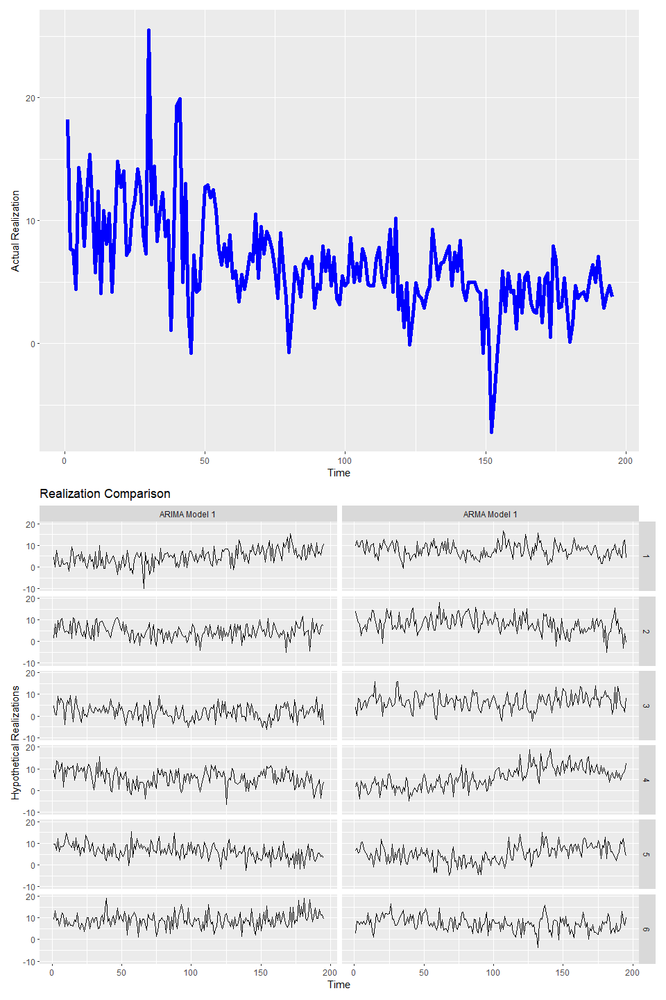

GDP Prediction
================
Nikhil Gupta
2020-03-15 11:39:25

-   [Setup](#setup)
-   [Stationarity](#stationarity)
    -   [Condition 1](#condition-1)
    -   [Condition 2](#condition-2)
    -   [Condition 3](#condition-3)
    -   [Conclusion](#conclusion)
-   [Stationary Model](#stationary-model)
    -   [Setup](#setup-1)
    -   [Model ID](#model-id)
    -   [Parameter Estimation](#parameter-estimation)
    -   [Factored Form](#factored-form)
    -   [Forecasting](#forecasting)
-   [Non Stationary Model](#non-stationary-model)
    -   [Model ID](#model-id-1)
    -   [Parameter Estimation](#parameter-estimation-1)
        -   [ARMA(1,1)](#arma11)
        -   [MA(1)](#ma1)
    -   [Factored Form](#factored-form-1)
    -   [Forecasting](#forecasting-1)
-   [Visualizing Results](#visualizing-results)
    -   [Compare Multiple Realizations](#compare-multiple-realizations)
    -   [ASE values across Batches](#ase-values-across-batches)
    -   [Forecasts across Batches](#forecasts-across-batches)
-   [Statistical Comparison](#statistical-comparison)

Setup
-----

``` r
library(tswge)
library(tswgewrapped)
library(tidyverse)
library(ggplot2)
```

``` r
data = read.csv("../data/economic_indicators_all_ex_3mo_china.csv")
data %>% glimpse()
```

    ## Observations: 195
    ## Variables: 15
    ## $ date            <fct> 1971 Q1, 1971 Q2, 1971 Q3, 1971 Q4, 1972 Q1, 1...
    ## $ gdp_change      <dbl> 18.2, 7.7, 7.6, 4.4, 14.3, 12.1, 7.9, 12.4, 15...
    ## $ unrate          <dbl> 6.0, 5.9, 6.0, 6.0, 5.8, 5.7, 5.5, 5.2, 4.9, 4...
    ## $ nfjobs          <int> 70860, 71254, 71614, 72109, 72944, 73758, 7426...
    ## $ treas10yr       <dbl> 5.53, 6.70, 6.00, 5.89, 6.12, 6.15, 6.54, 6.41...
    ## $ fedintrate      <dbl> 3.71, 4.91, 5.55, 4.14, 3.83, 4.46, 4.87, 5.33...
    ## $ personincomechg <dbl> 4.7, 4.9, 3.8, 5.2, 3.6, 3.2, 4.7, 7.6, 7.9, 7...
    ## $ cpi             <dbl> 40.0, 40.6, 40.8, 41.1, 41.4, 41.7, 42.1, 42.5...
    ## $ population      <int> 206960, 207562, 208230, 208829, 209299, 209811...
    ## $ corpprofitchg   <dbl> 12.7497657, 3.7704482, 6.6068568, 3.2925583, 5...
    ## $ crude_wti       <dbl> 3.56, 3.56, 3.56, 3.56, 3.56, 3.56, 3.56, 3.56...
    ## $ ppi             <dbl> 37.8, 38.2, 38.3, 38.6, 39.2, 39.7, 40.2, 41.1...
    ## $ gold            <dbl> 38.800, 40.200, 42.475, 43.500, 48.375, 64.100...
    ## $ japan           <dbl> 357.5187, 357.4118, 338.0210, 320.0727, 302.53...
    ## $ uk              <dbl> 2.4187, 2.4188, 2.4694, 2.5266, 2.6181, 2.5691...

``` r
x = data$gdp_change
```

``` r
px = plotts.sample.wge(x)
```


Stationarity
------------

``` r
tswgewrapped::check_stationarity(x)
```

    ## Loading required namespace: ggfortify

    ## Loading required namespace: patchwork


    ## [1] TRUE

### Condition 1

-   Looks like there is a slight trend in the data with the mean moving down over time. This would be expected. As a country is growing, its GDP is expected to be high. As it becomes a more developed economy, the GDP settles at a lower but steadier value.
-   The ACF plots shows extended autocorrelations although there is also a hint of exponentially decaying behavior. Hence, this trend (wanderig behavior) could be a result of a stationary AR process with positive phi values or it could be a result of a non-stationaty ARIMA like process.
-   **In summary, the mean is changing over time (wandering behavior) and based on the ACFs, this could be coming from either a stationary or a non stationary process.**

### Condition 2

-   Since we have only 1 realization, it is hard to say whether the varaince is different at different time points.
-   However we can make some important observations from this realization and domain knowledge. We see that in the initial part of the graph there is more volatility in the GDP numbers compared to the second half of the graph. This is again expected based on domain knowledge. Just as a developing economy has a higher GDP change value per quarter in general, this comes with a higher volatility. As an economy becomes more developed, not only does the GDP settle to a lower value in general but also the volatility decreases as well.
-   Given the above observations, there may be some hints that condition 2 has not been met

### Condition 3

-   Both the first half and second half ACFs show a damped exponential behavior for the first few lags although the second half ACFs take longer to die down. Also, the 1st half ACF shows higher values at lags of 9, 10 and 11 compared to the second half. It is also interesting to see that neither the firs half nor the second half ACF matches the full data ACF. There is enough evience here to indicate that the data is not stationary.

### Conclusion

-   Given the above analysis, there is a good chance that this data is not coming from a stationary process, although there were some hints (when looking at the mean) that it could have resulted from a stationary AR process. In order to completely eliminate the possibility that this may be coming from a stationary process, we will conduct an initial analysis with a stationary model.

Stationary Model
----------------

### Setup

``` r
n.ahead = 2
batch_size = 50 ## 12 years to predict the next 2 quarters
```

### Model ID

``` r
aic5.wge(x)
```

    ## ---------WORKING... PLEASE WAIT... 
    ## 
    ## 
    ## Five Smallest Values of  aic

    ##       p    q        aic
    ## 8     2    1   2.400740
    ## 11    3    1   2.405507
    ## 6     1    2   2.407727
    ## 9     2    2   2.408653
    ## 14    4    1   2.414109

### Parameter Estimation

``` r
est.s.mle = est.arma.wge(x, p = 2, q = 1)
```

    ## 
    ## Coefficients of Original polynomial:  
    ## 1.2175 -0.2239 
    ## 
    ## Factor                 Roots                Abs Recip    System Freq 
    ## 1-0.9917B              1.0084               0.9917       0.0000
    ## 1-0.2257B              4.4298               0.2257       0.0000
    ##   
    ## 

``` r
est.s.mle$theta
```

    ## [1] 0.9128495

**OBSERVATIONS**

-   This clears a lot of confusion. **Even when fitting a stationary ARMA model, we get an estimate of phi = 0.9917 which is very close to 1 (non stationary)**. Hence the confusion that we had before can be cleared now. The data most definitely is coming from a non stationary process. For the sake of completeness, we will continue modeling with this stationary model and see how well it performs.

### Factored Form

``` r
est.s.mle$avar
```

    ## [1] 10.58793

**(1 - 0.9917B)(1 - 0.2257B)*X*<sub>*t*</sub> = (1 - 0.9128)*a*<sub>*t*</sub> with *σ*<sub>*a*</sub><sup>2</sup> = 10.5879303**

### Forecasting

``` r
phi = est.s.mle$phi
theta = est.s.mle$theta
```

``` r
# Plot the forecasts
f = fore.arma.wge(x, phi=phi, theta = theta,
                  n.ahead = n.ahead, limits=TRUE, lastn = FALSE, plot = TRUE)
```


Non Stationary Model
--------------------

Next we will evaluate this as a non stationary model.

Because of the extended autocorrelations in the data, we will take the first difference and check the resultant data for stationarity

### Model ID

``` r
dif1 = artrans.wge(x, phi.tr = 1)
```


``` r
px = plotts.sample.wge(dif1)
```


-   ACF is indicatove of a MA(1) model with positive theta since most ACFs die down after lag = 1 and there is a dip in the Spectral Density at f = 0.

``` r
tswgewrapped::check_stationarity(dif1)
```


    ## [1] TRUE

``` r
aic5.wge(dif1, type = 'aic')
```

    ## ---------WORKING... PLEASE WAIT... 
    ## 
    ## 
    ## Five Smallest Values of  aic

    ##       p    q        aic
    ## 5     1    1   2.410123
    ## 2     0    1   2.414572
    ## 3     0    2   2.473242
    ## 16    5    0   2.490651
    ## 13    4    0   2.496508

-   AIC indicates that ARMA(1,1) is the best although our initial guess of MA(1) is not far behind.

``` r
aic5.wge(dif1, type = 'bic')
```

    ## ---------WORKING... PLEASE WAIT... 
    ## 
    ## 
    ## Five Smallest Values of  bic

    ##       p    q        bic
    ## 2     0    1   2.448261
    ## 5     1    1   2.460657
    ## 3     0    2   2.523776
    ## 10    3    0   2.567351
    ## 13    4    0   2.580732

-   With BIC, the order of the first 2 models is flipped. Now our initial guess of MA(1) takes 1st place.

We will try both to see which is the better model

### Parameter Estimation

#### ARMA(1,1)

``` r
est.ns.mle = est.arma.wge(dif1, p = 1, q = 1)
```

    ## 
    ## Coefficients of Original polynomial:  
    ## 0.2650 
    ## 
    ## Factor                 Roots                Abs Recip    System Freq 
    ## 1-0.2650B              3.7731               0.2650       0.0000
    ##   
    ## 

``` r
est.ns.mle$theta
```

    ## [1] 0.973168

-   Theta is the dominant factor here. This is almost no impact of the AR side since the root is so far away from the unit circle.
-   **Hence, we should stick to our initial assessment of an MA(1) model.**

#### MA(1)

``` r
est.ns.mle = est.arma.wge(dif1, p = 0, q = 1)
```

``` r
est.ns.mle$theta
```

    ## [1] 0.8880551

### Factored Form

``` r
est.ns.mle$avar
```

    ## [1] 10.95673

**(1 - B)*X*<sub>*t*</sub> = (1 - 0.8881)*a*<sub>*t*</sub> with *σ*<sub>*a*</sub><sup>2</sup> = 10.9567263**

### Forecasting

``` r
phi = est.ns.mle$phi
theta = est.ns.mle$theta
d = 1
s = 0
```

``` r
# Plot the forecasts
f = fore.aruma.wge(x, phi=phi, theta = theta, d = d, s = s,
                  n.ahead = n.ahead, limits=TRUE, lastn = FALSE, plot = TRUE)
```


Visualizing Results
-------------------

``` r
models = list("ARMA Model 1" = list(phi = est.s.mle$phi, theta = est.s.mle$theta, vara = est.s.mle$avar, sliding_ase = TRUE),
              "ARIMA Model 1" = list(phi = est.ns.mle$phi, theta = est.ns.mle$theta, d = 1, s = 0, vara = est.ns.mle$avar, sliding_ase = TRUE)
              )
```

``` r
mdl_compare = tswgewrapped::ModelCompareUnivariate$new(x = x, mdl_list = models,
                                                       n.ahead = n.ahead, batch_size = batch_size)
```

    ## 
    ## 
    ## 
    ## Computing metrics for:  ARMA Model 1 
    ## Number of batches expected:  73 
    ## 
    ## 
    ## 
    ## Computing metrics for:  ARIMA Model 1 
    ## Number of batches expected:  73

### Compare Multiple Realizations

``` r
mdl_compare$plot_multiple_realizations(n.realizations = 4, seed = 100, scales = 'fixed')
```



### ASE values across Batches

``` r
ASEs = mdl_compare$get_tabular_metrics(ases = TRUE)
print(ASEs)
```

    ## # A tibble: 146 x 5
    ##    Model           ASE Time_Test_Start Time_Test_End Batch
    ##    <chr>         <dbl>           <dbl>         <dbl> <dbl>
    ##  1 ARMA Model 1 10.4                49            50     1
    ##  2 ARMA Model 1  8.41               51            52     2
    ##  3 ARMA Model 1  3.38               53            54     3
    ##  4 ARMA Model 1  9.24               55            56     4
    ##  5 ARMA Model 1  4.28               57            58     5
    ##  6 ARMA Model 1  6.57               59            60     6
    ##  7 ARMA Model 1 15.1                61            62     7
    ##  8 ARMA Model 1  6.68               63            64     8
    ##  9 ARMA Model 1  0.689              65            66     9
    ## 10 ARMA Model 1  4.69               67            68    10
    ## # ... with 136 more rows

``` r
ASEs %>% 
  group_by(Model) %>% 
  summarise(ASE_mean = mean(ASE),
            ASE_median = median(ASE),
            ASE_sd = sd(ASE),
            num_batches = n())
```

    ## # A tibble: 2 x 5
    ##   Model         ASE_mean ASE_median ASE_sd num_batches
    ##   <chr>            <dbl>      <dbl>  <dbl>       <int>
    ## 1 ARIMA Model 1     6.65       3.58   10.7          73
    ## 2 ARMA Model 1      6.23       3.38   10.6          73

``` r
mdl_compare$plot_histogram_ases()
```


### Forecasts across Batches

``` r
mdl_compare$plot_forecasts(only_sliding = TRUE)
```


``` r
forecasts = mdl_compare$get_tabular_metrics(ases = FALSE)
print(forecasts)
```

    ## # A tibble: 585 x 5
    ##    Model         Time     f    ll    ul
    ##    <chr>        <dbl> <dbl> <dbl> <dbl>
    ##  1 ARMA Model 1     1    NA    NA    NA
    ##  2 ARMA Model 1     2    NA    NA    NA
    ##  3 ARMA Model 1     3    NA    NA    NA
    ##  4 ARMA Model 1     4    NA    NA    NA
    ##  5 ARMA Model 1     5    NA    NA    NA
    ##  6 ARMA Model 1     6    NA    NA    NA
    ##  7 ARMA Model 1     7    NA    NA    NA
    ##  8 ARMA Model 1     8    NA    NA    NA
    ##  9 ARMA Model 1     9    NA    NA    NA
    ## 10 ARMA Model 1    10    NA    NA    NA
    ## # ... with 575 more rows

Statistical Comparison
----------------------

``` r
mdl_compare$statistical_compare()  
```

    ##              Df Sum Sq Mean Sq F value Pr(>F)
    ## Model         1      7    6.52   0.058   0.81
    ## Residuals   144  16252  112.86               
    ## 
    ## 
    ##   Tukey multiple comparisons of means
    ##     95% family-wise confidence level
    ## 
    ## Fit: aov(formula = ASE ~ Model, data = results)
    ## 
    ## $Model
    ##                                 diff       lwr      upr     p adj
    ## ARMA Model 1-ARIMA Model 1 -0.422677 -3.898345 3.052991 0.8103839

    ## Call:
    ##    aov(formula = ASE ~ Model, data = results)
    ## 
    ## Terms:
    ##                     Model Residuals
    ## Sum of Squares      6.521 16251.941
    ## Deg. of Freedom         1       144
    ## 
    ## Residual standard error: 10.62359
    ## Estimated effects may be unbalanced

**CONCLUSION**

-   It looks like both model performs pooprly in predicting severe downturns (~ time point 80, 120, 150) and upturns (~ time points 48, 127, 172).
-   We may need to inclue exogenous variables into our model that are more indicative of these downturns and upturns in order to improve the model performance.
