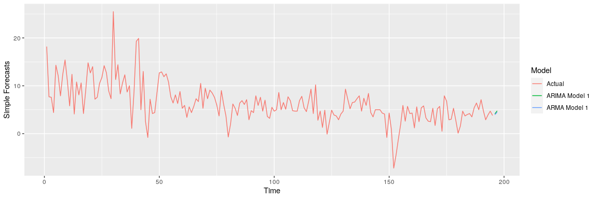

GDP Prediction
================
Nikhil Gupta
2020-03-16 20:14:04

## Setup

``` r
library(tswge)
library(tswgewrapped)
library(tidyverse)
library(ggplot2)
library(tseries)
```

``` r
data = read.csv("../data/economic_indicators_all_ex_3mo_china.csv")
data %>% glimpse()
```

    ## Observations: 195
    ## Variables: 15
    ## $ date            <fct> 1971 Q1, 1971 Q2, 1971 Q3, 1971 Q4, 1972 Q1, 197…
    ## $ gdp_change      <dbl> 18.2, 7.7, 7.6, 4.4, 14.3, 12.1, 7.9, 12.4, 15.4…
    ## $ unrate          <dbl> 6.0, 5.9, 6.0, 6.0, 5.8, 5.7, 5.5, 5.2, 4.9, 4.9…
    ## $ nfjobs          <int> 70860, 71254, 71614, 72109, 72944, 73758, 74264,…
    ## $ treas10yr       <dbl> 5.53, 6.70, 6.00, 5.89, 6.12, 6.15, 6.54, 6.41, …
    ## $ fedintrate      <dbl> 3.71, 4.91, 5.55, 4.14, 3.83, 4.46, 4.87, 5.33, …
    ## $ personincomechg <dbl> 4.7, 4.9, 3.8, 5.2, 3.6, 3.2, 4.7, 7.6, 7.9, 7.7…
    ## $ cpi             <dbl> 40.0, 40.6, 40.8, 41.1, 41.4, 41.7, 42.1, 42.5, …
    ## $ population      <int> 206960, 207562, 208230, 208829, 209299, 209811, …
    ## $ corpprofitchg   <dbl> 12.7497657, 3.7704482, 6.6068568, 3.2925583, 5.8…
    ## $ crude_wti       <dbl> 3.56, 3.56, 3.56, 3.56, 3.56, 3.56, 3.56, 3.56, …
    ## $ ppi             <dbl> 37.8, 38.2, 38.3, 38.6, 39.2, 39.7, 40.2, 41.1, …
    ## $ gold            <dbl> 38.800, 40.200, 42.475, 43.500, 48.375, 64.100, …
    ## $ japan           <dbl> 357.5187, 357.4118, 338.0210, 320.0727, 302.5365…
    ## $ uk              <dbl> 2.4187, 2.4188, 2.4694, 2.5266, 2.6181, 2.5691, …

``` r
x = data$gdp_change
```

``` r
px = plotts.sample.wge(x)
```

<!-- -->

## Stationarity

``` r
tswgewrapped::check_stationarity(x)
```

    ## Loading required namespace: ggfortify

    ## Loading required namespace: patchwork

<!-- -->

    ## [1] TRUE

### Condition 1

  - Looks like there is a slight trend in the data with the mean moving
    down over time. This would be expected. As a country is growing, its
    GDP is expected to be high. As it becomes a more developed economy,
    the GDP settles at a lower but steadier value.
  - The ACF plots shows extended autocorrelations although there is also
    a hint of exponentially decaying behavior. Hence, this trend
    (wanderig behavior) could be a result of a stationary AR process
    with positive phi values or it could be a result of a non-stationaty
    ARIMA like process.
  - **In summary, the mean is changing over time (wandering behavior)
    and based on the ACFs, this could be coming from either a stationary
    or a non stationary process.**

### Condition 2

  - Since we have only 1 realization, it is hard to say whether the
    varaince is different at different time points.
  - However we can make some important observations from this
    realization and domain knowledge. We see that in the initial part of
    the graph there is more volatility in the GDP numbers compared to
    the second half of the graph. This is again expected based on domain
    knowledge. Just as a developing economy has a higher GDP change
    value per quarter in general, this comes with a higher volatility.
    As an economy becomes more developed, not only does the GDP settle
    to a lower value in general but also the volatility decreases as
    well.
  - Given the above observations, there may be some hints that condition
    2 has not been met

### Condition 3

  - Both the first half and second half ACFs show a damped exponential
    behavior for the first few lags although the second half ACFs take
    longer to die down. Also, the 1st half ACF shows higher values at
    lags of 9, 10 and 11 compared to the second half. It is also
    interesting to see that neither the firs half nor the second half
    ACF matches the full data ACF. There is enough evience here to
    indicate that the data is not stationary.

### Conclusion

  - Given the above analysis, there is a good chance that this data is
    not coming from a stationary process, although there were some hints
    (when looking at the mean) that it could have resulted from a
    stationary AR process. In order to completely eliminate the
    possibility that this may be coming from a stationary process, we
    will conduct an initial analysis with a stationary model.

## Stationary Model

### Setup

``` r
n.ahead = 2
batch_size = 50 ## 12 years to predict the next 2 quarters
```

### Model ID

``` r
aic5.wge(x)
```

    ## ---------WORKING... PLEASE WAIT... 
    ## 
    ## 
    ## Five Smallest Values of  aic

    ##       p    q        aic
    ## 8     2    1   2.400740
    ## 11    3    1   2.405507
    ## 6     1    2   2.407727
    ## 9     2    2   2.408653
    ## 14    4    1   2.414109

### Parameter Estimation

``` r
est.s.mle = est.arma.wge(x, p = 2, q = 1)
```

    ## 
    ## Coefficients of Original polynomial:  
    ## 1.2175 -0.2239 
    ## 
    ## Factor                 Roots                Abs Recip    System Freq 
    ## 1-0.9917B              1.0084               0.9917       0.0000
    ## 1-0.2257B              4.4298               0.2257       0.0000
    ##   
    ## 

``` r
est.s.mle$theta
```

    ## [1] 0.9128495

#### White Noise Assessment

An assessment of the ARMA(2, 1) residuals rejects the residuals being
consistent with white noise. We will fit a higher order model to the
differenced
data.

``` r
white_noise_eval(est.s.mle$res, 2, 1)
```

<!-- -->

    ## At least one of the 'ljung_box' tests rejected the null hypothesis that the data is consistent with white noise at an significance level of  0.05

    ##             test  K chi.square df        pval    Decision
    ## 1 Ljung-Box test 24   44.98349 21 0.001740636 REJECT NULL
    ## 2 Ljung-Box test 48    76.7834 45 0.002194379 REJECT NULL

#### Higher Order Fit

Since the ARMA(2, 1) does not appear to be sufficient to whiten the
residuals, a higher order model, ARMA(13, 1) was fit. The models
suggested by BIC are not sufficient to whiten the residuals.

``` r
aicbic(x, p = 0:16, silent = T)
```

    ## Error in tswge::aic.wge(x, p, q, type) : object 'j_aic' not found
    ## Error in tswge::aic.wge(x, p, q, type) : object 'j_bic' not found

    ## [[1]]
    ##     p q      aic
    ## 78 12 5 2.294958
    ## 86 14 1 2.295388
    ## 80 13 1 2.301076
    ## 92 15 1 2.305607
    ## 85 14 0 2.307973
    ## 
    ## [[2]]
    ##    p q      bic
    ## 14 2 1 2.467879
    ## 9  1 2 2.474865
    ## 8  1 1 2.477624
    ## 10 1 3 2.488470
    ## 20 3 1 2.489430

#### ARMA(13, 1)

``` r
est.s.mle <- est.arma.wge(x, p = 13, q = 1)
```

    ## 
    ## Coefficients of Original polynomial:  
    ## 1.1957 -0.1012 -0.1049 -0.0276 -0.0421 0.0804 -0.0428 -0.2072 0.3985 -0.0524 0.0102 -0.3949 0.2810 
    ## 
    ## Factor                 Roots                Abs Recip    System Freq 
    ## 1-0.9928B              1.0073               0.9928       0.0000
    ## 1-0.6044B+0.8884B^2    0.3401+-1.0049i      0.9426       0.1981
    ## 1+1.7937B+0.8782B^2   -1.0213+-0.3094i      0.9371       0.4532
    ## 1+0.5388B+0.8414B^2   -0.3202+-1.0421i      0.9173       0.2974
    ## 1-1.4240B+0.8065B^2    0.8828+-0.6787i      0.8981       0.1043
    ## 1-1.6618B+0.7424B^2    1.1192+-0.3072i      0.8616       0.0426
    ## 1+1.1548B+0.7202B^2   -0.8017+-0.8636i      0.8487       0.3691
    ##   
    ## 

``` r
est.s.mle$theta
```

    ## [1] 0.882169

#### White Noise Assessment

The visual assessment of the ARMA(13, 1) on the residuals of the fit
confirms that the residuals appear to be consistent with white noise.
The Ljung-Box test fails to reject the null hypothesis, at K = 24 and K
= 48, that the residuals are white
noise.

``` r
white_noise_eval(est.s.mle$res, 13, 1)
```

<!-- -->

    ## None of the 'ljung_box' tests rejected the null hypothesis that the data is consistent with white noise at an significance level of  0.05

    ##             test  K chi.square df      pval Decision
    ## 1 Ljung-Box test 24   12.78603 10 0.2358823 FTR NULL
    ## 2 Ljung-Box test 48   27.21023 34 0.7890813 FTR NULL

**OBSERVATIONS**

  - This clears a lot of confusion. **Even when fitting a stationary
    ARMA model, we get an estimated root of 0.9928 in the factor table
    which is very close to 1 (non stationary)**. Hence the confusion
    that we had before can be cleared now. The data most definitely is
    coming from a non stationary process. For the sake of completeness,
    we will continue modeling with this stationary model and see how
    well it
performs.

### Factored Form

``` r
est.s.mle$avar
```

    ## [1] 8.561107

**(1-0.993\(B\))(1-0.604\(B\)+0.888\(B^2\))(1+1.794\(B\)+0.878\(B^2\))(1+0.539\(B\)+0.841\(B^2\))(1-1.424B+0.807\(B^2\))(1-1.662\(B\)+0.742\(B^2\))(1+1.155\(B\)+0.720\(B^2\))(\(X_{t}\)
+ 6.3887179) = (1-0.882B) \(a_{t}\) with \(\sigma_{a}^2\) = 8.5611071**

### Forecasting

``` r
phi = est.s.mle$phi
theta = est.s.mle$theta
```

``` r
# Plot the forecasts
f = fore.arma.wge(x, phi=phi, theta = theta,
                  n.ahead = n.ahead, limits=TRUE, lastn = FALSE, plot = TRUE)
```

<!-- -->

## Non Stationary Model

Next we will evaluate this as a non stationary model.

### Model ID

An overfit table should show the non-stationary characteristics. The
overfit table with \(p = 24\) has a root with absolute reciprocal of
0.9890, which is suggestive of a unit root.

``` r
vals <- est.ar.wge(x, p = 24, type = 'burg')
```

    ## 
    ## Coefficients of Original polynomial:  
    ## 0.3548 0.1412 0.0020 0.0885 -0.0911 0.1152 -0.0194 -0.2008 0.2358 0.1097 0.1403 -0.2764 0.0380 0.1195 -0.1324 0.1489 -0.1292 0.1275 0.0780 -0.0952 0.0974 0.0289 -0.0618 0.0979 
    ## 
    ## Factor                 Roots                Abs Recip    System Freq 
    ## 1-0.9890B              1.0111               0.9890       0.0000
    ## 1+1.3355B+0.9320B^2   -0.7165+-0.7481i      0.9654       0.3716
    ## 1-0.5630B+0.9058B^2    0.3108+-1.0037i      0.9517       0.2022
    ## 1+1.7817B+0.8915B^2   -0.9993+-0.3509i      0.9442       0.4463
    ## 1+0.4379B+0.8890B^2   -0.2463+-1.0316i      0.9429       0.2873
    ## 1+0.8052B+0.8776B^2   -0.4587+-0.9638i      0.9368       0.3207
    ## 1-1.7870B+0.8601B^2    1.0388+-0.2890i      0.9274       0.0432
    ## 1+0.9137B             -1.0945               0.9137       0.5000
    ## 1-1.4956B+0.7909B^2    0.9455+-0.6086i      0.8893       0.0910
    ## 1-1.3605B+0.7783B^2    0.8740+-0.7217i      0.8822       0.1099
    ## 1-0.8763B+0.7363B^2    0.5951+-1.0020i      0.8581       0.1647
    ## 1+1.5782B+0.7241B^2   -1.0898+-0.4397i      0.8509       0.4390
    ## 1-0.1355B+0.6534B^2    0.1037+-1.2327i      0.8084       0.2366
    ##   
    ## 

Because of the extended autocorrelations in the data, we will take the
first difference and check the resultant data for
stationarity.

``` r
dif1 = artrans.wge(x, phi.tr = 1)
```

<!-- -->

``` r
px = plotts.sample.wge(dif1)
```

<!-- -->

  - ACF is indicatove of a MA(1) model with positive theta since most
    ACFs die down after lag = 1 and there is a dip in the Spectral
    Density at f =
0.

<!-- end list -->

``` r
tswgewrapped::check_stationarity(dif1)
```

<!-- -->

    ## [1] TRUE

``` r
aic5.wge(dif1, type = 'aic')
```

    ## ---------WORKING... PLEASE WAIT... 
    ## 
    ## 
    ## Five Smallest Values of  aic

    ##       p    q        aic
    ## 5     1    1   2.410123
    ## 2     0    1   2.414572
    ## 3     0    2   2.473242
    ## 16    5    0   2.490651
    ## 13    4    0   2.496508

  - AIC indicates that ARMA(1,1) is the best although our initial guess
    of MA(1) is not far behind.

<!-- end list -->

``` r
aic5.wge(dif1, type = 'bic')
```

    ## ---------WORKING... PLEASE WAIT... 
    ## 
    ## 
    ## Five Smallest Values of  bic

    ##       p    q        bic
    ## 2     0    1   2.448261
    ## 5     1    1   2.460657
    ## 3     0    2   2.523776
    ## 10    3    0   2.567351
    ## 13    4    0   2.580732

  - With BIC, the order of the first 2 models is flipped. Now our
    initial guess of MA(1) takes 1st place.

We will try both to see which is the better model

### Parameter Estimation

#### ARMA(1,1)

``` r
est.ns.mle = est.arma.wge(dif1, p = 1, q = 1)
```

    ## 
    ## Coefficients of Original polynomial:  
    ## 0.2650 
    ## 
    ## Factor                 Roots                Abs Recip    System Freq 
    ## 1-0.2650B              3.7731               0.2650       0.0000
    ##   
    ## 

``` r
est.ns.mle$theta
```

    ## [1] 0.973168

  - Theta is the dominant factor here. This is almost no impact of the
    AR side since the root is so far away from the unit circle.
  - **Hence, we should stick to our initial assessment of an MA(1)
    model.**

#### MA(1)

``` r
est.ns.mle = est.arma.wge(dif1, p = 0, q = 1)
```

``` r
est.ns.mle$theta
```

    ## [1] 0.8880551

#### White Noise Assessment

An assessment of the MA(1) residuals rejects the residuals being
consistent with white noise. We will fit a higher order model to the
differenced
data.

``` r
white_noise_eval(est.ns.mle$res, 0, 1)
```

<!-- -->

    ## At least one of the 'ljung_box' tests rejected the null hypothesis that the data is consistent with white noise at an significance level of  0.05

    ##             test  K chi.square df         pval    Decision
    ## 1 Ljung-Box test 24   52.06025 23 0.0004908024 REJECT NULL
    ## 2 Ljung-Box test 48   81.01674 47  0.001498883 REJECT NULL

#### Higher Order Fit

BIC suggests an AR(11) and AIC suggests an ARMA(12, 1) of models with
options up to ARMA(16, 5). We will continue with the smaller model
AR(11).

``` r
aicbic(dif1, p = 0:16, silent = T)
```

    ## [[1]]
    ##     p q      aic
    ## 74 12 1 2.310990
    ## 79 13 0 2.313124
    ## 91 15 0 2.313580
    ## 92 15 1 2.314657
    ## 80 13 1 2.320861
    ## 
    ## [[2]]
    ##     p q      bic
    ## 2   0 1 2.448261
    ## 8   1 1 2.460657
    ## 3   0 2 2.523776
    ## 67 11 0 2.528362
    ## 50  8 1 2.536991

#### AR(11)

``` r
est.ns.mle <- est.arma.wge(dif1, p = 11, q = 0)
```

    ## 
    ## Coefficients of Original polynomial:  
    ## -0.6641 -0.4666 -0.3855 -0.3183 -0.3228 -0.2462 -0.2154 -0.3929 -0.1376 0.0322 0.2086 
    ## 
    ## Factor                 Roots                Abs Recip    System Freq 
    ## 1-0.6227B+0.8766B^2    0.3552+-1.0073i      0.9363       0.1960
    ## 1+1.7743B+0.8617B^2   -1.0295+-0.3171i      0.9283       0.4524
    ## 1-1.5025B+0.8361B^2    0.8985+-0.6235i      0.9144       0.0966
    ## 1+0.5210B+0.8091B^2   -0.3220+-1.0641i      0.8995       0.2968
    ## 1+1.0965B+0.6776B^2   -0.8092+-0.9062i      0.8231       0.3660
    ## 1-0.6025B              1.6598               0.6025       0.0000
    ##   
    ## 

#### White Noise Assessment

The visual assessment of the AR(11) on the residuals of the fit confirms
that the residuals appear to be consistent with white noise. The
Ljung-Box test fails to reject the null hypothesis, at K = 24 and K =
48, that the residuals are white
noise.

``` r
white_noise_eval(est.ns.mle$res, 11, 0)
```

<!-- -->

    ## None of the 'ljung_box' tests rejected the null hypothesis that the data is consistent with white noise at an significance level of  0.05

    ##             test  K chi.square df      pval Decision
    ## 1 Ljung-Box test 24   19.31463 13 0.1136669 FTR NULL
    ## 2 Ljung-Box test 48   33.68135 37 0.6254303 FTR NULL

### Factored Form

``` r
est.ns.mle$avar
```

    ## [1] 9.047744

**(1-0.6227\(B\)+0.8766\(B^2\))(1+1.7743\(B\)+0.8617\(B^2\))(1-1.5025\(B\)+0.8361\(B^2\))(1+0.5210\(B\)+0.8091\(B^2\))(1+1.0965\(B\)+0.6776\(B^2\))(1-0.6025\(B\))(1
- \(B\))(\(X_{t}\) + 6.3887179) = \(a_{t}\) with \(\sigma_{a}^2\) =
9.0477442**

### Forecasting

``` r
phi = est.ns.mle$phi
theta = est.ns.mle$theta
d = 1
s = 0
```

``` r
# Plot the forecasts
f = fore.aruma.wge(x, phi=phi, theta = theta, d = d, s = s,
                  n.ahead = n.ahead, limits=TRUE, lastn = FALSE, plot = TRUE)
```

<!-- -->

## Visualizing Results

``` r
models = list("ARMA Model 1" = list(phi = est.s.mle$phi, theta = est.s.mle$theta, vara = est.s.mle$avar, sliding_ase = TRUE),
              "ARIMA Model 1" = list(phi = est.ns.mle$phi, theta = est.ns.mle$theta, d = 1, s = 0, vara = est.ns.mle$avar, sliding_ase = TRUE)
              )
```

``` r
mdl_compare = tswgewrapped::ModelCompareUnivariate$new(x = x, mdl_list = models,
                                                       n.ahead = n.ahead, batch_size = batch_size)
```

    ## 
    ## 
    ## 
    ## Computing metrics for:  ARMA Model 1 
    ## Number of batches expected:  73 
    ## 
    ## 
    ## 
    ## Computing metrics for:  ARIMA Model 1 
    ## Number of batches expected:  73

### Compare Multiple Realizations

``` r
mdl_compare$plot_multiple_realizations(n.realizations = 6, seed = 100, plot = "realization", scales = 'fixed')
```

<!-- -->

``` r
mdl_compare$plot_multiple_realizations(n.realizations = 6, seed = 100, plot = c("acf", "spectrum"), scales = 'fixed')
```

<!-- --><!-- -->

### Compare Simple Forecasts

``` r
mdl_compare$plot_simple_forecasts()
```

<!-- -->

### ASE values across Batches

``` r
ASEs = mdl_compare$get_tabular_metrics(ases = TRUE)
print(ASEs)
```

    ## # A tibble: 146 x 5
    ##    Model           ASE Time_Test_Start Time_Test_End Batch
    ##    <chr>         <dbl>           <dbl>         <dbl> <dbl>
    ##  1 ARMA Model 1  4.35               49            50     1
    ##  2 ARMA Model 1  2.60               51            52     2
    ##  3 ARMA Model 1  7.58               53            54     3
    ##  4 ARMA Model 1  7.93               55            56     4
    ##  5 ARMA Model 1  1.62               57            58     5
    ##  6 ARMA Model 1 12.4                59            60     6
    ##  7 ARMA Model 1 13.7                61            62     7
    ##  8 ARMA Model 1  4.75               63            64     8
    ##  9 ARMA Model 1  0.609              65            66     9
    ## 10 ARMA Model 1  1.64               67            68    10
    ## # … with 136 more rows

``` r
ASEs %>% 
  group_by(Model) %>% 
  summarise(ASE_mean = mean(ASE),
            ASE_median = median(ASE),
            ASE_sd = sd(ASE),
            num_batches = n())
```

    ## # A tibble: 2 x 5
    ##   Model         ASE_mean ASE_median ASE_sd num_batches
    ##   <chr>            <dbl>      <dbl>  <dbl>       <int>
    ## 1 ARIMA Model 1     6.40       3.55   9.12          73
    ## 2 ARMA Model 1      5.77       3.73   9.42          73

``` r
mdl_compare$plot_histogram_ases()
```

<!-- -->

### Forecasts across Batches

``` r
mdl_compare$plot_forecasts(only_sliding = TRUE)
```

<!-- --><!-- -->

``` r
forecasts = mdl_compare$get_tabular_metrics(ases = FALSE)
print(forecasts)
```

    ## # A tibble: 585 x 5
    ##    Model         Time     f    ll    ul
    ##    <chr>        <dbl> <dbl> <dbl> <dbl>
    ##  1 ARMA Model 1     1    NA    NA    NA
    ##  2 ARMA Model 1     2    NA    NA    NA
    ##  3 ARMA Model 1     3    NA    NA    NA
    ##  4 ARMA Model 1     4    NA    NA    NA
    ##  5 ARMA Model 1     5    NA    NA    NA
    ##  6 ARMA Model 1     6    NA    NA    NA
    ##  7 ARMA Model 1     7    NA    NA    NA
    ##  8 ARMA Model 1     8    NA    NA    NA
    ##  9 ARMA Model 1     9    NA    NA    NA
    ## 10 ARMA Model 1    10    NA    NA    NA
    ## # … with 575 more rows

## Statistical Comparison

``` r
mdl_compare$statistical_compare()  
```

    ##              Df Sum Sq Mean Sq F value Pr(>F)
    ## Model         1     14   14.22   0.165  0.685
    ## Residuals   144  12382   85.98               
    ## 
    ## 
    ##   Tukey multiple comparisons of means
    ##     95% family-wise confidence level
    ## 
    ## Fit: aov(formula = ASE ~ Model, data = results)
    ## 
    ## $Model
    ##                                  diff       lwr      upr     p adj
    ## ARMA Model 1-ARIMA Model 1 -0.6242214 -3.657927 2.409485 0.6848292

    ## Call:
    ##    aov(formula = ASE ~ Model, data = results)
    ## 
    ## Terms:
    ##                     Model Residuals
    ## Sum of Squares     14.222 12381.569
    ## Deg. of Freedom         1       144
    ## 
    ## Residual standard error: 9.272708
    ## Estimated effects may be unbalanced

**CONCLUSION**

  - It looks like both model performs pooprly in predicting severe
    downturns (~ time point 80, 120, 150) and upturns (~ time points 48,
    127, 172).
  - We may need to inclue exogenous variables into our model that are
    more indicative of these downturns and upturns in order to improve
    the model performance.
